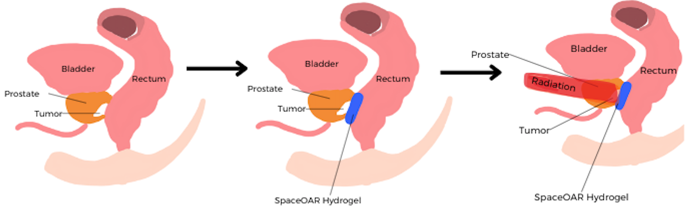
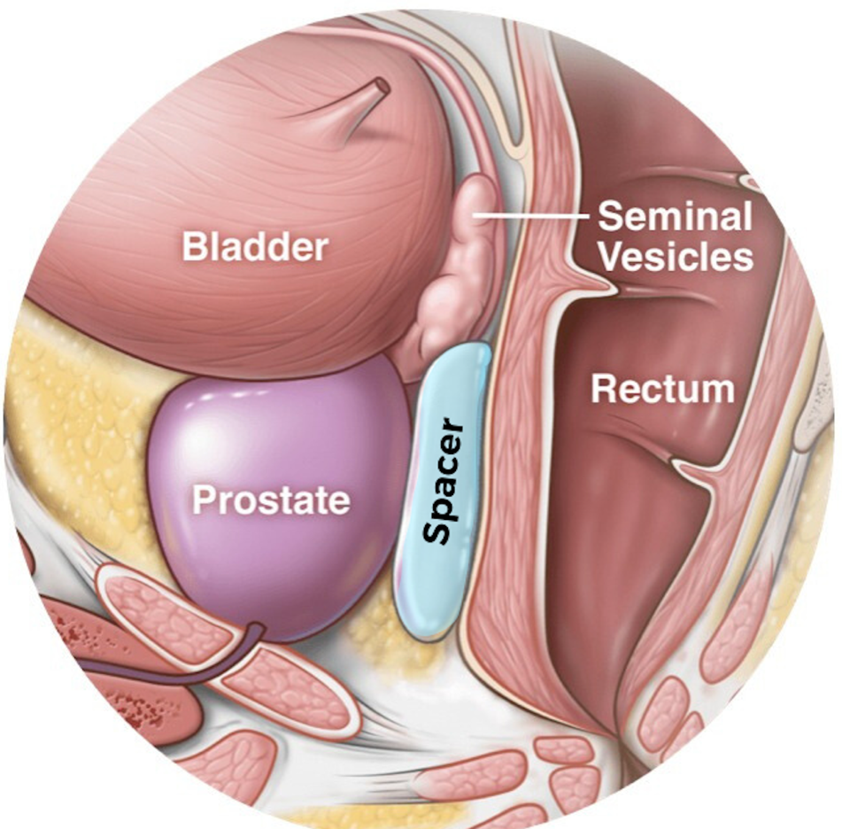

SpaceOAR Vue Hydrogel Preirectal Spacer Procedure (for prostate CA)    body {font-family: 'Open Sans', sans-serif;}

### SpaceOAR Vue Hydrogel Spacer Procedure (for prostate CA)

An outpatient procedure in which hydrogel is injected between the posterior side of the prostate gland and anterior rectum via a transperineal approach.  
**Indication:** Patients with prostate cancer who are or will receive radiation therapy.  
**Goal:** To temporarily position the anterior rectum away from the prostate gland and to reduce the dose (amount) of unintended radiation from prostate radiation therapy.  
Separating the two will minimize the GI side effects of pelvic radiation.

****

**Anatomy:**  
The prostate is next to the rectum.  
Due to the proximity, prostate radiation therapy can unintentionally cause damage to the rectum, leading to bowel function issues.

****

**Space-OAR Vue™ (Boston Scientific) Hydrogel:**  
\- A novel synthetic, absorbable, iodinated cross-linked polyethylene glycol (PEG)-based hydrogel.  
\- The newer SpaceOAR Vue™, through its iodinated cross-linked PEG.  
\- The spacer maintains position throughout prostate radiotherapy (for approximately three months).  
It is broken down by hydrolysis, absorbed by the patient, and excreted by renal filtration over time (after approximately six months).  
  
**The benefits of the spacer:**  
\- Provides physical separation, thus minimizing radiation exposure to the anterior rectum.  
\- It has radiopacity properties, providing an easily identifiable boundary on MR imaging to aid in contouring.  
\- It is especially pronounced in demarcating the rectal-prostatic boundary at the apex of the prostate, where overdosing could damage the anterior rectum.  
  
**Anesthesia Management:** (Similar to a “Prostate Biopsy” procedure)  
**Anesthesia:** Usually MAC  
Continuous propofol infusion (titrate to effect).  
**  
Common cocktail:**  
50 -100 mcg of Fentanyl with 50 -150 mcg/kg/min of propofol.  
Consider a small bolus of propofol just prior to needle insertion.  
  
**Position:** Lithotomy with arms out (slight Trendelenburg)  
Caution: Patients with moderate to severe GERD may be an aspiration risk in mild Trendelenburg.  
Communicate with the surgeon.  
The OR staff will NOT position the patient in lithotomy until he is asleep.  
  
**Note:** Bucking may prolong the procedure as the ultrasound must be repositioned.  
**Duration:** About 15-30 minutes  
  
**EBL:** Minimal  
  
**Possible complication:** Rare  
Aspiration while in mild Trendelenburg  
Inflammation  
Infection (abscess)  
Rectal erosion  
Rectal fistula formation  
Urinary retention  
Constipation  
Rectal/bladder/prostate perforation  
Fistula  
Mucosal damage/ulcers  
Necrosis  
Allergy  
Embolism  
Missing spacer: One case reported. It was believed to have been passed rectally through a fistula.  
  

Utilization of Iodinated SpaceOAR Vue™ During Robotic Prostate Stereotactic Body Radiation Therapy (SBRT) to Identify the Rectal–Prostate Interface and Spare the Rectum: A Case Report  
Frontiers in Oncology 2020; 10: 607698.  
Dylan Conroy, 1  Kelly Becht, 3  Matthew Forsthoefel, 1  Abigail N. Pepin, 1  Siyuan Lei, 1  Abdul Rashid, 1 Brian Timothy Collins, 1  Jonathan W. Lischalk, 1  Simeng Suy, 1  Nima Aghdam, 1  Ryan Andrew Hankins, 2  and Sean P. Collins 1 , \*  
  
SpaceOAR Hydrogel  
Accessed 09/2023)  
https://augmenix.wpenginepowered.com/assets/patient-brochure-english.pdf  
  
SpaceOAR Hydrogel  
A global leader in perirectal spacing  
Boston Scientific ((accessed 09/2023)  
https://tinyurl.com/2dma2a29  
  
The case of the missing spacer!  
Journal of Surgical Case Reports 2023 Mar; 2023(3): rjad163.  
Andrea Boerkamp and Marie Shella De Robles