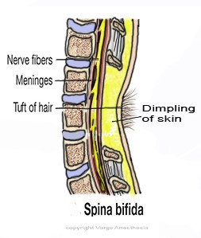
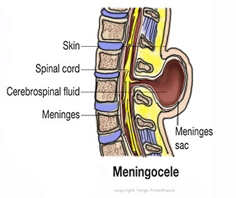
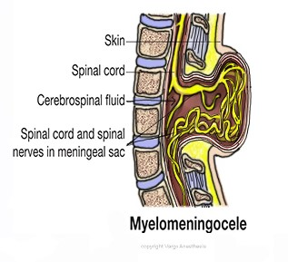

Spina Bifida   

### Spina Bifida

Neural tube defects are abnormalities that can occur in the brain, spine, or spinal column of a developing embryo and are present at birth.  
Spina Bifida is a Type of Neuro Tube Defect  
Also review “Neuro Tube Defects.”

Spina bifida, which literally means _cleft spine_, is characterized by the incomplete development of the brain, spinal cord, and/or meninges.

**There are four types of spina bifida:  
**Occulta  
Closed neural tube defects  
Meningocele  
Myelomeningocele

**And spina bifida is further divided into two subclasses:**  
Spina bifida occulta  
Spina bifida cystica (Meningocele, Myelomeningocele)

  
**Spina bifida occulta** (image below)

****

**Spina Bifida Occulta** (Most common form of spina bifida)  
“Occulta,” means _hidden_, indicates that a layer of skin covers the malformation, or opening in the spine.  
  
If examination reveals a naevus, hairy patch, dimple, sinus or subcutaneous mass at the site of defect.  
MRI scan of the spinal cord is recommended even if there are no associated problems with sphincter or limb control.  
Often found incidentally on an X-ray.  
Isolated laminar defects only seen in 5% of spinal X-rays  
Occurs in 10-20% of general population, most common and most hidden.  
Rarely causes disabilities or symptoms.  
Just a small gap in the spine, but no opening or sac protruding out of the back.  
It can cause asymmetrical lower motor neuron weakness associated with wasting, deformity and diminished reflexes.  
There may also be progressive gait disturbance with spasticity and impaired bladder control.

**Closed neural tube defects** **(** spinal defect is covered by skin)Closed neural tube defects is considered a type of spina bifida.  
Is considered a type of spina bifida.  
A diverse group of defects in which the spinal cord is marked by malformations of fat, bone, or meninges. In most instances there are few or no symptoms; in others the malformation causes incomplete paralysis with urinary and bowel dysfunction.  
In some cases, the only outward sign might be a dimple or tuft of hair on the spine  
  
**Closed Neuro Defects**  
Lipomyelomeningocele  
Lipomeningocele  
Spina bifida-can be open or closed  
Tethered cord  
  
**Spina Bifida Cystica  
**Meningocele  
Myelomeningocele  
  
**Meningocele** (image below)The sac of CSF does not have neural tissue or a Myelomeningocele.  
No associated hydrocephalus.  
Neural examination is often normal.  
Sac of cerebrospinal fluid (CSF) comes through an opening in the baby’s back without the spinal cord within the sac ,but can sometimes contain spinal elements.  
It may or may not be covered by a layer of skin. Some individuals with meningocele may have few or no symptoms while others may experience such symptoms as complete paralysis with bladder and bowel dysfunction.

**Myelomeningocele -** The most severe form. (image below)  
Whenever spina bifida is discussed, most often the healthcare team is referring to Myelomeningocele.  
A sac of CSF comes through an opening in the baby’s back with  
part of the spinal cord and damaged nerves within the sac.

The sac is covered with a thin membrane and leak CSF  
Occurs in 80-90% of spina bifida cystica cases.80% are lumbosacral  
These kids may also have bladder and bowel dysfunction.

Higher lesions are associated with bladder outlet obstruction, consequent dilatation of the upper urinary tract and pyelonephritis.May result in partial or complete paralysis of the parts of the body below the spinal opening.  
It is usually associated with Chiari II malformation but it may also be  
due to aqueduct stenosis or have no clear cause.It is usually detected by ultrasound.There may signs of progressive ventricular dilatation-rising ICP.  
May need for insertion of a ventriculoperitoneal shunt.

**  
Chiari II malformation:**

Occurs in approximately 70% of cases of myelomeningocele.

It consists of downward protrusion of the medulla below the foramen magnum to overlap the spinal cord.

This causes the medulla to be kinked and the cerebellar vermis indented, the fourth ventricle elongated and the midbrain distorted.

Problems include palsies and central apnea.

**Introduction**  
The human nervous system develops from a small, specialized plate of cells along the back of an embryo (called the neural plate). Early in development, the edges of this plate begin to curl up toward each other, creating the neural tube—a narrow sheath that closes to form the brain and spinal cord of the embryo. As development progresses, the top of the tube becomes the brain and the remainder becomes the spinal cord. This process is usually complete by the 28th day of pregnancy.

Sometimes the neuro plate does not close and may result with brain disorders called _neural tube defects_, including _spina_ _bifida_.

**What causes spina bifida?**  
The exact cause of spina bifida remains unknown.  
No one knows what disrupts complete closure of the neural tube, causing this malformation to develop.  
Scientists suspect the factors that cause spina bifida are multiple:  
Genetic  
Nutritional  
Environmental factors  
  
Studies indicate that insufficient intake of folic acid in the mother’s diet is a key factor in causing spina bifida and other neural tube defects. Prenatal vitamins typically contain folic acid as well as other vitamins.

**Chiari II Malformation and Spina Bifida  
**Chiari II Malformation may also result in a blockage of CSF and cause _hydrocephalus_. Hydrocephalus is commonly treated with a VP shunt.

Some newborns with myelomeningocele may develop meningitis, an infection in the meninges. Meningitis may cause brain injury and can be life-threatening.

Children with both myelomeningocele and hydrocephalus may have learning disabilities, including difficulty paying attention, problems with language and reading comprehension, and trouble learning math.

Additional problems such as latex allergies, skin problems, gastrointestinal conditions, and depression may occur as children with spina bifida get older.

**How is it diagnosed?**  
In most cases, spina bifida is diagnosed prenatally.  
Some mild cases may go unnoticed until after birth.  
Spinal bifida occulta may never be detected.

**_Prenatal Diagnosis_**  
The most common screening methods for spina bifida during the second trimester (16-18 weeks of gestation) is the maternal serum alpha fetoprotein (MSAFP) screening and fetal ultrasound.  
If an abnormally high AFP appears in the mother’s bloodstream, it may indicate that the fetus has an “open” (not skin-covered) neural tube defect.

The MSAFP test, however, is not specific for spina bifida and requires correct gestational dates to be most accurate; it cannot definitively determine that there is a problem with the fetus. If a high level of AFP is detected, the doctor will request an ultrasound or amniocentesis to help determine the cause.

**The second trimester MSAFP screen may be performed as a multiple-marker screen:**  
Neural tube defects  
Down syndrome  
Other chromosomal abnormalities.  
  
**Amniocentesis** may also be used to diagnose spina bifida. Although amniocentesis cannot reveal the severity of spina bifida, finding high levels of AFP and other proteins may indicate that the disorder is present.

**Postnatal Diagnosis**  
Mild cases of spina bifida (occulta, closed) not diagnosed during prenatal testing may be detected postnatally by plain. X-ray.  
  
Kids with the more severe forms of spina bifida often have muscle weakness in their feet, hips, and legs that result in deformities that may be present at birth.  
Doctors may use an MRI or CT scan to get a clearer view of the spinal cord and vertebrae.  
  
**How is Spina Bifida Treated?**  
There is no cure for spina bifida. The nerve tissue that is damaged cannot be repaired, nor can function be restored to the damaged nerves. Treatment depends on the type and severity of the disorder. Generally, children with the mildest form need no treatment, although some may require surgery as they grow.

The key early priorities for treating Myelomeningocele:  
Prevent infection from the exposed nerves and tissue  
Protect the exposed nerves from trauma.  
Surgery close the defect and minimize the risk of infection or trauma within the first few days of life.

**Spina Bifida and Tethered Cord  
**Twenty to 50 percent of children with myelomeningocele develop a tethered cord. Their spinal cord become fastened to an immovable structure (overlying membranes and vertebrae) and cause the spinal cord to become abnormally stretched with the child’s growth. This condition can cause loss of muscle function to the legs, as well as changes in bowel and bladder function.  
Early surgery on a tethered spinal cord may allow the child to return to their baseline level of functioning and prevent further neurological deterioration.

Some children will need subsequent surgeries to manage problems with the feet, hips, or spine. Individuals with hydrocephalus generally will require additional surgeries to replace the shunt, which can be outgrown or become clogged or infected.

Some individuals with spina bifida require assistive devices such as braces, crutches, or wheelchairs.

The location of the malformation on the spine often indicates the type of assistive devices needed. Children with a defect high on the spine will have more extensive paralysis and will often require a wheelchair, while those with a defect lower on the spine may be able to use crutches, leg braces, or walkers.  
  
Beginning special exercises for the legs and feet at an early age may help prepare the child for walking with those braces or crutches when he or she is older.

Treatment for bladder and bowel problems typically begins soon after birth, and may include bladder catheterizations and bowel management regimens.

Women who already have a child with spina bifida, who have spina bifida themselves, or who have already had a pregnancy affected by any neural tube defect are at greater risk of having another child with spina bifida or another neural tube defect; 5-10 times the risk to the general population. These women may benefit from taking a higher daily dose of folic acid before they consider becoming pregnant.

M. Memet Özek; Giuseppe Cinalli and Wirginia Maixner; Spina Bifida; 2008

_National Institute of Neurological Disorders and Stroke_  
**http://www.ninds.nih.gov/disorders/spina\_bifida/detail\_spina\_bifida.htm**

Spitz,Lewis and Coran, Arnold; Operative Pediatric Surgery; Seventh Edition, 2013.