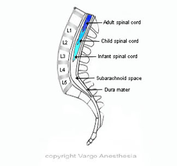
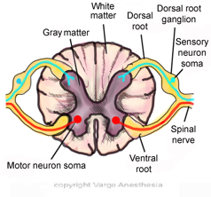
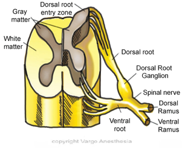
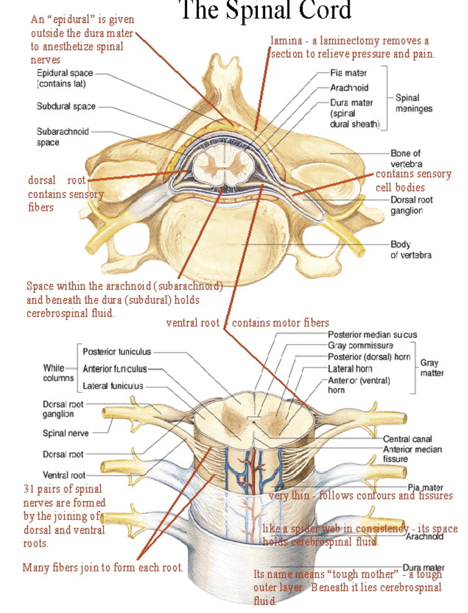

Spinal Cord Anatomy Notes and Simple Review    body {font-family: 'Open Sans', sans-serif;}

### Spinal Cord Anatomy Notes and Simple Review

The spinal cord (SC) is an extension of the (CNS), which consists of the brain and SC. It begins at the bottom of the brain stem (at the area called the medulla oblongata), and it ends in the lower back as it tapers to form a cone called the conus medullaris.  
  
Anatomically, the spinal cord runs from the the C1 vertebra to the level of the L1 vertebra. The spinal cord is about 18 inches (45 cm) in length and is relatively cylindrical in shape. It is about the diameter of a human finger.  
  
Beginning at the distal tip of the conus medullaris, a fibrous band called the filum terminale begins at the tip of the conus medullaris and extends to the coccyx.  
  
At the bottom of the spinal cord (conus medullaris) is the cauda equina, a collection of nerves that derives its name from the Latin translation of "horse's tail." (Early anatomists thought the collection of nerves resembled a horse's tail.)  
  
**Adult vs Infant  
**The spinal cord ends at L1/L2 in the adult and L3 in the infant.  
The point at which the spinal cord ends and the conus medullaris begins is variable.  
During development, vertebral column grows ~25cm longer than the SC.  
  
**A spinal needle below L2 is usually safe** In adults, it is usually safe to place a spinal needle below L2, unless there is a known anatomical variation. Needle trauma to the cauda equina is unlikely. Individual nerves of the cauda equina are in a fluid environment and not likely to be pierced by a needle.  
  
Approximately 30% of the population have a spinal cord that ends lower and a small proportion have one that ends very low and could be damaged by a lumbar puncture.  
  
**NOTE:** There are conditions (e.g. **Scheuermann’s syndrome)** in which the cord is “tethered” and vulnerable to a needle placed intrathecally even below L2. Another condition (spina bifida occulta) involves tethering of the cord; this is often associated with a tufted hairy nevus on the skin at the base of the spine.  
  
Nerves pass down the spinal cord and exit at particular points from the vertebral column.  

****

  
**CSF  
**CSF is present in the subarachnoid space and surrounds the spinal cord which is surrounded by the 3 layers of the meninges. The spinal cord is protected by the bony vertebral column. The CSF acts as a cushion to protect the delicate nerve tissues against damage from colliding with the inside of the vertebrae.|  
  
**Spinal Cord Overview  
**The spinal cord itself consists of millions of nerve fibers which transmit electrical information to and from the limbs, trunk and organs of the body, to and from the brain.  
  
Nerves that exit the spinal cord in the cervical region control breathing and the arms. NOTE: **_Mnemonic: “C3, 4 and 5 keep the diaphragm alive.”_**  
  
The nerves that exit the spinal cord in the mid and lower section of the back control the trunk and legs, as well as bladder, bowel and sexual function.  
  
**Motor neurons:** Nerves which carry information from the brain to the SC and then the muscles.  
  
**Sensory neurons:** Nerves which carry information from the body back to the SC and hence to the brain are called sensory neurons. Sensory neurons carry information to the brain about skin temperature, touch, pain and joint position.  
The brain and spinal cord are referred to as the central nervous system (CNS), while the nerves connecting the spinal cord to the body are referred to as the peripheral nervous system (PNS).  
  
**There are 31 pairs of spinal nerves**  
In the cervical region of the spinal cord, the spinal nerves exit above the vertebrae. A change occurs with the C7 vertebra, however, where the C8 spinal nerve exits the vertebra below the C7 vertebra. Therefore, there is an 8th cervical spinal nerve even though there is no 8th cervical vertebra.  
From the 1st thoracic vertebra downwards, all spinal nerves exit below their equivalent numbered vertebrae.  
The spinal nerves that leave the spinal cord are numbered according to the vertebra at which they exit the spinal column. So, the spinal nerve T4, exits the spinal column through the intervertebral foramen (bony canal) in the 4th thoracic vertebra. The spinal nerve L5 leaves the spinal cord from the conus medullaris, and travels along the cauda equina until it exits the 5th lumbar vertebra.  
  
The level of the spinal cord segments DO NOT relate exactly to the level of the vertebral bodies i.e. damage to the bone at a particular level (e.g. L5 vertebra) does not necessarily result in damage to the spinal cord at the same spinal nerve level.  
  
**Spinal Cord Level Numbering System** The spinal nerves carry information to and from different levels (segments) in the spinal cord.  
Both the nerves and the segments in the spinal cord are numbered in a similar way to the vertebrae.  
  
**Nerves:**  
C1-C8  
T1-T12  
L1-L5  
S1-S5  
CO1 (coccygeal nerves)  
**  
Within the vertebrae:  
**The spinal cord is surrounded by connective tissue  
Spinal Meninges (3 layers) support and protect spinal cord  
Spinal roots exit vertebral canal through intervertebral foramen  
Dorsal and ventral roots combine to form spinal nerves  
**Spinal cord has two main functions:**  
Connects a large part of the peripheral nervous system to the brain.  
Acts as a minor coordinating center responsible for some simple reflexes (e.g. withdrawal reflex).  
During development, the vertebral column grows ~25cm longer than spinal cord. Nerves pass down the spinal cord and exit at particular points from the vertebral column. At the lower end of the vertebral column is a thick bundle of elongated nerve roots called cauda equina (“horses tail”). **Cross section of Spinal Cord (basic)**

****

  

****

  

****

  
Above, a cross section of the spinal cord shows it is composed of grey matter in the center surrounded by white matter. **Ventral (anterior) horn – white matter**  
**Dorsal (posterior) horn – grey matter** Dorsal horn: Groups of afferent fibers carrying impulses from peripheral sensory receptors enter through the dorsal root into here.  
  
**Ventral horn:** Nerve fibers exit from here through ventral roots to skeletal muscles. Dorsal and ventral roots are very short and fuse to form the spinal nerves. **White matter** \- Composed of myelinated and unmyelinated nerve fibers. **Grey Matter** – resembles the letter H (butterfly) – consists of a mixture of multipolar neuron cell bodies.  
**Spinal Nerves  
**Nerves, called the spinal nerves or nerve roots, branch off the spinal cord and pass out through an opening between two vertebrae called the intervertebral foramen. These nerves carry information from the spinal cord to the rest of the body, and from the body back up to the brain.  
Each spinal nerve arises as rootlets which combine to form dorsal (posterior) & ventral (anterior) roots. Two roots merge laterally and form the spinal nerve  
  
**Conus Medullaris** The point at which the spinal cord ends is called the conus medullaris, and is the terminal end of the spinal cord. It occurs near lumbar nerves L1 and L2. After the spinal cord terminates, the spinal nerves continue as a bundle of nerves called the **cauda equina** . The upper end of the conus medullaris is usually not well defined.  

https://www.nscisc.uab.edu/  
Sekhon, Lali H.S.; Fehlings, Michael G. (2001). "Epidemiology, Demographics, and Pathophysiology of Acute Spinal Cord Injury". Spine 26 (24 Suppl): S2–12. doi:10.1097/00007632-200112151-00002. PMID 11805601.  
  
Alexander Vaccaro; Michael Fehlings (2010). Spine and Spinal Cord Trauma: Evidence-Based Management. Thieme Publishers. ISBN 9781604062229. Retrieved 2012-05-06.      
  
Maton, Anthea; Jean Hopkins; Charles William McLaughlin; Susan Johnson; Maryanna Quon Warner; David LaHart; Jill D. Wright (1993). _Human Biology and Health_ . Englewood Cliffs, New Jersey, United States of America: Prentice Hall. pp. 132–144.  
  
Myers, Gary. _Exploring Psychology_ . Worth Publishers. p. 41. "Spinal Cord Gross Anatomy".  
  
Kaufman, Bard. "Spinal Cord- Development and Stem Cells". _Life Map Discovery Compendium_ .  
  
Kaufman, Bard. "Spinal Cord-Development and Stem Cells". _Stem Cell Development Compendium_ .  
  
Saladin. _Anatomy & Physiology The Unity of Form and Function_ . Mc Graw Hill.  
  
Moore, Keith; Anne Agur (2007). _Essential Clinical Anatomy, Third Edition_ . Lippincott Williams & Wilkins. p. 298.  
  
Biglioli, Paolo; et alia (April 2004). "Upper and lower spinal cord blood supply: the continuity of the anterior spinal artery and the relevance of the lumbar arteries". _Journal of Thoracic and Cardiovascular Surgery_ **127** (4): 1188–1192.    
  
Le, Tao (10 January 2014). _First Aid for the USMLE Step 1 2014 / Edition 24_ . McGraw-Hill Professional Publishing.  
  
Chestnut, David.(2014) Chestnut’s Obstetric Anesthesia Principles and Practice.  
  
Santos, Alan., Epstein, Jonathan.,(2015) Chaudhuri, Kallol Obstetric Anesthesia ; 2015.  
  
Anatomy of Human Spine  
(Mayfield Brain and Spine)  
http://www.mayfieldclinic.com/PE-AnatSpine.htmSpinal Cord Anatomy, Structure and Tracts (Ken Hub)  
https://www.kenhub.com/en/library/anatomy/the-spinal-cord  
  
**Gray's Anatomy for Students  
**By Richard Drake, A. Wayne Vogl, Adam W. M. Mitchell