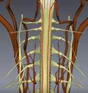
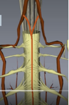
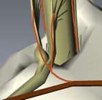
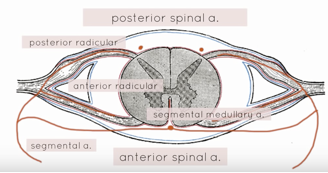

Spinal Cord Blood Supply    body {font-family: 'Open Sans', sans-serif;}

### Spinal Cord Blood Supply

The spinal cord vasculature has a complex and highly variable anatomy. It is presented below in simplified form.  
  
**The spinal cord receives blood from 2 main sources:**  
**Vertical arteries (** Also called longitudinal arterial channels)  
They descend vertically from the vertebral arteries within the cranium and descend throughout the length of the spinal cord.  
  
**Segmental arteries:** Instead of descending from the vessels of the brain, the segmental arteries originate from their specific segmental level. They come in bilaterally in at each segmental level of the spinal cord from the cervical, thoracic and lumbar area and directly connect bilaterally to the spinal cord as radicular arteries. These arteries that arise from the posterior aorta will branch off near the spinal cord and become a “segmental artery.” From there, they enter the intervertebral foramen (the boney canal the spinal nerves exit the vertebrae) and now divide along with the dorsal and ventral nerves and become radicular arteries as they connect and feed into the spinal cord at the extradural area. Segmental vessels are also known as “feeder vessels.”  
  
**Example** : Segmental arteries in the cervical area run off the “vertebral” and “deep cervical” arteries.   Segmental arteries in the thorax come from the posterior intercostal arteries that came directly off the aorta.  
The abdominal area segmental arteries come from the lumbar arteries that also come directly off the aorta.  
Segmental arteries become radicular arteries after they enter the intervertebral foramen. When they divide, they soon connect and feed the spinal cord.  
  
**Vertical arteries - 3 total  
Two posterior spinal arteries -** supply 25% of the blood.  
Posterior spinal arteries arise from the 2 vertebral arteries within the cranium and both descend the dorsal (posterior) surface of the spinal cord medial to the dorsal nerve roots.  
They supply the posterior 1/3 of the spinal cord and the sensory tracts.  
_2 Posterior Arteries below  
_

_****_

Unfortunately, these two arteries don’t offer an adequate blood supply down the length of the spinal cord. It is only the cervical region that receives a sufficient supply from the posterior arteries. The anterior spinal artery provides the main source of blood supply to the posterior spinal arteries below the upper thoracic level.  
Fortunately, for collateral circulation, the anastomoses with **radicular arteries and segmental medullary arteries** fulfill the required circulation of the caudal regions of the spinal cord.  
(Radicular and medullary arteries are covered below)  
  
_Blockage of a posterior spinal artery may have little effect because it receives extensive collateral circulation. Occlusion of an **anterior spinal artery** may result in “Anterior Spinal Artery Syndrome” and cause ischemia and infarction of the spinal cord resulting in flaccid paralysis and loss of pain and temperature sensation.  
  
_**One Anterior Spinal Artery** supplies 75% of the blood.  
The anterior artery also arises from the vertebral arteries and runs down the entire length of the ventral (anterior) side of the spinal cord. It runs anterior (ventral) to the median fissure.  
The spinal cord and nerve roots access their most of their blood supply from a single anterior spinal artery and two posterior arteries.  
The anterior section of the LOWER spinal cord has a collateral circulation that is of lesser quality than that of the posterior lower section. Occlusion of an **anterior spinal artery** often produces ischemia of the anterior central part of the cord causing flaccid paralysis and loss of pain and temperature sensation.  
Fortunately, the anterior spinal artery receives extra arterial blood from the anterior segmental medullary arteries in the thoracic and lumbar regions.  

****

  
Unfortunately, the two posterior arteries and the anterior artery do not offer an adequate blood supply down the length of the spinal cord. It is only the cervical region that receives a sufficient supply from the posterior arteries. _Fortunately, for collateral circulation, the anastomoses with radicular arteries fulfill the required circulation of the caudal regions of the spinal cord.  
  
_**Spinal Cord also Receives Blood from Radicular Arteries at each segment  
**_This involves the “segmental arteries” described a few paragraphs above?  
_**Radicular arteries** (they come in bilaterally and horizontally)The anterior and posterior radicular arteries run off the **segmental arteries** that originate from that area level with the aorta that corresponds with that segment of the spinal cord. This occurs at each spinal segment.  
The segmental arteries become radicular arteries when they enter the intervertebral foramen along the spinal roots to feed the spinal cord.  
There are particularly large radicular arteries at the cervico-thoracic junction and at the thoraco-lumbar junction. As was previously described, the segmental arteries become anterior and posterior radicular arteries when they enter the vertebral foramen and then divide into the anterior and posterior radicular arteries along the spinal nerve roots to feed the spinal cord.  
In the illustration below, a vertebra is removed to reveal a segmental artery coming off a posterior intercostal artery then dividing into two radicular arteries with the dorsal and ventral nerves feeding into the spinal cord.  

****

  
Below is an image of an intervertebral foramen with an exiting spinal nerves. The ventral and dorsal nerves are not visible in this illustration.  

****

  
Below is illustrated a segmental artery becoming a posterior and anterior **radicular** artery after it enters the intervertebral foramen along the spinal roots.  

****

**Segmental Medullary Arteries** (also called medullary feeder arteries):These reinforce (supply) the posterior and anterior spinal arteries.These vary from 2-17 on anterior side and 6-25 on posterior side.  
  
_This is where the artery of Adamkiewicz becomes relevant_ Another source of arterial blood to the anterior and posterior arteries are **segmental medullary arteries.** These arteries are segmental vessels but instead of entering the intervertebral foramen and become radicular arteries, they bypass entering the intervertebral foramen and go directly to and feed the anterior and posterior spinal arteries that are vertically descending the spinal cord. Unfortunately, this does not occur at every segmental level and is only found in the thoracic and lumbar areas.  
One of these vessels is ANTERIOR and much larger than the other segmental medullary arteries that feed into the anterior spinal artery. This is “Artery of Adamkiewics.”  
It varies in origin and location but is a major source of arterial blood supply to the lower anterior 2/3rds of the spinal cord. (see Artery of Adamkowicz link for more detail)  

****

  
Medullary arteries most commonly arise from multiple levels of intercostal arteries and have a characteristic hairpin appearance as they course medial to the vertebral pedicle. Early in embryologic development, each vertebral body level has paired medullary arteries supplying the cord. During development, most of these branches regress leaving adults with only six to eight arterial branches to the ANTERIOR spinal artery, which supplies the anterior 80% of the cord including the corticospinal tracts.  
**  
  
More important Notes  
**The region of supply of the posterior spinal arteries is limited to the posterior portions of the posterior columns and the posterior horns, while the anterior spinal artery supplies the rest of the cord, both grey and white matter.  
  
There appears to be little or no anastomosis between the capillaries of the two arterial systems.  
  
Since the anterior spinal artery provides the main source of blood supply to the posterior spinal arteries below the upper thoracic level, partial occlusion of this vessel may cause not only an interference with the blood supply to the anterior surface of the cord below the level of the lesion, but also an ischemia of the posterior surface of the cord to a level above that of the site of the lesion. This results in an alteration or loss of sensation at levels higher than that of the actual site of the pressure lesion. The lumbosacral area is supplied by the branches of the hypogastric and sacral arteries  
  
There is an anastomosis between the spinal arteries, called **arterial vasocorona** , that supplies the peripheral lateral aspect of the spinal cord (lateral columns).  
  
**Venous Drainage  
**The venous drainage runs closely with the arterial supply: there is a single posterior spinal vein (behind the posterior median sulcus and septum), a pair of posterolateral spinal veins (behind the dorsal nerve roots), a single anterior spinal vein (in front of the anterior median fissure) and a pair of anterolateral spinal veins (behind the ventral nerve rootlets).  
  
These drain via radicular veins to the internal vertebral venous plexus in the epidural space. This plexus is continuous with the dural venous sinuses in the skull via the foramen magnum.  
  
Venous drainage largely follows arterial supply. That is, there are:  
**Anterior** and **posterior spinal veins  
Anterior** and **posterior radicular veins** , which freely communicate with the internal vertebral plexus in the epidural space.  
This is in turn drains to the cerebral dural venous sinuses and cerebral veins as well as the external vertebral plexus. The veins of the spinal cord and vertebral column are valveless.  
  
There are two sets of vessels

1.  Veins of spinal cord
2.  Venous plexus of Batson 

Veins of spinal cord are small veins and form a small component of the venous system. They drain into Batson plexus.  
Batson plexus is a large and complex venous channel communicating directly with inferior and superior vena cava.  
  
It extends from the base of the skull to the coccyx.

The Batson plexus has three components:

-   Extradural venous plexus
-   Extravertebral venous plexus
-   Veins to osseous structures of spine  
      
    The longitudinal venous trunks are called anterior and posterior venous channels.

  

Grecu L, Schonberger RB. Vascular Disease In:  Barash PG, Cullen BF, Stoelting RK, Cahalan M, Stock MC, eds. Clinical Anesthesia, 6th ed.   Philadelphia, PA: Lippincott, Williams and Wilkins; 2009: Ch. 8.  
  
J Bone Joint Surg Br. 1974 May;56(2):225-35. **The blood supply of the spinal cord.** **A critical vascular zone in spinal surgery.  
  
**Luyendijk W, Cohn B, Rejger V, Vielvoye GJ (1988). "The great radicular artery of Adamkiewicz in man. Demonstration of a possibility to predict its functional territory". _Acta neurochirurgica_ **95** (3–4): 143–6  
  
Melissano, G.; Bertoglio, L.; Civelli, V.; Moraes Amato, A.C.; Coppi, G.; Civilini, E.; Calori, G.; De Cobelli, F.; et al. (2009). "Demonstration of the Adamkiewicz Artery by Multidetector Computed Tomography Angiography Analysed with the Open-Source Software OsiriX". _European Journal of Vascular and Endovascular Surgery_ **37** (4): 395–400  
  
Yoshioka, K.; Niinuma, H.; Ohira, A.; Nasu, K.; Kawakami, T.; Sasaki, M.; Kawazoe, K. (2003). "MR Angiography and CT Angiography of the Artery of Adamkiewicz: Noninvasive Preoperative Assessment of Thoracoabdominal Aortic Aneurysm". _Radiographics_ **23** (5): 1215–25.  
  
Grecu L, Schonberger RB. Vascular Disease In:  Barash PG, Cullen BF, Stoelting RK, Cahalan M, Stock MC, eds. Clinical Anesthesia, 6th ed.   Philadelphia, PA: Lippincott, Williams and Wilkins; 2009: Ch. 8.  
  
Norris EJ. Anesthesia for Vascular Surgery. In:  Miller RD, Eriksson LI, Fleisher L, Wiener-Kronish JP, Cohen NH.  Miller’s Anesthesia, 8th ed. Philadelphia, PA: Elsevier Saunders; 2014: Ch. 69  
  
Open Anesthesia; Spinal anatomy: Anterior spinal artery syndrome  
  
Milen, Mark T.; Bloom, David A.; Culligan, J.; Murasko, K. (1999). "Albert Adamkiewicz (1850-1921) - his artery and its significance for the retroperitoneal surgeon". _World Journal of Urology_ **17** (3): 168–70.  
  
Koshino, T; Murakami, G; Morishita, K; Mawatari, T; Abe, T (1999). "Does the adamkiewicz artery originate from the larger segmental arteries?". _The Journal of Thoracic and Cardiovascular Surgery_ **117** (5): 898–905.  
  
Nijenhuis RJ, Mull M, Wilmink JT, Thron AK, Backes WH (2006). "MR angiography of the great anterior radiculomedullary artery (Adamkiewicz artery) validated by digital subtraction angiography". _AJNR_ **27** (7): 1565–72.  
  
Greathouse, David G.; Halle, John S.; Dalley, Arthur F. (2001). "Blood supply to the spinal cord". _Physical_ _therapy_ **81** (6): 1264–5.  
  
Takase, K.; Sawamura, Y.; Igarashi, K.; Chiba, Y.; Haga, K.; Saito, H.; Takahashi, S. (2002). "Demonstration of the Artery of Adamkiewicz at Multi- Detector Row Helical CT". _Radiology_ **223** (1): 39–45.  
  
Lazorthes, Guy; Gouaze, Andrè; Zadeh, Jean O.; Jacques Santini, Jean; Lazorthes, Yves; Burdin, Phillipe (1971). "Arterial vascularization of the spinal cord". _Journal of Neurosurgery_ **35** (3): 253–62.  
  
Wan, Innes Y. P.; Angelini, Gianni D.; Bryan, Alan J.; Ryder, Ian; Underwood, Malcolm J. (2001). "Prevention of spinal cord ischaemia during descending thoracic and thoracoabdominal aortic surgery". _European Journal of Cardio-Thoracic Surgery_ **19** (2): 203–13.