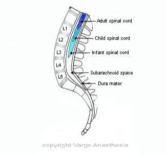

Spinal Cord Terminates    body {font-family: 'Open Sans', sans-serif;}

### Spinal Cord Terminates

The spinal cord does NOT run through the lumbar spine.  
  
The spinal cord ends at L1 in the adult and L3 in the infant. The location where the spinal cord ends and the conus medullaris begins varies slightly within the population.  
  
In adults, it is usually safe to place a spinal needle below L2, unless there is a known anatomical variation. Needle trauma to the cauda equina is unlikely. Individual nerves of the cauda equina are in a fluid environment and not likely to be pierced by a needle.  
  
The spinal cord extends from the foramen magnum to L1 in adult and  
extends to L3 in newborn  
Terminates at the conus medullaris and filum terminale and anchors in the lower sacral area.  
  
The cauda equina (not shown below) resembles strands of spaghetti surrounded by the CSF within the subarachnoid space. The floating nerve rootlets usually float away from the spinal needle. Intrathecal injections must be carried out in the area of the cauda equina (below L1). Puncture of and especially injection into the body of the spinal cord can cause significant damage.  

****

  

Chestnut, David.(2014) Chestnut’s Obstetric Anesthesia Principles and Practice. 2015) Chaudhuri, Kallol (2015) Obstetric Anesthesia ;.