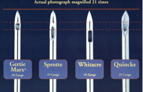
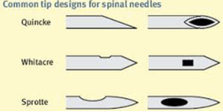
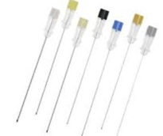

Spinal Needles and Images    body {font-family: 'Open Sans', sans-serif;}

### Spinal Needles and Images

  
_Daniel D. Moos, CRNA_

**Spinal Needle Length  
**Spinal needles are traditionally 3.5 inched long.  
There are also longer 5 inch spinal needles for larger patients, but rarely needed.  
Long 5 inch spinal needles are commonly used for a CSE because it needs to be able to extend past the 3.5 inch CSE Touhy and protrude the dura.  
  
**Spinal Needle Diameter  
25g is the most common  
  
DO NOT use a 22g Quincke Needle  
**“A large (22g) Quincke (cutting) needle can produce PDPH in 30-70% of cases, whereas a small (24-25g) Whitacre or Sprotte (pencil point) needle will produce PDPH in only 3-5%.”  
  
A 22g needle may be used in older patients > 50 with an arthritic back. We still usually initially attempt with a 25g spinal needle and convert to a 22g if we have issues.  
  
A 25-27g needle is used in patients that are less than 50 years of age.  
  
A smaller needle is used in the younger patient to decrease the incidence of post dural puncture headache.  
  
The removable stylet occludes the lumen and avoids tracking tissue into the subarachnoid space.  
  
**Needles are “Cutting” or “Blunt Tipped”**  
The **Quincke** needle is an example of a cutting needle, with the opening at the end of the needle.  

****

  
**Blunt tipped needles (pencil point)**  
  
The blunt tipped needle decreases the incidence of postdural puncture headaches compared to cutting needles. Whitacre and other pencil point needles, have a rounded tip with a side port.  
  
Sprotte needles have a long opening, allowing for excellent CSF flow.  

****

  

****

  

****

  

****