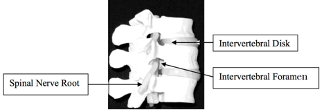
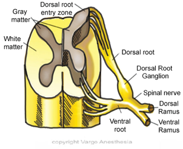
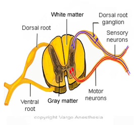

Spinal Nerve Roots    body {font-family: 'Open Sans', sans-serif;}

### Spinal Nerve Roots

**The spine is divided into 4 segments  
Cervical:** 7 vertebral segments, 8 nerve roots  
**Thoracic** **:** 12 vertebral segments,12 nerve roots  
**Lumbar** **:** 5 vertebral segments,5 nerve roots  
**Sacral** **:** 5 fused segments,5 nerve roots  
  
The peripheral nervous system begins at the nerve roots.  Each segment of the spinal cord gives rise to a ventral (anterior) motor and a dorsal (posterior) sensory nerve root. The spinal nerve roots can be damaged as they traverse the spinal (vertebral) canal, but are especially vulnerable in the intervertebral foramina, where the ventral and dorsal spinal roots join to form the spinal nerves.  
  
The spinal nerve roots are the origin of the spinal nerves where they first exit the spinal cord. The nerve roots are not visible because they run through the intervertebral foramina (bony canal) and dorsal (posterior) and ventral (anterior) roots fuse and become single spinal nerves when they exit the intervertebral vertebrae.  
The vertebrae must be removed to view the dorsal and ventral roots.  
**Note:** Dorsal is easy to remember as “posterior” when you think of a “dorsal fin” on a dolphin.  
  
Spinal nerve roots vary in size and structure from patient to patient. This may play a role in the quality of neuraxial blockade between patients when similar techniques are used.  
  
Dorsal roots are larger than the ventral roots.  
Dorsal roots are responsible for sensory blockade.  
Ventral roots are responsible for motor blockade.  
  
Even though the dorsal root is larger, it is blocked more easily than the smaller anterior root. This is due to the organization of the dorsal root into bundles which expose a larger surface area to local anesthetic solutions. Thus, sensory nerves are blocked more easily than are motor nerves.  
  
For this reason, the motor function of the lower extremities is preserved until late in the development of spinal and epidural anesthesia.  
  
The consequence of nerve root damage from any cause is known as a “radiculopathy” (L. radicula = little root; pathos = disease). The term “radicular pain” describes pain when it is mainly from a single nerve root.  
  
Two pairs of nerve roots from each segment of the spinal cord  
**Ventral (anterior) Nerve Roots:** Motor neurons exit through it  
**Dorsal** (posterior) Roots: Larger and sensory neurons pass through it  
**Dorsal Root Ganglion (spinal ganglia):** The small bulge on the dorsal root that contains the cell bodies of the sensory neurons  
  
**Fusion of the Dorsal and Ventral Nerve Roots  
**The dorsal and ventral nerve roots fuse while they are in the intervertebral foramen and become a single spinal nerve as it exits the vertebrae.  
  
**Intervetebral Foramina (singular foramen):** Lateral openings (bony canals) that occur between the adjacent vertebrae. These spaces allow the spinal nerves to exit the vertebral column.  
  
**Cervical Spinal Nerve Roots Numbered Above The Cervical Vertebrae  
**Each corresponding nerve root exits the spine in a specific pattern and this pattern differs between the cervical and the thoracic/lumbar regions.    
  
The spinal nerves exit the cervical spine ABOVE their corresponding CERVICAL vertebral body level.  
**For example** , the C7 nerve root exits above C7 through the C6-C7 neural foramen.  C8 exits in between T1 and C7, since there is no C8 vertebral body level.    
  
**Thoracic and Lumbar Spinal Nerve Roots exit below their corresponding vertebral body** This orientation is reversed in the thoracic and lumbar spine. The thoracic and lumbar spinal nerve roots exit below their corresponding vertebral body level.    
**For example,** the L3 nerve root exits below L3 through the L3-L4 foramen.  It is important to know which nerve root exits which foramen to determine whether a patient's radiculopathy symptoms can be explained by a specific anatomic derangement.     
  
Tuffier’s line (at the level of the iliac crests), crosses over the L4 vertebra. The vertebra just above it is L3. The spinal nerve root L3 exits at that level. Studies examining large numbers of lumbar spine radiographs have called this landmark into question and suggest that the level judged by palpation is often above the actual level, sometimes by two interspaces. Ultrasonography is the most accurate bedside method to determine spinal levels.  

****

  
  

****

  

****

  

Hughes, Samuel C., Levinson, Gershon, & Rosen, Mark A. (2002).  Snider and Levinson’s Anesthesia for Obstetrics.  (4 th  ed). Philadelphia: Lippincott, Williams & Wilkins.  
  
Morgan, Edward G., Mikhail, Maged S., & Murray, Michael J. (2002)  Clinical Anesthesiology.  (3 rd  ed). New York: McGraw-Hill Companies Inc.Mulroy, Michael F. (2002)  Regional Anesthesia: An Illustrated Procedural Guide . (3 rd  ed). Philadelphia: Lippincott, Williams & Wilkins.  
  
ODonnell, John M. (2003). Powerpoint Presentation,   Regional Anesthetic Techniques .  
  
Reese, Charles A. (1996).  Clinical Techniques of Regional Anesthesia.  (4 th  ed). Park Ridge: American Association of Nurse Anesthetists.  
  
Zwiers, William., Bauer, Jason., Hughes, Amy. (2003). Powerpoint Presentation,  Spinal Anesthesia, The Subarachnoid Block .  
  
Chestnut, David.(2014) Chestnut’s Obstetric Anesthesia Principles and Practice.  
  
Santos, Alan., Epstein, Jonathan.,(2015) Chaudhuri, Kallol Obstetric Anesthesia ; 2015.