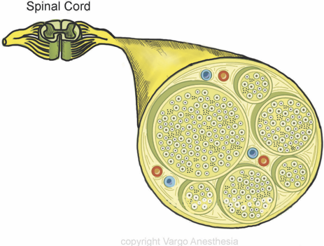
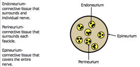

Spinal Nerve and Fibers in Cross Section    body {font-family: 'Open Sans', sans-serif;}

### Spinal Nerve and Fibers in Cross Section

As local anesthetic spreads and diffuses, and as distance to the site of action increases, a smaller concentration of local anesthetic is available to reach nerve roots.  
  
Spinal nerve roots contain several nerve fiber types.  
Small myelinated fibers are more susceptible to blockade than larger unmyelinated fibers.  
  
With a neuraxial block there is a difference between sympathetic, sensory, and motor block level. The sympathetic level is generally two to six dermatome levels higher than the sensory level. The sensory level is approximately two dermatome levels higher than the motor level.  
  
**Note:** _Those blood vessels that run with the nerves absorb local anesthetics weakening and reducing the duration of the block. They are sensitive to vasoconstriction by catecholamines. Epinephrine may be added to local anesthetic solutions to slow this absorption by these vessels, thus increasing the duration of the block.  
_

_****_

**Order of Nerve Blockage for Spinal and Epidurals  
B Fibers** \- preganglionic sympathetic (efferent) are blocked first (blood pressure drops)  
**C and A – delta fibers** \- temperature, pain and touch (afferents) are blocked second along with postganglionic sympathetic neurons**Large A Fibers below are located at the core of the nerve bundle** **gamma fibers  
A-beta fibers  
A-alpha fibers**  

****

  

Chestnut, David.(2014) Chestnut’s Obstetric Anesthesia Principles and Practice.  
  
Santos, Alan., Epstein, Jonathan.,(2015) Chaudhuri, Kallol Obstetric Anesthesia ; 2015.  
  
Anatomy of Human Spine  
(Mayfield Brain and Spine)  
http://www.mayfieldclinic.com/PE-AnatSpine.htm  
  
Spinal Cord Anatomy, Structure and Tracts (Ken Hub)  
https://www.kenhub.com/en/library/anatomy/the-spinal-cord  
  
**Gray's Anatomy for Students  
**By Richard Drake, A. Wayne Vogl, Adam W. M. Mitchell