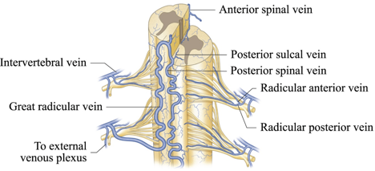

Spinal Veins    body {font-family: 'Open Sans', sans-serif;}

### Spinal Veins

Venous drainage of the spinal cord follows a similar distribution as the spinal arteries.  
  
**Anterior and Posterior Veins**There are 3 longitudinal anterior spinal veins and 3 posterior spinal veins that communicate with the segmental anterior and posterior radicular veins.  
  
_Drainage of the medial and lateral components of the epidural space is via the internal vertebral venous plexus.  
  
_  
Some literature states that there is just one posterior spinal vein, rather than two smaller posterolateral veins, and this is frequently of smaller caliber than the anterior median vein.  

****

  

Takase K, Akasaka J, Sawamura Y, et al. Preoperative MDCT evaluation of the artery of Adamkiewicz and its origin. J Comput Assist Tomogr. 2006;30(5):716-22.    
  
Yoshioka K, Niinuma H, Ohira A, et al. MR angiography and CT angiography of the artery of Adamkiewicz: noninvasive preoperative assessment of thoracoabdominal aortic aneurysm. Radiographics. 2003;23(5):1215-25.  
  
Etz CD, Kari FA, Mueller CS, et al. The collateral network concept: a reassessment of the anatomy of spinal cord perfusion. J Thorac Cardiovasc Surg. 2011;141(4):1020-8.