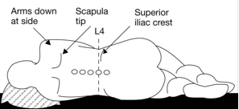

Spinal and Positioning    body {font-family: 'Open Sans', sans-serif;}

### Spinal and Positioning

Pregnant women have exaggerated lumbar lordosis **,** which makes it more difficult for them to flex the lumbar spine.  
Most pregnant women have sufficient flexibility to facilitate the insertion of a needle into the epidural or subarachnoid space.  
  
A spinal or epidural can be can be administered with the patient in either a  
seated or lateral decubitus position.  
**  
Advantages of seated position**  
Facilitates the identification of the spinous process  
Provides better respiratory mechanism  
Improves maternal comfort  
  
**Warning:** Seated position may cause an increased incidence of orthostatic hypotension. An assistant often is required while using the seated position.  
  
**Lateral Position  
**The patient is positioned with their back parallel with the side of the OR table. Thighs are flexed up, and neck is flexed forward (fetal position).  

****

  
**While in lateral position, the patient’s back should lie parallel to the edge of the bed for the following 2 reasons:  
**First, the edge is the firmest section of the mattress.  
If the patient lies away from the edge of the bed, the patient’s weight depresses the mattress, and the anesthesia provider must work in a downhill direction.  
  
It permits the anesthesia provider to keep his or her elbows flexed, which facilitates control of fine hand and wrist muscle movements. This is particularly important when using the loss of resistance technique for performing epidural anesthesia.  
  
**Advantages of Lateral Position**  
Better uteroplacental perfusion  
Lower incidence of orthostatic hypotension  
Facilitation of fetal heart rate monitoring during placement of the epidural catheter.  
Some patients feel more comfortable  
  
**Hyperbaric local anesthetic and lateral position  
**When administering a hyperbaric local anesthetic solution while the patient is in the lateral position, posture has more influence on the spread of spinal analgesia than epidural anesthesia.  
  
**For a spinal in the lateral positon (rare)  
**The patient should be lying on her right side and she should be tilted afterwards. If the local anesthetic is injected with the patient lying on her left side, and the leftward tilt is maintained thereafter, an asymmetric inadequate block may result.  
  
Posture has less influence on the spread of epidural anesthesia.  
During epidural anesthesia, a unilateral block more often results from malposition of the catheter than from prolonged use of one position.  

**Spinal and Epidural Anesthesia  
**https://medlineplus.gov/ency/article/007413.htm  
  
Chestnut, David.(2014) Chestnut’s Obstetric Anesthesia Principles and Practice.  
  
Santos, Alan., Epstein, Jonathan.,(2015) Chaudhuri, Kallol Obstetric Anesthesia ; 2015.  
  
IFNA / International Federation of Nurse Anesthetists  
Developing Countries Regional Anesthesia Lecture Series  
Daniel D. Moos CRNA, Ed.D. U.S.A.