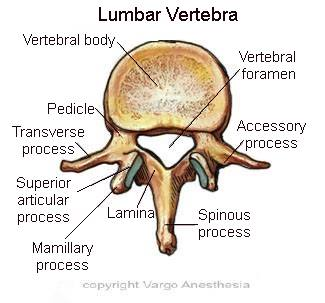
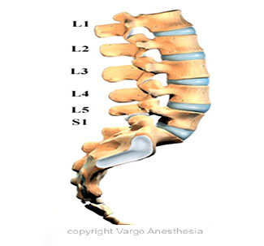

Spinous Process    body {font-family: 'Open Sans', sans-serif;}

### Spinous Process

The spinous process is a bony projection off the posterior (back) of each vertebra.  
Spinous processes resemble “fins” that extend posteriorly from the vertebrae.  
The spinous process provides the point of attachment for muscles and ligaments of the spine.  
Spinous processes are the ridges that can be felt through the skin along the back of the spine.  
Spinous processes, project downward and inferiorly  
Spinous processes of cervical vertebra 2-6 are bifid  
  
The angle of the transverse process in the lumbar and thoracic vertebrae dictate the angle of insertion of the needle when performing an epidural. The spinous process in the lumbar region is almost horizontal with flexion; in the thoracic spine they are angled in a more caudad direction.  

****

  
**_Note:_** _The word “Vertebrae” is plural and only one vertebra is shown, thus the singular form “vertebra.”_  

****

  

Chestnut, David.(2014) Chestnut’s Obstetric Anesthesia Principles and Practice.  
  
Santos, Alan., Epstein, Jonathan.,(2015) Chaudhuri, Kallol Obstetric Anesthesia ; 2015.  
  
**Gray's Anatomy for Students  
**By Richard Drake, A. Wayne Vogl, Adam W. M. Mitchell