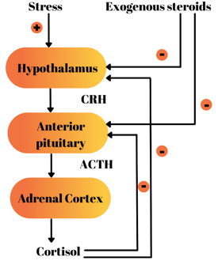

Steroid Perioperative Stress Dosing Review    body {font-family: 'Open Sans', sans-serif;}

### Steroid Perioperative Stress Dosing Review

\- Patients may present for surgery currently on glucocorticoids for treatment of systemic autoimmune inflammatory disease, asthma, and chronic pulmonary disease, and post organ transplantation.  
\- Recall that adrenal glucocorticoid stimulates phenylethanolamine N-methyltransferase (PNMT) to convert norepinephrine to epinephrine in the adrenal medulla.  
\- Naturally, plasma and adrenal corticosterone levels are very high during stress and tends to fall significantly with exogenous glucocorticoid supplementation.  
\- Patients with a recent history or currently taking steroids may have a suppressed hypothalamic-pituitary-adrenal (HPA) axis via negative feedback resulting in a secondary/tertiary adrenal insufficiency (AI).  
\- With AI, the adrenal cortex cannot secrete enough cortisol in times of stress.  
\- The inability of a suppressed HPA axis to secrete enough cortisol during the stress of surgery can result in cardiovascular collapse from an adrenal crisis.  
_\-Therefore, anesthesia providers usually administer a stress dose (supraphysiologic dose) o a glucocorticoid steroid to prevent this dilemma.  
_\- Patients with AI who are fasting before procedures, glucocorticoid therapy must be continued by parenteral routes if necessary.**Avoid Etomidate:  
**\- Suppression of the adrenal synthesis of cortisol by etomidate is a well-documented side effect.  
\- Dose-dependent in nature, it results in the inhibition of adrenal mitochondrial 11-β hydroxylase, the enzyme responsible for the final conversion of 11-deoxycortisol to cortisol.  
\- Hence, Etomidate should be avoided in patients at risk for adrenal suppression and adrenal crisis.  
  
**Physiology review:  
Adrenocorticosteroids are steroid derivatives produced in the adrenal cortex and include three endogenous hormones.**  
\- **_Glucocorticoids_** such as cortisol affect carbohydrate, fat, and protein metabolism and have anti-inflammatory, immunosuppressive, anti-proliferative, and vasoconstrictive effects.  
**_\- Mineralocorticoids_** such as aldosterone are primarily involved in the regulation of electroland water balance by modulating ion transport in the epithelial cells of the renal tubules of the kidney.  
**_\- Androgens_** (not discussed) such as testosterone are a group of sex hormones.  
**Glucocorticoids vs Mineralocorticoids:  
Glucocorticoids:  
**\- Produced in the zona fasciculata of the adrenal cortex.  
\- Controls body homeostasis, stress and immune responses.  
\- Example: Cortisol (hydrocortisone)  
  
**Cortisol mediates the following:**  
\- Carbohydrate and protein metabolism  
\- Fatty acid transfer  
\- Electrolyte and fluid balance  
\- Anti-inflammatory reactions  
\- Enables the synthesis and release of catecholamines  
\- Contributes to normal vascular permeability, vascular tone, and myocardial contraction by regulating β-receptor synthesis and regulation.  
  
**Mineralocorticoids:  
**\- Produced in the zona glomerulosa of the adrenal cortex  
\- Regulating the water and electrolyte balance  
\- Example: Aldosterone  
  
**Hypothalamic-pituitary-adrenal (HPA) axis:**  
\- The HPA axis regulates the secretion of adrenal cortical hormones listed above.  
\- The corticotropin-releasing hormone (CRH) secreted from the hypothalamus stimulates the secretion of adrenocorticotropic hormone (ACTH) in the anterior pituitary gland.  
\- ACTH then stimulates the adrenal gland to secrete glucocorticoid and mineralocorticoids.  
\- The cortisol blood concentration regulates the positive and negative feedback mechanisms that controls the secretion of the hormones.

****

**Cortisol and circadian rhythm**  
\- The secretion of cortisol changes and depends on the pulsatile secretion of CRH and ACTH according to the circadian rhythm.  
\- Serum cortisol concentration reaches the highest concentration around 6–9 am, then drops to the lowest concentration is around 11 pm to 1 am.  
  
**Serum cortisol levels:  
\-** **Adult daily secretion:** 5 to 10 mg/m2/day (body surface area per day), which is equivalent to equivalent to 5 to 7 mg of oral prednisone or 20 to 30 mg of hydrocortisone.  
**\- 6-9 am:** 15/mcg/dL  
**\- 11p-1am:** 2mcg/dL  
**\- Median value over 24-hour period:** 5.2 mcg/dL  
**\- Normal 24-hour basal secretion:** 8 to 10 mg/day  
\- **Minor surgery or illness:** Secretion of cortisol increases to 50 mg/day  
\- **Severe stress, major trauma:** Secretion rate can reach 200 to 500 mg/day  
**\- Serum levels during stress:** ↑ to 18-20 mcg/dL  
**\- Cortisol secretion during moderate stress:** ↑ up to 30-45 mcg/dL  
**\- Cortisol secretion during severe stress:** ↑ up to 260 mcg/dL  
**\- Note:** Therefore, a large dose of Solu-Medrol is administered with CABG procedures.  
\- Increased levels normalize within 24 to 48 hours after the stress is resolved.  
  
**Perioperative serum cortisol level changes:  
**\- Increase at the time of incision and during surgery.  
**  
The greatest ACTH and cortisol secretion occurs during:**  
\- Reversal of anesthesia  
\- Extubation  
\- The immediate postoperative recovery period, primarily in response to pain.  
  
**Levels of ACTH and cortisol secretion can be reduced by:  
**\- Regional block  
\- Local anesthetic injection prior to incision.  
\- Spinal or epidural anesthesia  
\- Opioids**  
  
Sudden stress (including surgical) activates the HPA axis.**  
Sudden stress will activate the HPA axis to increase serum ACTH and cortisol levels.  
**Stressors that activate the HPA axis:  
**\- Major surgery  
\- Trauma  
\- Burns  
\- Hypoglycemia  
\- High fever  
\- Hypotension  
\- Severe exercise  
\- Cold exposure  
\- Mental stress  
  
**Types of adrenal insufficiency (AI):  
Primary AI:** From a damaged adrenal gland by another cause.  
Example: Metastatic cancer, autoimmune diseases, infection, cancer….  
_Addison’s disease is the most common primary AI._  
**Secondary AI:** From a disease impairing the production of ACTH or CRH of the pituitary gland or hypothalamus.  
  
**Tertiary AI:** The most common form.  
\- Some literature refers to this type as secondary.  
\- It is widely included in secondary AI.  
\- Caused by the negative feedback effect due to iatrogenic corticosteroid therapy.  
\- The degree of adrenal dysfunction is variable and sometimes reversible.  
  
**Perioperative adrenal crises could be disastrous.  
Possible intraoperative symptoms and manifestations:  
  
**\- Severe hypotension refractory to vasopressors, studies have shown that the administration of low doses of vasopressin can be helpful.  
\- Poor response to decreasing depth of anesthesia.  
\- Poor response to fluid resuscitation.  
\- Require the management of metabolic abnormalities.  
\- Shock  
\- Tachycardia  
\- Hypoglycemia  
\- Hyponatremia  
\- Hyperkalemia  
\- Metabolic acidosis  
**  
Possible symptoms and manifestations of a postoperative adrenal crisis:  
**\- Unexplained PONV  
\- Unexplained hypotension  
\- Unexplained orthostasis  
\- Unexplained change in mental status  
\- Hyponatremia or hyperkalemia\- Hypoxia  
\- Fever  
\- Convulsions  
\- Syncope  
\- Lethargy  
**  
Benefits of an administration of exogenous glucocorticoid:**\- Vascular tone and maintenance of BP  
\- Catecholamine synthesis and secretion  
\- Myocardial contractility  
**Vascular tone and maintenance of blood pressure:**  
\- They have a permissive effect on vascular tone and maintenance of blood pressure.  
\- When administered with a vasopressor, glucocorticoids enhance vascular reactivity to vasopressors.  
  
**Catecholamine synthesis and secretion:  
**\- Cortisol is involved in catecholamine synthesis and mediates the release of catecholamine from sympathetic nerve cells.  
  
**\- Myocardial contractility:  
**\- In patients with hemodynamically unstable secondary adrenal insufficiency (AI), supplemental IV increases the stroke work index of the LV.**Indications for stress dose:  
Prediction of suppressed HPA axis patients:**  
**\- Patients who should be assumed to have functional suppression of their HPA include:**  
\- Any patient who is currently taking more than 20 mg/day of prednisone or its equivalent (e.g., 16 mg/day of methylprednisolone, 2 mg/day of dexamethasone, or 80 mg/day of hydrocortisone) for more than three weeks.  
\- Patients currently taking doses of 5 to 20 mg of prednisone (or its equivalent) for more than three weeks.  
\- On steroids with signs or symptoms of Cushing disease  
\- All routes of administration (oral, inhaled, topical, intranasal, intra-articular) can cause suppression of the HPA axis.  
  
**Prophylaxis dose:  
**\- An optimal stress dose has not been established.\- **Popular dose among anesthesia providers:** 100 mg of Solu-Cortef IV, preferably with intraoperative induction.  
\- 200 mg a day over the next two days  
**Possible side-effects of exogenous perioperative glucocorticoids:**  
\- Hyperglycemia  
\- Hypertension  
\- Fluid retention  
\- Edema  
\- Increased risk of infection (delayed wound healing)  
\- Confusion  
**  
Glucocorticoids have mineralocorticoid properties:**  
\- Glucocorticoids have mineralocorticoid properties that may result in dose-dependent edema/fluid retention and hypokalemia.  
\- If a patient requires a dose greater than 100 mg of Solu-Cortef, consider switching to methylprednisolone because it has a higher glucocorticoid to mineralocorticoid activity ratio.  
  
**Glucocorticoid conversion and potency chart:**

table.tableizer-table { font-size: 12px; border: 1px solid #CCC; font-family: Arial, Helvetica, sans-serif; } .tableizer-table td { padding: 4px; margin: 3px; border: 1px solid #CCC; } .tableizer-table th { background-color: #104E8B; color: #FFF; font-weight: bold; }

| Glucocorticoid | Approximate mg  
Equivalent dose | Anti-inflammatory  
Potency | Mineralocorticoid  
Potency | Biological  
half-life hours |
| --- | --- | --- | --- | --- |
| Solu-Cortef  
(hydrocortisone) | 20 | 1 | 2 | 8-12 |
| Prednisone | 5 | 4 | 1 | 18-36 |
| Prednisolone | 5 | 4 | 1 | 18-36 |
| Cortisone | 25 | 0.8 | 2 | 8-12 |
| Methylprednisolone | 4 | 5 | 0 | 18-36 |
| Triamcinolone | 4 | 5 | 0 | 12-36 |
| Dexamethasone | 0.75 | 20-30 | 0 | 36-54 |
| Betamethasone | 0.6-0.75 | 20-30 | 0 | 36-54 |

_Tarascon Pharmacoeia 2022  
_**  
Treatment for adrenal crises:  
**\- If the diagnosis for adrenal crises is made in time, it can easily be managed simply by administering 100 mg **Solu-Cortef (hydrocortisone) IV.  
****\- Repeat doses vary  
****\- Note:** Historically, 200-300 mg of hydrocortisone doses were a standard recommendation.  
  
_\- A coinciding presence of hypovolemia, hyperkalemia, and hyponatremia may also need to be addressed.  
_**\- When AI is not recognized, the condition may cause severe morbidity and be fatal.**  
  

Acute adrenal crisis after orthopedic surgery for pathologic fracture  
World Journal of Surgical Oncology 2007; 5: 27.  
Norifumi Naka, Satoshi Takenaka,Katsuhiko Nanno, Yu Moriguchi, Bang-mi Chun, Shunji Sonoda,Nobuyuki Hashimoto Yoshitane Tsukamoto, and Nobuhito Araki  
  
Addison’s disease: Perioperative treatment  
Open Anesthesia (accessed 02/2022)  
https://www.openanesthesia.org/addisons\_disease\_perioperative\_treatment/  
Hypothalamic-Pituitary-Adrenal Axis Suppression  
Anesthesiology July 2017 Vol. 127, 166–172.  
Melanie M. Liu, M.D. Andrea B. Reidy, M.D, Siavosh Saatee, M.D. Charles D. Collard, M.D.  
  
Perioperative glucocorticoid management based on current evidence  
Anesthesia & Pain Medicine (accessed 02/2022)Kwon Hui Seohttps://www.anesth-pain-med.org/m/journal/view.php?number=1057  
  
Requirement of perioperative stress doses of corticosteroids: a systematic review of the literature.  
Archives of Surgery 2008; 143: 1222–6.  
Marik PE, Varon J.  
  
The management of the surgical patient taking glucocorticoids  
UpToDate (accessed 02.2022)  
Amir H Hamrahian, MD **,** Sanziana Roman, MD, FACS **and** Stacey Milan, MD  
Modified-release hydrocortisone to provide circadian cortisol profiles.  
Journal of Clinical Endocrinol & Metabolism 2009; 94: 1548–54.  
Debono M, Ghobadi C, Rostami-Hodjegan A, Huatan H, Campbell MJ, Newell-Price J, et al.  
  
Corticosteroid withdrawal. In: Current Therapy in Endocrinology and Metabolism, 3rd Ed,  
Bardin CW (Ed), BC Decker, New York 1988. p.113.  
Christy NP.  
Perioperative steroid management: approaches based on current evidence.  
Anesthesiology 2017; 127: 166–72.  
Liu MM, Reidy AB, Saatee S, Collard CD.  
  
Guidelines for the management of glucocorticoids during the perioperative period for patients with adrenal insufficiency: guidelines from the Association of Anaesthetists, the Royal College of Physicians and the Society for Endocrinology UK.  
Anaesthesia 2020; 75: 654–63.  
Woodcock T, Barker P, Daniel S, Fletcher S, Wass JAH, Tomlinson JW, et al.  
  
Corticosteroid supplementation for adrenal insufficiency.  
JAMA 2002; 287: 236–40.  
Coursin DB, Wood KE.  
Management of adrenal insufficiency during the stress of medical illness and surgery  
The Medical Journal of Australia 2008; 188 (7): 409-413.  
Caroline Jung and Warrick J Inder