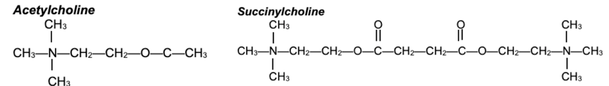

  Succinylcholine (Anectine, Quelicin) section { margin-bottom: 20px; } table { border-collapse: collapse; } table, tr, th, td { border: 1px solid black; } th, td { padding: 0px 8px 0px 8px; text-align: left; vertical-align: top; } h3, p, ol.custom-counter, li { margin: 0px; padding: 0px; } .text-red { color: red; } .text-black { color: black; } ul.custom-dash { list-style: none; padding-left: 0; margin: 0; } ul.custom-dash > li { display: flex; align-items: flex-start; } ul.custom-dash > li::before { content: "–"; margin-right: 0.5em; flex-shrink: 0; line-height: 1; } ul.custom-dash > li > \*:not(::before) { flex: 1; } ul.custom-dash > li.no-dash::before { content: ""; width: 1em; margin-right: 0.5em; flex-shrink: 0; } /\* Change the ol style \*/ ol.custom-counter { list-style: none; padding-left: 0; counter-reset: custom calc(var(--start, 1) - 1); } ol.custom-counter li { counter-increment: custom; margin-bottom: 5px; } ol.custom-counter li::before { content: counter(custom) ") "; } /\* This is just for this file \*/ ul.custom-bullet-arrow { list-style: none; padding-left: 0; margin: 0; } ul.custom-bullet-arrow > li { display: flex; align-items: flex-start; } ul.custom-bullet-arrow > li::before { content: "↑"; margin-right: 0.5em; flex-shrink: 0; } ul.custom-bullet-arrow > li.no-arrow::before { content: ""; width: 0.5em; margin-right: 0.5em; flex-shrink: 0; } ul.custom-bullet\_arrow ul { list-style-type: disc; padding-left: 1.5em; margin-top: 0.5em; } img.resized-200 { width: 200px; height: auto; } img.resized-400 { width: 400px; height: auto; } img.resized-600 { width: 600px; height: auto; } .mb-10px { margin-bottom: 10px; } .mb-20px { margin-bottom: 20px; } .mt-10px { margin-top: 10px; } .mt-20px { margin-top: 20px; } .reference-notes { font-size: 11px; } .text-indent-45px { text-indent: 45px; } .text-bold { font-weight: bold; }

### Succinylcholine (Anectine, Quelicin), Sch or Sucs

Sch is structurally two molecules of acetylcholine (ACh), and it is linked by an acetate methyl group.

Thus, it acts as an ACh agonist at both postsynaptic and extrajunctional ACh receptors.

<table><tbody><tr><th style="width: 150px;">Class</th><td style="width: 565px;">Depolarizing Neuromuscular Blocker- (the only one on the market)</td></tr><tr><th>Structure</th><td>
Structure bis-quaternary ammonium compound (contains two quaternary ammonium groups)
</td></tr><tr><th>Indications</th><td>
RSI or any situation requiring immediate muscle paralysis for intubation

Muscle relaxant of choice for a difficult airway

Off-label: Treatment of laryngospasms
</td></tr><tr><th>Action</th><td><ul class="custom-dash"><li>Creates a depolarization block (phase 1 block)</li><li>Mimics the action of ACh and binds to the postsynaptic cholinergic receptors at the neuromuscular junction (NMJ).</li><li><b>Produces a prolonged depolarization</b> of the endplate region</li><li class="text-bold">Desensitizes nicotinic acetylcholine receptors</li><li><b>Inactivates voltage-gated sodium channels</b> at the neuromuscular junction</li><li><b>Increase K+ permeability in surrounding membrane</b> (K+ out)</li><li>Results in <b>membrane hyperpolarization</b></li><li class="text-bold">Inhibits an action potential</li><li class="text-bold">Inhibits neuromuscular transmission</li></ul>
Muscle fasciculation followed by skeletal muscle paralysis

Does not affect smooth muscle
</td></tr><tr><th>Onset</th><td>
<b>IV:</b> 60 seconds

<b>IM:</b> 2-3 minutes
</td></tr><tr><th>Duration</th><td>
<b>IV:</b> 3-8 minutes

<b>IM:</b> 3-10 minutes
</td></tr><tr><th>Recovery of 90% of muscle strength</th><td>9-13 minutes after a 1mg/kg dose</td></tr><tr><th>Half Life</th><td>~5 minutes</td></tr><tr><th>Dosing</th><td>
<b>IV:</b> 1 mg/kg (3x the ED95)

<b>IM:</b> 2-3 mg/kg (Don't exceed 150 mg)

<b>For laryngospasm:</b> 0.1 mg/kg or 10 mg (1/2 mL is a common dose)- off-label
</td></tr><tr><th>Histamine release</th><td>Slight</td></tr><tr><th>Potassium release</th><td>Yes, ↑ K+ by 0.5- 1.0 mEq/dL in healthy patients within 3-5 minutes</td></tr><tr><th class="text-red">MH trigger</th><td>Yes</td></tr><tr><th>Metabolism</th><td>
Plasma cholinesterase (also known as pseudocholinesterase or butyrylcholinesterase) 90% of Sch is metabolized before it reaches the nicotine acetylcholine receptors Recovery of Sch-induced blockade occurs as Sch diffuses away from the NMJ.
</td></tr><tr><th>Elimination half-life</th><td>47 seconds</td></tr><tr><th>Route of elimination</th><td>10% of an administered dose is excreted unchanged in the urine.</td></tr><tr><th>Metabolites</th><td>
Succinylmonocholine and choline

The 10% of Sch that reaches the endplate diffuses away as serum levels of the drug fall, resulting in termination of paralysis.
</td></tr><tr><th>Prolongs the block</th><td>
Factors that decrease plasma cholinesterase activity:

Liver disease, malignancies, advanced age, malnutrition, burns, pregnancy, oral contraceptives, MOA inhibitors, lithium, corticosteroids, cytotoxic drugs, echothiophate, neoplastic disease, anticholinesterase drugs, metoclopramide, magnesium, lidocaine (amides), beta-blockers, Aminoglycosides, and bambuterol.
</td></tr><tr><th>Pregnancy</th><td>C</td></tr><tr><th>Breast feeding</th><td>Safe, due to 5-minute half-life and poorly absorbed orally</td></tr><tr><th>Contraindications</th><td>
ALS (Lou Gehrig's Disease)

Burn patient (&lt; 25% 3rd degree burns): Post 24 hours

Gullain-Barré Syndrome

Hyperkalemic periodic Paralysis

Malignant Hyperthermia

Muscular dystrophy (Duchenne)

Myotonias: Myotonic Dystrophy

Plasma Cholinesterase Deficiency

Muscular Denervation (peripheral nerve damage)

Refer to <em>"Succinylcholine Contraindications Cheat Sheets" for relative contraindications and details.</em>
</td></tr><tr><th>Side or adverse effects</th><td>
<b>Cardiac:</b> Bradycardia, junctional rhythm, sinus arrest if it activates cardiac muscarinic cholinergic receptors, where it mimics ACh.

Most likely occurs with the 2nd dose of Sch within 5 minutes of the 1st dose

Frequently seen in children and adults after repeated doses

<b>Hyperkalemia:</b> ↑ K+ by 0.5 - 1.0 mEq/dL in healthy patients, with greater increases in other conditions.

Refer to <em>"Succinylcholine Contraindications Cheat Sheets"</em>

<b>Myoglobinuria:</b> From skeletal muscle damage, especially in pediatrics

↑ Intraocular pressure: Peaks in 2-4 minutes, returns to normal in 6 minutes

↑ Intragastric pressure and lower esophageal sphincter (LES) pressure from the fasciculations of abdominal muscles.

↑ <b>ICP:</b> May be prevented by prior administration of a nondepolarizing NMBD

<b>Myalgias:</b> Prominent in the neck, back, and abdomen, especially in young people.

<b>Masseter spasm (Muscle Jaw Rigidity):</b> An increase in the masseter muscle tone may also be an early indicator of MH.

<b>Trismus</b> (difficulty opening the mouth)
</td></tr></tbody></table>

Extea Notes

**The current trend in Pediatrics is** to avoid using succinylcholine for induction whenever possible.

**Obese patients:** Have an increase in plasma cholinesterase so that you may need a larger dose of Anectine.

Succinylcholine and Hyperkalemia

In normal individuals, the increase in serum K+ is 0.5–1.0 mEq/L

It occurs within 3–5 minutes after the IV administration of succinylcholine and only lasts for less than 10–15 minutes.

However, in certain conditions, such as trauma, burns, infection, and certain neuromuscular disorders, there is an exaggerated increase in the serum K+ level that may manifest clinically in cardiac dysrhythmias and even cardiac arrest.

Fasciculations:

Succinylcholine is known to cause involuntary muscle contractions, or fasciculations, right before muscle paralysis sets in.

Some may appear violent, resulting in myalgia, after surgery.

An alternative to succinylcholine for RSI:

Due to succinylcholine's problematic side effects and multiple contraindications, rocuronium has increasingly replaced it as the paralytic of choice for rapid sequence induction.

With the availability of sugammadex for rapid reversal, the duration difference is less of a concern than it once was.

A vial of sugammadex should always be readily available for a quick reversal in case there is a "can't intubate, can't ventilate" situation.

The RSI dose of rocuronium is 1.2 mg/kg with an onset of 90 seconds.

Can a patient have an allergic reaction with their first exposure to Sux?

**Answer:** Yes

-   An allergic reaction from the first exposure to Sux would suggest a prior sensitization to a compound within rocuronium.
-   A study suggests that repetitive exposure to quaternary ammonium compounds used in hairdressing is a risk factor for sensitization muscle relaxants.
-   Hairdressers are routinely exposed to a wide range of hair products containing the quaternary ammonium compound.
-   This repeated exposure to quaternary ammonium compounds can lead to the development of IgE antibodies specific.
-   Sux contains two quaternary ammonium groups.
-   After the administration of Sux, the quaternary ammonium can act as an antigenic epitope, triggering an immune response in sensitized individuals and possibly an anaphylactic reaction.
-   One study showed that 7.4% of hairdressers had IgE antibodies to quaternary ammonium, compared to only 1.6% of non-hairdressing apprentices.

Stoelting’s Pharmacology & Physiology in Anesthetic Practice 6th Ed, 2022

CH. 12 Neuromuscular-Blocking Drugs and Reversal Agents, pp. 314-318

Pamela Flood, James P. Rathmell

Pharmacology of neuromuscular blocking drugs

BJA Education, Vol. 4, Issue 1, P. 2-7, Feb 2004

Janas Appiah-Ankam, MB ChB FRCA, and Jenifer M Hunter MB Chb, PhD FRCA

Plasma cholinesterase is associated with Chinese adolescent overweight or obesity and metabolic syndrome prediction

Diabetes, Metabolism Syndrome and Obesity, 2019 May 14;12:685–702.

Yanshuo Han 1,2, Yanan Ma 1,3, Yang Liu 1, Zhongyi Zhao 1, Shihan Zhen 1, Xuelian Yang , Zhiyong Xu 4, Deliang Wen sup,✉

Neuromuscular physiology and pharmacology.

Miller's Anesthesia, 9th edition; 2019:333-353.

by Michael A. Gropper MD PhD (Editor), Lars I. Eriksson MD (Editor), Lee A. Fleisher MD (Editor), Jeanine P. Wiener-Kronish

MD (Editor), Neal H. Cohen MD MPH MS (Editor), Kate Leslie MD (Editor)

Molecular Mechanisms

Anesthesiology 1 2006, Vol.104, 158-169.

Prevalence of IgE against neuromuscular blocking agents in hairdressers and bakers

Clinical & Experimental Allergy, 2013;43:1256-1262

Dong S, Acouetey DS, Guéant-Rodriguez R-M, Zmirou-Navier D, Rémen T, Blanca M, Mertes PM, Guéant J-L