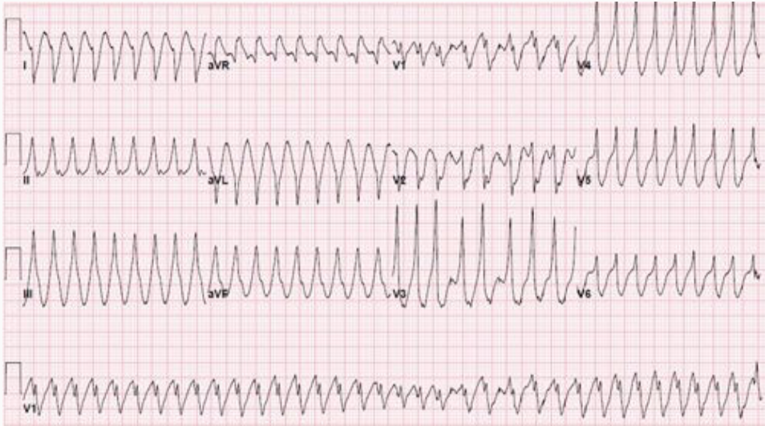

Supraventricular Antiarrhythmic IV Meds Cheat Sheet (Intraoperative)    body {font-family: 'Open Sans', sans-serif;}

### Supraventricular Antiarrhythmic IV Meds Cheat Sheet (Intraoperative)

**Supraventricular arrhythmias consist of:  
**Atrial fibrillation (A-fib)  
Atrial flutter (A-flutter)  
Premature atrial contractions (PACs)-rarely an issueSupraventricular tachycardia (SVT)_Many of the agents below are not readily available in operating rooms but are usually available in operating room pharmacies._  
**  
IV meds for acute supraventricular arrhythmias:  
**Procainamide (Pronestyl)  
Esmolol (Brevibloc)  
Metoprolol (Lopressor)  
Amiodarone (Cordarone)  
Ibutilide (Corvert)  
Vernakalant (Brinavess)  
Diltiazem (Cardizem)Verapamil (Calen)  
  
**Other therapy:**  
Adenosine  
Digoxin  
Cardioversion is recommended for an unstable patient refractory to medications.  
  
**Cardioversion for A-fib and flutter:**  
If a biphasic defibrillator is used, the optimal setting for synchronized cardioversion is:  
A-fib: 120-200 joules  
A-flutter: 50-100 joules  
  
**The goal of managing A-fib or A-flutter intraoperatively:  
**Maintain BP and perfusion  
Control the ventricular rate  
Prevent embolic complications  
  
**Quick summary:**  
When not contraindicated, a beta-blocker is commonly administered for attempting to break the onset of a tachyarrhythmia but not usually for ongoing rate control.  
When the beta-blocker is ineffective for rate control, a continuous infusion of a nondihydropyridine calcium channel is often started.  
  
**Special warnings:**  
When NOT to administer beta-blockers and nondihydropyridine calcium channel blockers for the management of supraventricular arrhythmias: table.tableizer-table { font-size: 12px; border: 1px solid #CCC; font-family: Arial, Helvetica, sans-serif; } .tableizer-table td { padding: 4px; margin: 3px; border: 1px solid #CCC; } .tableizer-table th { background-color: #104E8B; color: #FFF; font-weight: bold; }

|  |
| --- |
| When NOT to administer beta-blockers and nondihydropyridine calcium channel blockers for the management of supraventricular arrhythmias:  
  
Rapid ventricular response without preexcitation  
Decompensated heart failure  
LV systolic dysfunction (EF < 40%)  
Hypotension |

**Amiodarone** is the drug of choice in the above conditions for rate control.  
  
With Wolf-Parkinson-White Syndrome (WPW) and A-fib, the ABCD AV node blockers may generate ventricular fibrillation!  
Use Procainamide, Ibutilide, or DCCV (direct current cardioversion) in this scenario.  
**  
The “ABCD” AV blocking agents to avoid with WPW and A-fib.**  
A = Adenosine/amiodarone  
B = Beta-blockers  
C = Calcium channel blockers  
D = Digoxin  

****

**  
A-fib with WPW is very recognizable.  
**There are bizarre QRS with multiple morphologies and very fast rhythms with short R-R intervals.  
If you can find any R-R interval shorter than 240 msec, then AV nodal blockers are dangerous.  
  
Administering drugs that slow AV nodal conduction MAY block the AV node and permit the accessory pathway (which has faster conduction than the AV node) to assume a rate up to 300 bpm with a 1:1 atrial to ventricular conduction leading to ventricular fibrillation.  
  
Defibrillation is then required.  
Unfortunately, in this case, the adenosine or other AV nodal drugs have become a diagnostic tool informing you that the arrhythmia was originating in the atria with an accessory pathway.  
  
**Procainamide (Pronestyl) IV** table.tableizer-table { font-size: 12px; border: 1px solid #CCC; font-family: Arial, Helvetica, sans-serif; } .tableizer-table td { padding: 4px; margin: 3px; border: 1px solid #CCC; } .tableizer-table th { background-color: #104E8B; color: #FFF; font-weight: bold; }

|  |
| --- |
| _Procainamide has fallen out of favor due to its side effects and the development of newer antiarrhythmics._  
Not usually available in the operating room pyxis.  
  
**Antiarrhythmic class:** 1A  
Inhibits fast Na ion channels  
  
**Indications - Manage and treat:**  
Supraventricular arrhythmias: Acute A-fib, PACs, and SVT  
Precipitation of A-fib or A-flutter  
Convert accessary atrial pathway (AV nodal re-entrant tachycardia)  
Wolf-Parkinson-White syndrome  
Ventricular arrhythmias -Lidocaine and/or Amiodarone have become the first options.  
  
100 mg IV loading dose Q 5 mins until arrhythmia subsides (up to a total of 15 mg/kg) or  
Continuous Infusion: 2-6 mg/min  
  
**Off-label pediatrics:**  
2-6 mg/kg IV over 5 mins (max loading dose 100 mg)  
Repeat loading dose Q 5-10 mins PRN up to a max 15/mg/kg  
  
**Peds infusion:** 20-80 mcg/kg/min (max 2g/day) |

_See extra notes at the bottom of this page._**Esmolol (Brevibloc) IV** table.tableizer-table { font-size: 12px; border: 1px solid #CCC; font-family: Arial, Helvetica, sans-serif; } .tableizer-table td { padding: 4px; margin: 3px; border: 1px solid #CCC; } .tableizer-table th { background-color: #104E8B; color: #FFF; font-weight: bold; }

|  |
| --- |
| **Antiarrhythmic class:** II  
Decreases rate of depolarization  
  
Supraventricular antiarrhythmic indications: Converts or maintains a slow ventricular response in acute A-fib.  
**Ex.** SVT (rapid ventricular rate in patients with atrial fibrillation or atrial flutter)  
  
**Dose:** 0.5-1 mg/kg loading dose with each 50 mcg/kg/min increase in infusion  
  
**Infusion:** 50-300 mcg/kg/min  
Hypotension and bradycardia are limiting factors.  
A good drug for attempting to break the onset of a tachyarrhythmia but not for rate control if it is ineffective.  
Avoid with a rapid ventricular response without preexcitation, decompensated heart failure  
and/or LV systolic dysfunction, consider amiodarone |

**Metoprolol (Lopressor) IV** table.tableizer-table { font-size: 12px; border: 1px solid #CCC; font-family: Arial, Helvetica, sans-serif; } .tableizer-table td { padding: 4px; margin: 3px; border: 1px solid #CCC; } .tableizer-table th { background-color: #104E8B; color: #FFF; font-weight: bold; }

|  |
| --- |
| **Antiarrhythmic class:** II  
Decreases rate of depolarization  
2-20 mg bolus  
When not contraindicated, it is common to initially administer metoprolol at the onset of a rapid  
A-fib/flutter and follow with a Cardizem infusion if rate control is still indicated (stable patient).  
Avoid with a rapid ventricular response without preexcitation, decompensated heart failure  
and/or LV systolic dysfunction, consider amiodarone. |

**Amiodarone (Cordarone) IV** table.tableizer-table { font-size: 12px; border: 1px solid #CCC; font-family: Arial, Helvetica, sans-serif; } .tableizer-table td { padding: 4px; margin: 3px; border: 1px solid #CCC; } .tableizer-table th { background-color: #104E8B; color: #FFF; font-weight: bold; }

|  |
| --- |
| **Antiarrhythmic class:** III  
Inhibits K+ ion channels and converts acute A-fib and flutter to normal sinus  
5 mg/kg IV over 15 minutes (do not bolus)  
Then 300 mg over 1 hour → 0/5-1 mg/min x 24 hours  
SVT: Preferred in patients with impaired LV function or with heart failure or structural heart disease.  
Usually readily accessible intraoperatively.  
_Preferred over beta-blocks and calcium channels blockers with LV dysfunction and decompensated heart failure._ |

**Ibutilide (Corvert) IV** table.tableizer-table { font-size: 12px; border: 1px solid #CCC; font-family: Arial, Helvetica, sans-serif; } .tableizer-table td { padding: 4px; margin: 3px; border: 1px solid #CCC; } .tableizer-table th { background-color: #104E8B; color: #FFF; font-weight: bold; }

|  |
| --- |
| **Antiarrhythmic class:** III  
Inhibits K+ ion channels and converts acute A-fib and flutter to normal sinus  
  
**Adults (> 60 kg):** 1 mg IV over 10 mins; may repeat once  
**Adults (< 60 kg) and children:** 0.01 mg/kg IV over 10 mins; may repeat once  
Not usually available in the operating pyxis. |

**Vernakalant (Brinavess) IV** table.tableizer-table { font-size: 12px; border: 1px solid #CCC; font-family: Arial, Helvetica, sans-serif; } .tableizer-table td { padding: 4px; margin: 3px; border: 1px solid #CCC; } .tableizer-table th { background-color: #104E8B; color: #FFF; font-weight: bold; }

|  |
| --- |
| **Antiarrhythmic class:** III  
Inhibits K+ ion channels and converts acute A-fib and flutter to normal sinus  
3 mg/kg over 10 mins in acute-onset A-fib  
If no conversion; wait 15 mins then repeat with 2 mg/kg over 10 mins  
Hypotension may occur in few patients.  
Not usually available in the operating room pyxis. |

  
  
**Verapamil (Calan) IV** table.tableizer-table { font-size: 12px; border: 1px solid #CCC; font-family: Arial, Helvetica, sans-serif; } .tableizer-table td { padding: 4px; margin: 3px; border: 1px solid #CCC; } .tableizer-table th { background-color: #104E8B; color: #FFF; font-weight: bold; }

|  |
| --- |
| **Antiarrhythmic class:** IV  
Inhibits slow calcium channels  
Slows ventricular response to acute A-fib; converts AV node reentry SVT  
5-10 mg over 2 minutes (may repeat in 30 minutes)  
5-15 mg/hour continuous infusion  
Not usually available in the operating room pyxis.  
  
**Warning:** It may cause hypotension and exacerbate heart failure.  
Avoid if EF < 40%  
Preferred in severe COPD patients.  
It may increase digoxin serum levels. |

**Diltiazem (Cardizem)** table.tableizer-table { font-size: 12px; border: 1px solid #CCC; font-family: Arial, Helvetica, sans-serif; } .tableizer-table td { padding: 4px; margin: 3px; border: 1px solid #CCC; } .tableizer-table th { background-color: #104E8B; color: #FFF; font-weight: bold; }

|  |
| --- |
| For emergency and unstable situations  
It slows the AV node and converts AV node reentry and accessory pathway SVT.  
Aids in diagnosis of A-fib and A-flutter  
3-6 mg bolus and may repeat with 6-12 mg bolus  
  
**Children:** 100 mcg/kg bolus and may repeat with 200 mcg/kg bolus  
Not usually available in the operating pyxis. |

  
**Other therapy:  
****Adenosine (Adenocard)** table.tableizer-table { font-size: 12px; border: 1px solid #CCC; font-family: Arial, Helvetica, sans-serif; } .tableizer-table td { padding: 4px; margin: 3px; border: 1px solid #CCC; } .tableizer-table th { background-color: #104E8B; color: #FFF; font-weight: bold; }

|  |
| --- |
| **Antiarrhythmic class:** IV  
Inhibits slow calcium channels  
Slows ventricular response to acute A-fib; converts AV node reentry SVT  
0.25 mg/kg over 2 minutes (may repeat in 15 minutes)  
Then 5-15 mg/hr infusion.  
  
**Warning:** It may cause hypotension and exacerbate heart failure.  
Avoid if EF < 40%  
Preferred in severe COPD patients.  
It may increase digoxin serum levels. |

**Digoxin (Lanoxin)** table.tableizer-table { font-size: 12px; border: 1px solid #CCC; font-family: Arial, Helvetica, sans-serif; } .tableizer-table td { padding: 4px; margin: 3px; border: 1px solid #CCC; } .tableizer-table th { background-color: #104E8B; color: #FFF; font-weight: bold; }

|  |
| --- |
| When it's maintenance, IV therapy for A-fib or A-flutter  
Slow ventricular response  
Onset > 30 minutes  
  
**Adults:** 0.25 mg/kg IV bolus followed by 0.125mg Q 1-2 hours until the rate is controlled.  
Do not exceed 10 mcg/kg in 24 hours.  
  
**Children** (< 10 years): 10-30 mcg/kg load given in divided doses over 24 hours  
  
**Maintenance:** 25% of a loading dose  
Not usually available in the operating pyxis. |

**Procainamide extra notes:** table.tableizer-table { font-size: 12px; border: 1px solid #CCC; font-family: Arial, Helvetica, sans-serif; } .tableizer-table td { padding: 4px; margin: 3px; border: 1px solid #CCC; } .tableizer-table th { background-color: #104E8B; color: #FFF; font-weight: bold; }

|  |
| --- |
| **When to stop administering Procainamide:**  
Dysrhythmia suppressed  
QRS widens > 50%  
Hypotension  
A total of 15 mg/kg total or 1,000 mg  
  
**Notes:**  
FDA approved for ventricular arrhythmia and off-label for A-fib.  
52% conversion rate of A-fib to normal sinus  
28% conversion rate from -A-flutter to normal sinus  
  
**Mechanism of action:**  
Binds to fast sodium channels inhibiting recovery after repolarization.  
It also prolongs the action potential and reduces the speed of impulse conduction.  
  
**This results in:**  
Decreased myocardial excitability  
Slows conduction velocity  
Reduces myocardial contractility  
  
**Contraindications:**  
Hypersensitivity  
Complete heart block  
Lupus Erythematosus  
Torsades de pointes  
  
**Caution and warnings:**  
Reported blood dyscrasias in 0.5% of patients (Ex. thrombocytopenia, agranulocytosis)  
  
**Caution in patients with:**  
Heart failure  
Electrolyte imbalances (esp. hypokalemia and hypomagnesemia)  
Hepatic or renal impairment  
  
**Contraindications:**  
Hypersensitivity  
Complete heart block  
Lupus Erythematosus  
Torsades de pointes  
  
**Caution and warnings:**  
Reported blood dyscrasias in 0.5% of patients (Ex. thrombocytopenia, agranulocytosis)  
  
**Caution in patients with:**  
Heart failure  
Electrolyte imbalances (esp. hypokalemia and hypomagnesemia)  
Hepatic or renal impairment |

  
**Extra notes:  
**With A-fib, the atrial rate is actually 400 to 600 bpm.  
Normally, the AV node blocks a lot of that, resulting in maybe 150 bpm conducting to the ventricles.  
Most patients can tolerate that without losing consciousness or getting too dramatically hypotensive.  
  

Pocket Cardiology 2 nd Ed. 2023; section AF 8-5  
Marc S. Sabatine  
Walters Kluwer  
  
Advanced Cardiovascular Life Support Provider Manual 2020, page 88  
M. Mastnbjork, MD and S. Meloni, MD  
Medical Creations  
  
Kaplan’s Essentials of Cardiac Anesthesia for Noncardiac Surgery 2019, pages 269-271  
Joe A. Kaplan, MD, Brett Cronin, MD, and Timothy Maus MD  
  
Antiarrhythmic Medications  
StatPearls;June, 2022 (accessed 09/2022)  
Gregory S. King; Amandeep Goyal; Yulia Grigorova; Muhammad F. Hashmi.  
https://www.ncbi.nlm.nih.gov/books/NBK482322/  
  
Atrial Fibrillation in Wolff-Parkinson-White Syndrome  
Journal of American College Cardiology Case Reports. 2019 Oct, 1 (3) 403–404  
Andy Kieu and Vikram Nangia  
  
Procainamide  
StatPearls May 2022 (accessed 09/2022)  
Brian Pritchard; Holly Thompson  
https://www.ncbi.nlm.nih.gov/books/NBK557788/  
  
Procainamide  
Drugs.com  
https://www.drugs.com/pro/pronestyl.html  
  
Stoelting’s Pharmacology & Physiology in Anesthetic Practice 6 th Ed. 2022, CH 21  
Pamela Flood and James P. Rathmell  
  
Electrical versus pharmacological cardioversion for emergency department patients with acute atrial fibrillation (RAFF2): a partial factorial randomized trial.   
Lancet. 2020 Feb 01;395(10221):339-349.  
Stiell IG, Sivilotti MLA, Taljaard M, Birnie D, Vadeboncoeur A, Hohl CM, McRae AD, Rowe BH, Brison RJ, Thiruganasambandamoorthy V, Macle L, Borgundvaag B, Morris J, Mercier E, Clement CM, Brinkhurst J, Sheehan C, Brown E, Nemnom MJ, Wells GA, Perry JJ.  
  
Acute Treatment of Patients With Supraventricular Tachycardia  
JAMA Cardiology Clinical Guidelines Synopsis  
JAMA Cardiology. 2016;1(4):483-485.   
  
Metoprolol in the treatment of supraventricular tachyarrhythmias  
Annals of Clinical Research 1979 Feb;11(1):34-41.  
B Möller, C Ringqvist  
  
Effect of Amiodarone on Clinical Status and Left Ventricular Function in Patients With Congestive Heart Failure  
Circulation Vol. 93, 1996  
Barry M. Massie, Susan G. Fisher, Prakash C. Deedwania, Bramah N. Singh, Ross D. Fletcher, Steven N. Singh   
  
Atrial fibrillation in Wolff-Parkinson-White syndrome   
Healio.com (accessed 09/2022)  
https://tinyurl.com/47677x9b  
  
Wolff-Parkinson White Syndrome (WPW) and Atrioventricular reciprocating tachycardia (AVRT)  
Overview  
https://tinyurl.com/t4cxpauv  
  
Pocketbook Cardiology 2nd Ed. 2023; section AF 8-5  
Marc S. Sabatine  
  
Advanced Cardiovascular Life Support-Provider Manual 2020; page 88.  
M Mastenbjork, MD and S. Meloni MD