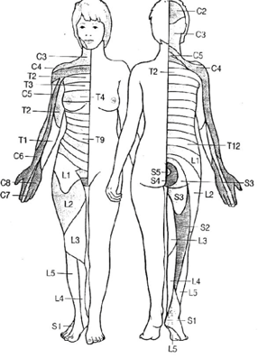

T10 Level (umbilicus)    body {font-family: 'Open Sans', sans-serif;}

### T10 Level (umbilicus)

  
_Daniel D. Moos CRNA_

A T10 Level should provide adequate anesthesia for procedures including:  
Hip surgery  
Vaginal delivery  
Vaginal/uterine surgery  
Bladder/prostate surgery  
  
A T12 Level should provide adequate anesthesia for procedures including:  
Lower extremity surgery without a tourniquet  
T10 Level (umbilicus)

****