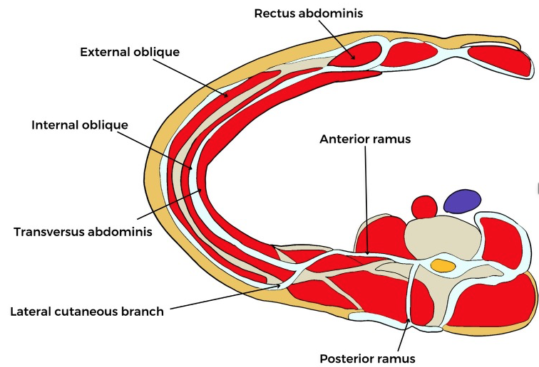
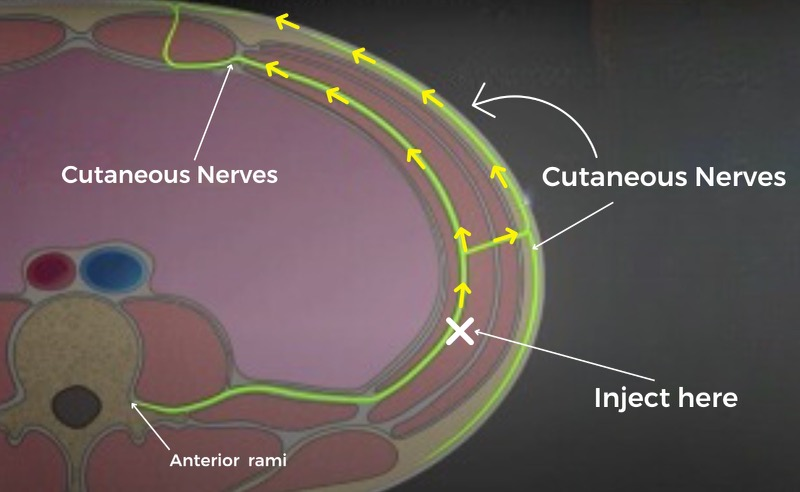
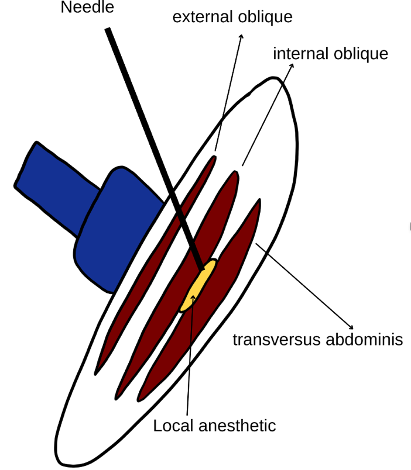
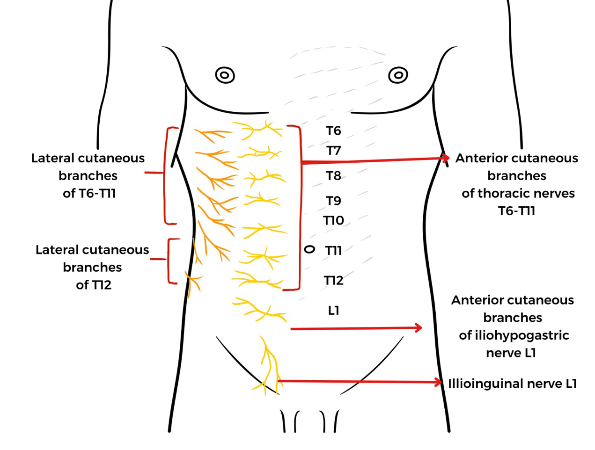
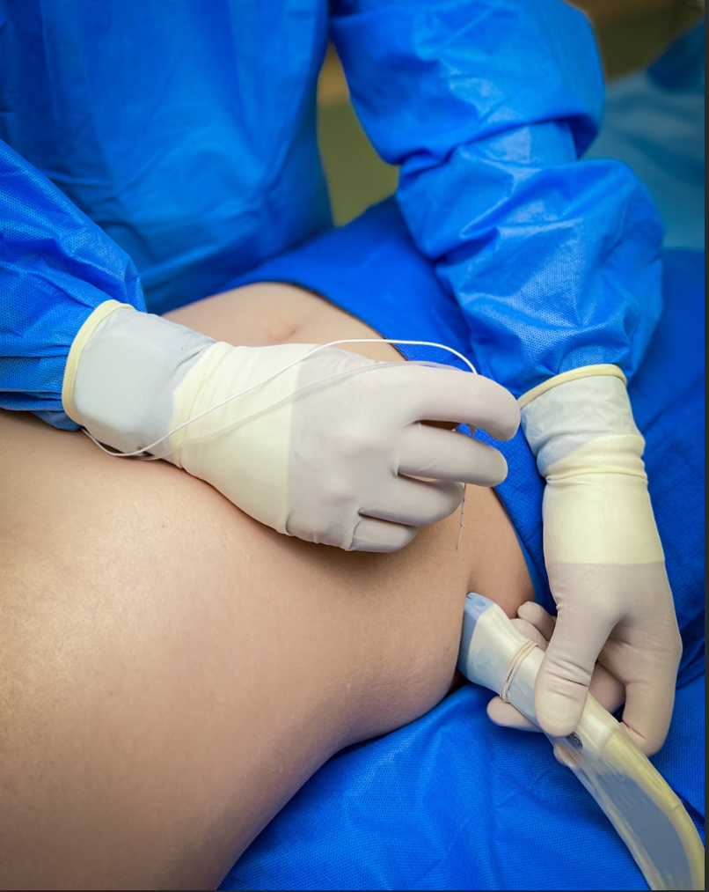

TAP Block Anatomy and Images    body {font-family: 'Open Sans', sans-serif;}

### TAP Block Anatomy and Images

**Goal:** To block the thoracolumbar nerves (T9 to T12) that travel from the spine and eventually loop around (lateral to anterior) and innervate the lower abdominal wall.  
Some literature states T10-T12.  
**  
The nerves being blocked with a TAP block:**  
These nerves arise from the anterior rami of spinal nerves T7 to L1.  
**These include:**  
Intercostal nerves (T7-T11)  
subcostal nerve (T12)  
Iliohypogastric and ilioinguinal nerves (L1).

****

**  
Spinal intercostal nerves:  
**The spinal intercostal nerves arise from the anterior rami while exiting the vertebral foramina and wind their way around the trunk between the tranversus abdominus and the internal oblique.  
They penetrate the rectus sheath before emerging anteriorly to innervate the anterior midline at the midaxillary line.  
They also give off the lateral cutaneous branches, which divide and innervate the anterolateral and posterolateral aspects of the trunk.

****

**  
Anterior and lateral cutaneous branches:**  
As seen below, these two branches divide and innervate the anterolateral and posterolateral aspects of the trunk.The anterior and lateral cutaneous nerves together innervate the majority of the truncal surface minus the area at the posterior midline intermuscular fascial plane.

****

**Goal:** Inject a local anesthetic where the “X” is to block the nerves upstream just prior to the lateral branch takeoff.  
This will result in the maximal effect.  
**TAP (Tranversus Abdominus Plane)  
**The intermuscular fascial plane is where the nerves travel between the tranversus abdominus and the internal oblique of the abdominal wall.  
  
**The lateral three layers of abdominal wall muscles are visualized laterally:**  
External oblique  
Internal oblique  
Transversus abdominis (innermost muscular layer of the anterolateral abdominal wall.

****

****

Lateral cutaneous branches of T7-T11: Supply the lateral thoracoabdominal wall.**Anterior cutaneous branches of T7-T11:** Innervate the anterior abdominal wall.

****

****

****

****

  
  

Transversus Abdominis Plane Block: An Updated Review of Anatomy and Techniques  
Biomed Research International 2017; 2017: 8284363 (accessed 05/2025)  
Hsiao-Chien Tsai, Takayuki Yoshida, Tai-Yuan Chuang, Sheng-Feng Yang, Chuen-Chau Chang,Han-Yun Yao, Yu-Ting Tai, Jui-An Lin,and Kung-Yen Chen  
  
Contributor: Michael MacKinnon DNP, FNP-C, CRNA, FAANA  
National University Associate Professor Doctor of Anesthesiology Program  
Ultrasound-Guided Transversus Abdominis Plane and Quadratus Lumborum Nerve Blocks  
NYSORA (accessed 05/2023)Hesham Elsharkawy and Thomas F. Bendtsen  
https://tinyurl.com/bd7cudh5  
  
Ultrasound Guided Transversus Abdominis Plane (TAP) Block  
Regional Anesthesiology and Acute Pain Medicine (accessed 5/2023)  
https://www.youtube.com/watch?v=OqedcP9OPvc