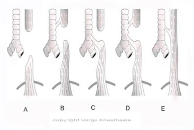

TE Fistula Types   

### TE Fistula Types

**There of 5 types of EAs/TEFs we refer to:  
Warning:** Classifications of Type A B,C D and-E fistulas vary between text books.  
The most popular TEF consist of a:  
1\. Proximal EA (closed pouch)  
2\. Fistula between distal esophagus and trachea (just above the carina)  
Most text books classify this most popular TEF as Type “C.”  
Unfortunately, some resources classify Type “C” as Type “A ” and it becomes confusing.However, they all state the most popular TEF has the proximal EA and distal fistula just above of near the carina.We were taught that Type C is the popular TEF.See image below.

****

**Type A**  
Pure EA (no TEF), Second most common -10-12%  
Esophageal atresia (blind esophageal pouch)  
No tracheal communication  
Nothing going to the stomach (abdomen will be scaphoid)

**Type B  
**Esophageal atresia  
Proximal esophageal segment communicates with the trachea.

**Type C (most popular-84%)  
**Esophageal atresia (blind esophageal pouch)  
Distal esophageal segment communicates with the posterior trachea  
  
**Type D**  
Esophageal atresia (blind esophageal pouch)  
Both proximal and distal esophageal segments communicate with the trachea

**Type E** “H-Type” (**fistula is due to its shape)**  
Esophageal atresia (blind esophageal pouch)  
Both proximal and distal esophageal segments communicate with the trachea  
Presentation are different than the other fistulae because there is no EA.  
So, the diagnosis can be much later.