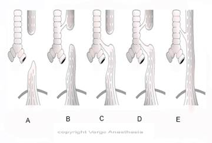

TE Fistula and Esophogeal Atresia Review   

### TE Fistula and Esophogeal Atresia Review

Almost 50 years ago, the mortality rate for TE-Fistula was 100%. Today the survival rate  
is nearly 100% in full term infants that are free of other anomalies and who have not developed pulmonary complications.

TE fistula is an abnormal connection (fistula) in one or more places between the esophagus and the trachea. When a baby with a TE fistula swallows, the liquid can pass through the fistula between the esophagus and the trachea leading to aspiration and pneumonia.

**Esophageal atresia** (EA) is characterized by incomplete formation of the esophagus-usually a closed pouch. It is often associated with a fistula between the trachea and the esophagus. Many anatomic variations of esophageal atresia with or without a TEF have been described. The esophagus has two segments, one that connects to the hypopharynx and the other that connects to the stomach. However, the hollow centers of these two segments do not connect to each other, forming two separate parts. If this infant feeds, the upper part fills up and liquid overflows into the trachea (if there is a TEF), leading to aspiration and pneumonia. For this reason, a baby with EA must remain NPO.  
  
In literature, TEF and EA are often written together because they usually occur together.  
  
**Pathophysiology**  
During the fourth and fifth week of gestation, a tracheoesophageal septum develops at the site where the longitudinal tracheoesophageal folds fuse together. This septum divides the foregut into a ventral portion, the laryngotracheal tube and a dorsal portion (the esophagus). Esophageal atresia results if the tracheoesophageal septum is deviated posteriorly. This deviation causes incomplete separation of the esophagus from the laryngotracheal tube and results in a concurrent tracheoesophageal fistula.  
  
**TEF Occurrence:** 1:3,500 (1/3 are premature)  
**Associated Anomalies:** 50% with or without an EA

Holzki et al. published the bronchoscopic findings of 67%, the TEF was >1 cm above the carina, 22% <1 cm above the carina and 11% below the carina.

**A TEF with EA:** 25% have cardiac defects (common ones below)  
Ventricular septal defect  
PDA  
Tetralogy of Fallot

**Associated Congenital Anomalies with EA (with or without TEF)**  
  
**EA Associated GI Malformations (with or without TEF) 10-15%**  
Imperforate anus  
Duodenal atresia  
Malrotation  
Duodenal atresia  
Intestinal malformations  
Meckel's diverticulum,  
Annular pancreas

**EA Associated Genitourinary Malformations (with or without TEF) 10-15%**  
Renal agenesis or dysplasia,  
Horseshoe kidney  
Polycystic kidney  
Ureteral and urethral malformations  
Hypospadias  

**EA Associated Musculoskeletal Malformations (with or without TEF) 20-30%  
**Hemivertebrae  
Radial dysplasia or Amelia  
Polydactyly  
Syndactyly  
Rib malformations  
Scoliosis  
Lower limb defects

**EA Associated Cardiac defects Malformations (with or without TEF)  
**VSD  
ASD  
PDA  
Tetralogy of Fallot  
Single umbilical artery  
Right-sided aortic arch  
Tricuspid Atresia  
Transposition of Great Arteries

**EA Associated Multiple genetic abnormalities and syndromes (TEF with TE) 1.7%  
**Trisomies 13, 18, and 21  
Charge Syndrome 10%  
Feingold syndrome  
Pallister-Hall syndrome  
Anophthalmia-esophogeal-genital syndrome  
Fanconi anemia  
Opitz syndrome  
VACTERL

**Charge Syndrome** (an autosomal dominant syndrome) associated with  
Coloboma  
Heart anomaly  
Choanal atresia  
Mental retardation  
Genital hypoplasia  
Ear abnormalities

**Pulmonary anomalies – 2.1%  
  
Craniofacial malformations - 9.7%  
  
Prenatal Ultrasound Findings for possible TE fistula with EA**  
Mom with polyhydramnios  
Absence of fluid in the stomach  
Small sized abdomen  
Dilated proximal esophageal pouch  
  
**Note:** Polyhydramnios and the absence or small stomach bubble have a positive predictive value close to 50% of a TEF. These neonates will be immediately evaluated after birth.

**Ultrasound: EA and Polyhydramnios** -is common due to the inability of the fetus to swallow amniotic fluid. The proximal esophageal pouch may hypertrophy and cause compression of the trachea. This compression can cause tracheomalacia.

A Fetal **MRI** can confirm prenatally  
**  
Signs and Symptoms of TE fistula with EA**Coughing, gagging and cyanosis, may increase after feedings  
Crackles  
Cyanosis  
Vomiting  
Copious, fine, white, frothy bubbles of mucus in the mouth and, sometimes, the nose.  
Possibly respiratory distress  
Abdominal distension  
Aspiration  
Subsequent pneumonitis  

Passing an NG tube for suspected TEF with TE (newborn)  
With EA: The tube should stop at no more than _10-12cm.  
_Absence of EA: Stomach is reached at 17cm  
  
**Chest X-ray:**  
A Chest X-ray can be done immediately following the passing of an NG Tube.  
When NG Tube fails to pass and there is coiling in the proximal atretic segment (pouch).  
Tracheal compression  
Absence of gastric bubble in pure EA or with proximal fistulae.  
**Barium swallow:** should be avoided-controversial

**There of 5 types of EAs/TEFs we refer to:  
Warning:** Classifications of Type A B,C D and-E fistulas vary between text books.  
The most popular TEF consist of a:  
1\. Proximal EA (closed pouch)  
2\. Fistula between distal esophagus and trachea (just above the carina)  
Most text books classify this most popular TEF as Type “C.”  
Unfortunately, some resources classify Type “C” as Type “A.”However, they all state the most popular TEF has the proximal EA and distal fistula just above of near the carina.We were taught that Type C is the popular TEF.**  
  
**Pure EA (no TEF), Second most common -10-12%  
Esophageal atresia (blind esophageal pouch)  
No tracheal communication  
Nothing going to the stomach (abdomen will be scaphoid)

**Type B  
**Esophageal atresia  
Proximal esophageal segment communicates with the trachea.

**Type C (most popular-84%)  
**Esophageal atresia (blind esophageal pouch)  
Distal esophageal segment communicates with the posterior trachea  
  
**Type D**  
Esophageal atresia (blind esophageal pouch)  
Both proximal and distal esophageal segments communicate with the trachea

**Type E** “H-Type” (**fistula is due to its shape)**  
Esophageal atresia (blind esophageal pouch)  
Both proximal and distal esophageal segments communicate with the trachea.  
Presentation are different than the other fistulae because there is no EA.  
So the diagnosis can me much later.  

Fistula between the trachea and the distal esophagus-usually close to the carina  
**Common Symptoms of “H-Type” fistula**  
Frequent episodes of pneumonia due to recurrent aspiration.  
Choking during feeding for a large fistula

**Once Diagnosed (preparation for surgery)  
**NPO  
IV Fluids started (usually D10W)  
Keep oral pharynx clear  
8 French sump tube placed to allow for continuous suctioning of the upper pouch  
Neonates head is elevated  
O2 to maintain SaO2  
Intubated if respiratory failure occurred  
NOT to bag-mask ventilate: Neonatal nurses know that bag-masking can cause acute gastric distention requiring emergency gastrostomy.

**Antibiotics:** Some institutions use administer antibiotics prophylactically due to the  
increases aspiration risk. If sepsis or pulmonary infection is suspected, broad-spectrum antibiotics such as ampicillin and gentamicin are administered.

The neonate is also evaluated thoroughly for other congenital anomalies

**Chest and abdominal X-rays for:**  
Skeletal abnormalities  
Cardiovascular malformations  
Pneumonia and a right aortic arch.  
Obstruction and malrotation

**Contrast upper GI** is not usually necessary for evaluation of classic esophageal atresia.  
  
An echocardiogram and renal ultrasonogram may also be obtained

**G-Tube for pneumonia or atelectasis  
**For severe pneumonia or atelectasis, a Gastrostomy tube may is inserted to

prevent reflux of gastric contents through the fistula and into the trachea.

Healthy infants without pulmonary complications or other major anomalies usually can undergo primary surgical repair in the first few days of life. Survival rates in this group of patients approach 100 percent

**Surgical repair with involving other complications**

Surgery is delayed for the following:  
Low birth weight.  
Other major anomalies.  
  
Premature low-birth-weight infants, and infants with major concomitant malformations are usually treated with TPN (total parenteral nutrition).

Gastrostomy and upper pouch suction until they are appropriate surgical candidates.  
  
The survival rate in this group is lower but in the range of 80 to 95 percent. Cardiac anomalies typically are the cause of death in these more complicated cases.

Most neonates who undergo repair of EA and TEF end up having some degree of esophageal dysmotility.  
Esophageal strictures at the site of the anastomosis are common and may subsequently require dilatation. Serial esophagraphy should be performed at two months, six months and one year of age, or whenever swallowing difficulties occur.

Recurrence of the TEF has been reported; recurrence requires repeat surgical correction. Recurrence is most common at the site of the primary anastomosis.

Approximately 50% of patients with surgically corrected esophageal atresia develop GERD. Of those who develop GERD, one half respond to routine medical therapy with prokinetic agents, histamine H2 receptor blockers, or both, and one half require surgical intervention for correction.

The post surgically corrected patients with longstanding GERD may develop esophageal mucosal changes such as esophagitis and gastric metaplasia (Barrett's esophagus).

Adenocarcinoma of the esophagus has occurred from gastric metaplasia from the repair of EA 20 years after neonatal anastomosis. For these reasons, some doctors advocate long-term endoscopic follow-up in these patients.

Gregory and Andropoulus; Gregory’s Pediatric Anesthesia; Fifth Edition; 2012  
  
Houck, Hach’e and Sun; Handbook of Pediatric Aesthesia; 2015  
  
Litman; Basics of Pediatric Anesthesia; 2013.  
  
Davis, Cladis and Motoyama; Smith's Anesthesia for Infants and Children, 8th Edition; 2011.  
https://pedclerk.bsd.uchicago.edu/page/tracheoesophageal-fistula  
**http://www.aafp.org/afpO21999/0215/p910.html**  
Depaepe A, Dolk H, Lechat MF. The epidemiology of tracheo-oesophageal fistula and oesophageal atresia in Europe. EUROCAT Working Group. Arch Dis Child 1993; 68:743.  
GeneReviews™ \[Internet\]. Pagon RA, Bird TD, Dolan CR, et al., editors. Seattle (WA): University of Washington, Seattle; 1993-. http://www.ncbi.nlm.nih.gov/books/NBK5192/  
Clark DC. Esophageal atresia and tracheoesophageal fistula. Am Fam Physician 1999; 59:910.  
Goyal A, Jones MO, Couriel JM, Losty PD. Oesophageal atresia and tracheo-oesophageal fistula. Arch Dis Child Fetal Neonatal Ed 2006; 91:F381.  
Luo CC, et al. A new variant of esophageal atresia with distal tracheo-antral fistula associated with congenital intrathoracic stomach and situs inversus. Journal of Ped Surg 2003; 38:7; E25-27  
Spitz L, Kiely EM, Morecroft JA, Drake DP. Oesophageal atresia: at-risk groups for the 1990s. _J Pediatr Surg_. 1994;29:723–5.  
Spitz L. Esophageal atresia: past, present, and future. _J Pediatr Surg_. 1996;31:19–25.  
  
Martin LW, Alexander F. Esophageal atresia. _Surg Clin North Am_. 1985;65:1099–113.  
  
Foglia RP. Esophageal disease in the pediatric age group. _Chest Surg Clin North Am_. 1994;4:785–809.  
German JC, Mahour GH, Woolley MM. Esophageal atresia and associated anomalies. _J Pediatr Surg_. 1976;11:299–306.  
Holder TM, Ashcraft KW, Sharp RJ, Amoury RA. Care of infants with esophageal atresia, tracheoesophageal fistula, and associated anomalies. _J Thorac Cardiovasc Surg_. 1987;94:828–35.  
  
Poenaru D, Laberge JM, Neilson IR, Guttman FM. A new prognostic classification for esophageal atresia. _Surgery_. 1993;113:426–32.  
Ein SH, Shandling B, Wesson D, Filler RM. Esophageal atresia with distal tracheoesophageal fistula: associated anomalies and prognosis in the 1980s. _J Pediatr Surg_. 1989;24:1055–9.