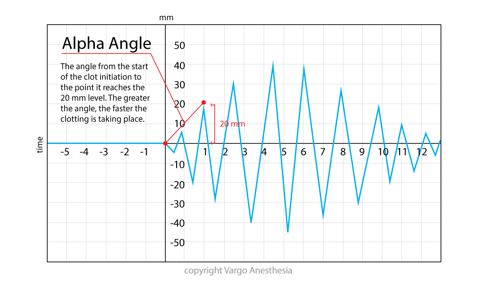

TEG Alpha Angle    body {font-family: 'Open Sans', sans-serif; padding-left: 10px;}

**Alpha Angle (53-72 degrees)**Alpha Angle reflects the speed of fibrin accumulation and cross-linking (clot strengthening).  
Alpha Angle is impacted by: Fibrinogen

A low value represents a deficient in fibrinogen and treated with cryoprecipitate.

  

  
  
Thromboelastograms  
Data Interpretation in Anesthesia, 2017, CH 30 and 31  
By Tilak D. Raj  
Springer  
  
Thromboelastogram TEG  
AETCM Emergency Medicine (accessed 06/2021)  
https://www.youtube.com/watch?v=YGChy0IbOoU