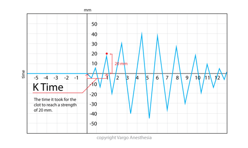

TEG K (Kinetic) Time    body {font-family: 'Open Sans', sans-serif; padding-left: 10px;}

**TEG K (Kinetic) Time**

**K (Kinetic) Time 1-3 minutes  
**K is the time elapsed until the clot reaches a fixed strength (20mm).  
K is impacted by Fibrinogen.  

Together with the alpha angle, it is a measure of clot strengthening.  
Elevation of K time represents a deficiency of Fibrinogen and is treated with FFP/Cryoprecipitate.

  

  
  
Thromboelastograms  
Data Interpretation in Anesthesia, 2017, CH 30 and 31  
By Tilak D. Raj  
Springer  
  
Thromboelastogram TEG  
AETCM Emergency Medicine (accessed 06/2021)  
https://www.youtube.com/watch?v=YGChy0IbOoU