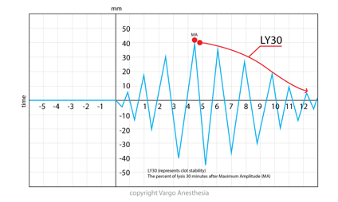

TEG LY30    body {font-family: 'Open Sans', sans-serif; padding-left: 10px;}

**TEG LY30**

  

**LY30** 0-8%  
Basically shows clotting stability and clot breakdown.  
LY30 is the percentage of amplitude reduction 30 minutes after its maximum amplitude(MA).  
LY30 is a measure of Fibrinolysis.

  

  
  
Thromboelastograms  
Data Interpretation in Anesthesia, 2017, CH 30 and 31  
By Tilak D. Raj  
Springer  
  
Thromboelastogram TEG  
AETCM Emergency Medicine (accessed 06/2021)  
https://www.youtube.com/watch?v=YGChy0IbOoU