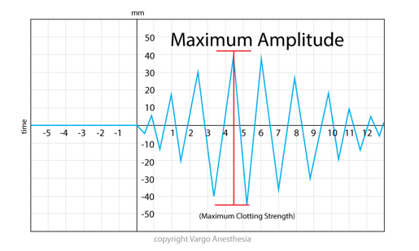

TEG MA (Maximum Amplitude)    body {font-family: 'Open Sans', sans-serif; padding-left: 10px;}

**MA (Maximum Amplitude)  
  
****MA** (Maximum Amplitude) 50-70mm  
MA is basically represents the ultimate strength of the clot.  
The taller (greater the amplitude) the stronger the clot.  
MA is the highest vertical amplitude of the TEG.  
The MA is impacted by Platelets  
(A direct function of the maximum dynamic properties of the fibrin and platelet bonding via GPIIb/IIIa.)  
A low MA represents deficient platelets and treated with Platelets.

  

  
  
Thromboelastograms  
Data Interpretation in Anesthesia, 2017, CH 30 and 31  
By Tilak D. Raj  
Springer  
  
Thromboelastogram TEG  
AETCM Emergency Medicine (accessed 06/2021)  
https://www.youtube.com/watch?v=YGChy0IbOoU