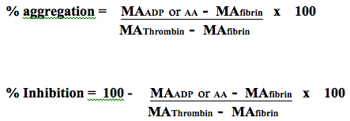

TEG Platelet Mapping    body {font-family: 'Open Sans', sans-serif;}

### Thromboelastography (TEG) Platelet Mapping

TEG is a blood test designed to analyze the entire clot formation.  
TEG Platelet Mapping is a new modification of the TEG to platelet contribution to the clot strength.  
  
**TEG Platelet Mapping can assess:  
**Aspirin  
P2Y12 inhibitors  
GP IIb/IIIa inhibitors  
  
**Advantages of TEG Platelet Mapping  
**Low sample volume needed.  
Offers additional viscoelastic properties.  
Offers additional information on coagulation pathways.**  
  
Disadvantages of TEG Platelet Mapping  
**MA value from the TEG may take 30-40 minutes after the onset of the test.  
Requires the use of 3 different channels.  
Requires 2 TEG devices for one patient.  
Minimal literature and data available.  
More demanding than other platelet function tests.  
Requires repeated pipetting for sample preparations.  
  
**How TEG Platelet Mapping works**  
  
**Provides platelet information through 4 different blood tests.**  
1) **MAThrombin :** (potential for maximum clot strength)  
A Kaolin activated sample produces a strong thrombin response to  
MAXIMALLY activate all platelets and cleave all available fibrinogen  
demonstrating the underlying potential for maximum clot strength.  
  
2) **MAA :** This assay blocks all thrombin and uses a special activator to demonstrate the clot  
strength coming from fibrin.  
  
3 rd and 4 th assays also block all thrombin and activate platelets at their **ADP-activated receptor  
**(those which clopidogrel inhibits) or **Thromboxane A2 receptor** (which aspirin affects).  
  
This demonstrates clot strength when platelets are activated ONLY through those  
specific receptors ( **MAADP** or **MAAA ).** (AA= Arachidonic acid)  
  
**2 equations  
  
**

********

**  
  
TEG Platelet Mapping normal values (no antiplatelet therapy)**

<table><tbody><tr><td width="76">
<strong>Assay</strong>
</td><td width="126">
<strong>Normal Values (mm)</strong>
</td></tr><tr><td width="76">
<strong>MA </strong><strong>thrombin</strong>
</td><td width="126">
<strong>60.9 ( </strong>± 4.5)
</td></tr><tr><td width="76">
<strong>MA </strong><strong>fibrin</strong>
</td><td width="126">
<strong>7.5 ( </strong>± 2.7)
</td></tr><tr><td width="76">
<strong>MA </strong><strong>AA</strong>
</td><td width="126">
<strong>64.6 ( </strong>± 2.7)
</td></tr><tr><td width="76">
<strong>MA </strong><strong>ADP</strong>
</td><td width="126">
<strong>51.1 ( </strong>± 8.1)
</td></tr></tbody></table>

(Bochsen et al. 2007)  
  
**Interpretation** (very little data available)  
**  
Aspirin resistance**  
**AA assay** showing > 50% aggregation or < 50% inhibition of platelet.  
**  
P2Y12 inhibitory drug resistance  
**ADP assay showing > 50% aggregation or < 50% inhibition of platelet.  
**MAADP** \> 47mm is associated with increased ischemic risk.  
**MAADP** < 31mm is associated with increased bleeding risk.  

Perioperative Hemostasis – Coagulation for Anesthesiologist  
C. Marcucci and P. Schoettker; 2015. Pp 58-60.  
TEG Platelet Mapping  
2016 Haemonetics Corporation. Haemonetics, Haemonetics The Blood Management Company and TEG  
https://www.haemonetics.com/~/media/sharepoint/devices/teg/marketing/brochures/teg\_plateletmapping/col-pp-000196-us\_teg\_plateletmapping\_assay%20pdf.pdf  
  
Perioperative Hemostasis –Coagulation for Anesthesiologist  
C. Marcucci and P. Schoettker; 2015. Pp 58-60