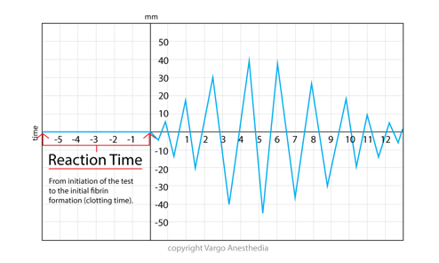

TEG R Time    body {font-family: 'Open Sans', sans-serif; padding-left: 10px;}

**TEG R Time (Reaction Time)  
**_(looks like a needle pointer at the beginning of the image)  
_  
**R (reaction time): 5-10 minutes**

**R**: is a period of time the time blood was placed in the TEG analyzer until the initiation of fibrin formation.  
Basically "Clotting time" impacted by "Coagulation Factors."  
\> 10 minutes represents a deficient in clotting factors and is treated with FFP.

  

  
  
Thromboelastograms  
Data Interpretation in Anesthesia, 2017, CH 30 and 31  
By Tilak D. Raj  
Springer  
  
Thromboelastogram TEG  
AETCM Emergency Medicine (accessed 06/2021)  
https://www.youtube.com/watch?v=YGChy0IbOoU