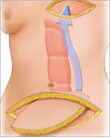

TRAM Flap    body {font-family: 'Open Sans', sans-serif;}

### TRAM Flap

Breast Reconstruction Using a transverse rectus abdominis myocutaneous flap (either a pedicle or free flap type TTAM graft).  
Layman’s terms: “Tummy Tuck" breast reconstruction. Skin, fat, and muscle is tunneled from the abdomen up to the chest and used to create a breast mound.  
  
**Two methods:** Free flap or a pedicle flap, in which the proximal portion remains attached to the rectus abdominis muscle that provides the blood supply.  
Usually follows a bilateral mastectomy during a single anesthetic.  
The TRAM flap can be used for reconstructing one or both breasts.  
  
**Pre-op:** Pre-operative sedation should be withheld until the plastic surgeon has marked evaluated the patient and marked the skin, which usually requires that the patient stand.  
  
**Anesthetic:** General endotracheal; muscle relaxation is usually required.  
**Position:** Arms out  
**BP Cuff:** Avoid the arm on the side on which axillary node dissection takes place.  
**IV Access:** 20G is acceptable. Avoid the affected arm.  
  
**BP:** Avoid hypotension. The surgeon uses a Doppler to check for adequate perfusion. The flap is based on the superior epigastric vessels, which are considered to be the secondary blood supply to the lower abdominal wall skin.  
  
**EBL:** 200-500ml. The rectus abdominis muscle is vascular.  
**Duration:** 3-6 hours (not including mastectomy).**Warming Blanket:** A lower body warming device is necessary because of procedure length and extent of bare skin exposure.  
  
**Notes**  
**A Pedicle TRAM Flap:** Uses the whole rectus muscle.  
**A Free TRAM Flap:** Muscle sparing, a very small portion of the rectus abdominis muscle is utilized. Using less of the muscle for reconstruction may help the patient retain abdominal strength after surgery.

****

  

Jaffe, Richard A. _Anesthesiologist's Manual of Surgical Procedures_ . Philadelphia, Pa.: Lippincott Williams & Wilkins, 2009.  
  
"Johns Hopkins Medicine, Based in Baltimore, Maryland." _Johns Hopkins Medicine, Based in Baltimore, Maryland_ . N.p., n.d. Web. 23 Jan. 2014.  
  
Macksey, Lynn Fitzgerald. _Surgical Procedures and Anesthetic Implications: A Handbook for Nursing Practice_ . Sudbury, MA: Jones & Bartlett Learning, 2011.  
  
"Patient and Cancer Information." _Cancer Treatment and Cancer Research_ . N.p., n.d. Web. 23 Jan. 2014.  
  
Scott-Conner, Carol E. H., and David L. Dawson. _Operative Anatomy_ . Philadelphia: Wolters Kluwer Health/Lippincott Williams & Wilkins, 2009. 128-50.