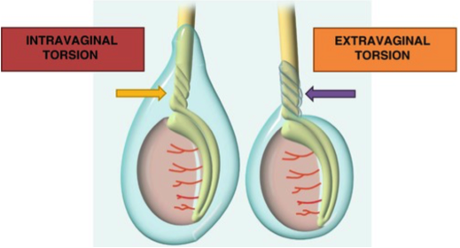
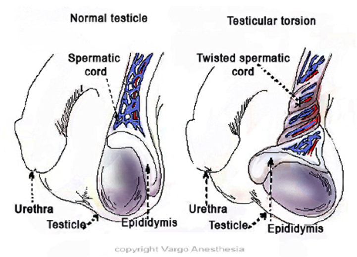

Testicular Torsion    body {font-family: 'Open Sans', sans-serif;}

### Testicular Torsion

_Edited by Martin Kramer, CRNA_  
  
A testicular torsion is considered an acute scrotum and is an emergency that usually requires immediate surgery to save the testicle.  
  
**Acute scrotum:** A sudden painful swelling of the scrotum or its contents, accompanied by local signs or systemic symptoms.  
_All cases of acute scrotum should be considered testicular torsion until proven otherwise._  
  
Testicular torsion is present when the testicle(s) and spermatic cord becomes twisted, which may result in arterial and venous obstruction, acute ischemia and loss of testis.  
_The testicle will infarct and atrophy if the blood supply is not restored within six hours.  
_  
**The duration of torsion and testicular salvage rate:**  
**< 6h:** 90–100%  
**12–24h:** 20–50%  
**\> 24h:** 0–10%  
The orchiectomy (removal of a testicle) rate for boys undergoing surgery for testicular torsion is 42%.  
  
All cases of testicular torsion exceeding 360 degrees and lasting for more than 24 hours result in severe or complete testicular atrophy.  
However, even those testes which are salvaged by surgery may undergo atrophy.  
The primary symptom is sudden and often severe scrotal pain and swelling.  
  
**The two types of testicular torsion** are intravaginal and extravaginal torsion.

****

**Intravaginal torsion (bell clapper deformity):  
**The most common type  
Most commonly occurs in adolescents (peak age 13 years)  
The most common type, it accounts for more than 80% of testicular torsion beyond the neonatal period.  
The torsion occurs within the tunica vaginalis.  
It results from an inadequate fixation to the testicular gubernaculum during descent of the testis, which permits the testis to rotate freely within the tunica vaginalis.  
This lack of fixation accounts for the ‘‘bell clapper’’ deformity noted in many cases of testicular torsion.  
Approximately 16% of patients presenting to an emergency department with acute scrotum have intravaginal torsion.  
  
The left testis is more frequently involved.  
Bilateral cases account for 2% of all testicular torsion.

****

**Extravaginal torsion:**  
Much less common (5% of all of all testicular torsion).  
Most common in neonates; may occur months PRIOR to birth.  
Usually presents at birth with scrotal swelling and dark discoloration of the scrotum.  
However, the affected testis is usually firm and painless  
Extravaginal torsion results from twisting of the tunica vaginalis and testicle before complete descent into the scrotum and its fusion to the scrotal wall.  
The twisting affects the testis, cord, and processus vaginalis as a unit.  
It is associated with high birth weight.  
Up to 20% of cases are synchronous, and 3% are asynchronous bilateral torsion.  
It is usually unilateral but can also occur bilaterally.  
The affected testis is usually necrotic.  
The treatment is orchidectomy and contralateral orchidopexy to obviate the risk of torsion on the other side.  
**Note:** Neonates can have an intravaginal torsion.  
  
**  
Statistics and facts regarding testicular torsion:  
**It is the most common pediatric genitourinary emergency.It is the most common cause of acute scrotal pain in prepubertal and adolescent boys.  
It may occur in utero at around week 32 of gestation.  
  
**Age range:** From newborn period to seventh decade.  
**Peak incidence** occurs at age 14.  
Occurs before age 25 in about 1 in 4,000 males.  
  
Accounts for 10% to 15% of acute scrotal disease in children.  
Annually affects 3.8 per 100,000 males younger than 18 years.  
65% of cases occur in the second decade.  
Human testes occasionally survive up to 10 hours of torsion; however, viability is considerably reduced after 4–6 hours of ischemia.  
Testicular malignancy may be present in children and especially in adults with testicular torsion.  
**Associated with cryptorchidism:** (failure of testicle to descend into the scrotum)  
Cryptorchidism commonly accompanies testicular torsion.  
The urologist commonly performs an orchiopexy (or orchidopexy) on the other testicle after the torsion is repaired.  
**Signs and symptoms manifesting at presentation:  
**Acute onset of severe scrotal pain resulting from decreased blood flow.  
Scrotal swelling and erythema on the affected side  
Nausea/vomiting  
Local scrotal redness  
Severe pain  
One testicle appears higher than the other, which indicates that the spermatic cord has shortened as it twisted.  
_Intermittent testicular torsion should be considered in all young males with a history of occasional scrotal pain and swelling.  
  
_**Diagnosis:  
**Color Doppler ultrasound has become the gold standard for imaging the acute scrotum. The sensitivity ranges from 89% to 100%.  
In the acute setting, it can differentiate between epididymo-orchitis and testicular torsion.  
However, the scans’ sensitivity is believed to be lower in incomplete or intermittent testicular torsion, both of which may have normal flow.  
Scrotal ultrasonography is performed with the patient supine and a towel placed between the legs to support the scrotum.  
The best imaging is obtained using a 10 to 14 MHz linear array transducer in direct contact with the scrotal skin.  
  
**Gray scale ultrasound:** Findings vary with the duration of torsion and degree of spermatic cord rotation.  
  
**Management: (detorsion)  
**Early exam is crucial because necrosis of the testicle can occur after 6 to 8 hours.  
During the examination the urologist attempts manual detorsion, resulting in the restoration of the blood supply.  
Success rates for manual detorsion ranges from 3% to 57%.  
Surgical exploration will usually follow but is less urgent if the manual detorsion is successful.  
  
**Surgical exploration and detorsion:  
**Surgical exploration provides definitive diagnosis and management consistent with findings.  
During surgery, the affected testicle will be untwisted and then a suture is placed around both testicles to prevent future torsion.  
Most often this is performed through the scrotum, although an inguinal approach may be used.  
If the testicle cannot be saved, an orchiectomy is required.  
  
**Anesthesia and surgical concerns:  
Pre-op:  
**Patients should be assumed to have a full stomach because of emergent presentation and the effect of severe pain on gastric emptying.  
Assess for cardiac dysfunction.  
Assess for venous access and evaluate hydration.  
  
**Age range:** Mostly 5-15 years on average  
**Anesthetic:** General/ETT, usually RSI.  
**Regional:** caudal is appropriate for young children.  
  
**Airway:** The incidence of airway difficulty does not differ from similar populations; however, all appropriate preparation, including suction and any special equipment, should be immediately available.  
  
Muscle relaxation is not required but may be used at the surgeon’s preference.  
Duration is between 30 and 90 minutes  
  
**IV Access:** 22g is acceptable  
An arterial line is unnecessary unless comorbid conditions indicate one.  
  
**EBL:** Minimal  
**Position:** Supine  
  
**Hydration:  
**Use the 4:2:1 ratio.  
Use isotonic fluids such as LR or NS  
  
Foley catheter if indicated.  
  
**Emergence:** Awake extubation for full stomach  
  
**Possible complications:**  
Bleeding  
Infection  
Hernia  
Permanant testicular damage  
Persistent leakage of urine  
Blockage of the ureter  
  
**More notes:  
**Differential diagnosis of acute scrotum:  
Torsion of testicular appendages (appendix epididymis or appendix testis) 35–67% of acute scrotal pain.  
Epididymitis (8–18% of acute scrotal pain cases)  
Testicular tumors with acute hemorrhage with or without a history of apparently minor trauma.  
Incarcerated inguinal hernia  
Fournier’s gangrene and ruptured abdominal aortic aneurysm (due to a patent processus vaginalis or referred pain)  
Orchitis  
Acute hydrocele  
Traumatic hematoma  
Scrotal edema or abscess  
Insect bite  
Acute varicocele  
Henoch-Schönlein purpura (inflammatory vasculitis)  
Leukemic infiltrate  
Dermatologic lesions  
  
**Anatomy:  
**In normal anatomy, two testicles rest within the scrotum, the sack of skin that hangs below the penis.  
A small ligament, the spermatic cord, and a series of blood vessels connect each testicle to the rest of the body.  
If the spermatic cord rotates or twists within the scrotum, the testicle will be deprived of its blood supply.  
There is usually no explanation for what triggers torsion.  
  
Torsion of the cryptorchid testis can be difficult to diagnose.  
Many patients with scrotal pain do not have torsion.  
Torsion may be mistaken for incarcerated hernia, appendicitis, or other causes of acute abdomen.  
Intra-abdominal testicular torsion is often associated with malignant degeneration.  
  
In the absence of obvious necrosis, surgery to preserve the testis yields better testicular function than orchiectomy.  
  
Testicular torsion does not necessarily cause the circulation to cease completely; preserving surgery can also sometimes be attempted after delayed diagnosis.  
Irreversible changes and possible damage start occurring after 6 hours.  
One study found that nearly 75% of patients in whom surgery was delayed for more than 12 hours required orchiectomy.  
  
Testicular torsion is most common between ages 12 and 16, but it can occur at any age, even before birth.  
  
**Blood Supply:  
**The testis receives blood through the spermatic cord, which arises in the abdomen, courses through the inguinal canal and then enters the scrotum.  
This cord also includes the vas deferens, which transports sperm to the urethra.  
While the testis has more than one arterial blood supply, all enter the testicle via the spermatic cord.  
Interruption of this arterial route, therefore, will result in complete ischemia and loss of the testicle.  
  

Testicular Torsion  
5-Minute Clinical Consult (accessed 10/2020)  
https://im.unboundmedicine.com/medicine/view/5-Minute-Clinical-Consult/116592/all/Testicular\_Torsion?q=Testicular+Torsion  
  
Testicular Torsion  
MedScape (accessed 2020)  
Oreoluwa I Ogunyemi, MD; Chief Editor: Edward David Kim  
https://emedicine.medscape.com/article/2036003-overview  
  
Scrotal emergencies  
Emergency Medical Clinics of North America 2011;29(3):469–484.  
Davis JE, Silverman M.  
  
Bell Clapper Testis, Torsion, and Detorsion: A Case Report  
Case Reports in Urology; 2011; 2011: 631970.  
F. Khan, \* Okwudili Muoka,and G. M. Watson  
  
American Urology Association Update Series Vol. 28; 2009  
Testicular Torsion (Lesson 12)  
Israel P. Nosnik, MD and Harris M. Nagler, MD  
  
Testicular Torsion and Torsion of the Testicular or Epididymal Appendage  
Pediatric Surgery, AlSadik Hospital, Qatif, Saudi Arabia  
Anestesia Key (accessed 10/2020)  
https://abdominalkey.com/testicular-torsion-and-torsion-of-the-testicular-or-epididymal-appendage/  
  
Testicular Torsion: Diagnosis, Evaluation, and ManagementAmerican Family Physician _._ 2013 Dec 15;88(12):835-840.  
Victoria Sharp, MD, Kathleen Kierin, MD, and Angela Arlen, MD  
  
Kaplan, Steven A., Alan W. Partin, and Anthony Atala. _Minimally Invasive Procedures in Urology_ . New York: Dekker, 2005.  
  
McAninch, Jack W., Tom F. Lue, and Donald R. Smith. _Smith and Tanagho's General Urology / Editors, Jack W. McAninch, Thomas F. Lue_ . New York: McGraw-Hill Professional, 2013.