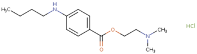

Tetracaine    body {font-family: 'Open Sans', sans-serif;}

### Tetracaine

**Tetracaine (Pontocaine, Dicaine, Amethocaine, Proparacaine)  
Ester** \-Type local anesthetic  
**pKa:** 8.5  
**Nonionized:** 7% at pH 7.4(93% ionized)  
  
**Relative Potency (CNS toxicity):** 2 out of 4  
  
**CNS toxicity risk:** 2 out of 5 (potential for neurotoxicity at higher doses).  
Tetracaine is hydrolyzed the most slowly of all esters, which makes it 16 times more toxic than 2-chloroprocaine, which is hydrolyzed the fastest.  
  
**Uses:** Topically and for spinals (not used OB)  
  
**Onset/duration:** slow onset with a long duration (spinal and topical)Primary application is for extended duration of spinals. Produces stronger motor block and more relaxation than bupivacaine. In contrast with bupivacaine, epinephrine will prolong the duration of tetracaine.  
  
**Rarely used for epidurals or peripheral nerve blocks** because of its slow onset, profound motor blockade and potential for neurotoxicity when administered at high doses.  
  
**Tetracaine**

table.tableizer-table { font-size: 12px; border: 1px solid #CCC; font-family: Arial, Helvetica, sans-serif; } .tableizer-table td { padding: 4px; margin: 3px; border: 1px solid #CCC; } .tableizer-table th { background-color: #104E8B; color: #FFF; font-weight: bold; }

| Route | Conc | Onset | Duration | Max Doses |
| --- | --- | --- | --- | --- |
| Topical Spray | 2% | Fast | 0.5-1 hour | 1.5mg/kg up to 200 mg |
| Spinal | 1% | Fast | 2-6 hours | 20 mg |

Pocket Anesthesia ; 3 rd ed. 2017. Pp 2D-22. R. Urman, J. Ehrenfeld  
_Nurse Anesthesia_ _;_ 5 th ed. 2014. pp 701. J. Nagelhout, Sass Elisha, Karen Plaus  
  
A Guidance on the Use of Topical Anesthetics for Naso/Oropharyngeal and Laryngotracheal Procedures  
(VHA Pharmacy Benefits Management Healthcare group and the Medical Advisory Panel  
and the National Center for Patient Safety). January, 2006.  

**Adult Tetracaine Doses**

table.tableizer-table { font-size: 12px; border: 1px solid #CCC; font-family: Arial, Helvetica, sans-serif; } .tableizer-table td { padding: 4px; margin: 3px; border: 1px solid #CCC; } .tableizer-table th { background-color: #104E8B; color: #FFF; font-weight: bold; }

| Procedure | Conc | Doses |
| --- | --- | --- |
| Topical | 0.5 or 2% | Apply with cotton pledgets |
| Spinal | 1% | 2-20 mg adjusted to height (rarely > 15 mg).  
Decrease usual dose in pregnant patients.  
Dilute with equal volume of sterile dextrose  
10% (hyperbaric) to make it easier to control height. |
| Topical  
Spray | 2% | Short spurts less than 2 seconds |
| Ophthalmic  
Ointment | 0.5% | 3.5 grams |
| Ophthalmic  
Drops | 0.5% | 15 ml |
| Aerosol  
(Supracaine  
Aerosol Metered) | 0.5% solution |

Great to use for a spinal when a long duration is required.  

****

  
**Systemic absorption** of anesthetic from the combination cream is directly related to the duration and surface area of application. Although peak plasma concentrations for lidocaine were measured, plasma levels for tetracaine could not be determined due to low levels (<0.9 ng/mL)  
  
**Metabolism:** It is rapidly hydrolyzed by plasma esterases to the following primary metabolites: para-aminobenzoic acid and diethylaminoethanol. The activity of both metabolites is unspecified.  
  
**Protein binding:** Tetracaine is rapidly hydrolyzed in the plasma; therefore, protein binding could not be determined.  
  
**Contraindications:** Patient with a plasma pseudocholinesterase deficiency or hepatic disease.  
  
**Avoid with PABA allergy:** 2-chloroprocaine is an ester **\-** after metabolism, the byproduct of esters is para-amino benzoic acid (PABA).  
  
**Metabolite:** PABA  
The para-amino benzoic acid metabolite of 2-chloroprocaine inhibits the action of sulfonamides, therefore, 2-chloroprocaine should not be used in any condition in which a sulfonamide drug is being employed.  
  
**CNS toxicity:**  
The most common adverse effects with the combination cream are localized reactions such as: erythema (47%), skin discoloration (16%), and edema (14%). Systemic adverse events were less common, occurring at a rate of <1% and included vomiting, headache, dizziness and fever.  
  
As with other amide and ester anesthetics, CNS excitation and/or depression may occur. It is not well known at which plasma concentration systemic toxicity occurs with tetracaine; however, the threshold is thought to be much lower than that of lidocaine, which is 1000 ng/mL.  

Pocket Anesthesia ; 3 rd ed. 2017. Pp 2D-22. R. Urman, J. Ehrenfeld  
  
_Nurse Anesthesia ;_ 5 th ed. 2014. pp 701. J. Nagelhout, Sass Elisha, Karen Plaus  
  
Anesthesiology Core Review ; Part 1, CH. 57, pp 165. Freeman, B and Berger J;2014Pocket Anesthesia ; 3 rd ed. 2017. Pp 2D-22. R. Urman, J. Ehrenfeld  
_Nurse Anesthesia ;_ 5 th ed. 2014. pp 684. J. Nagelhout, Sass Elisha, Karen Plaus  
  
Drug Bank  
https://www.drugbank.ca/drugs/DB09085