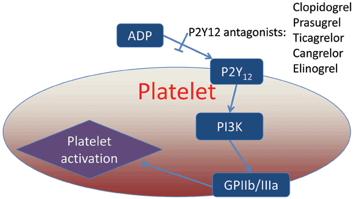

Thienopyridines    body {font-family: 'Open Sans', sans-serif; padding-left: 10px;}

### Thienopyridines

A class of drugs of the ADP Receptor / P2Y12 inhibitors (antiplatelet drugs).  
  
Plavix is the most commonly prescribed thienopyridine.  
  
**Thienopyridines  
**Clopidogrel (Plavix)  
Ticlopidine (Ticlid)  
Prasugrel (Effient, Efient)  
  
The thienopyridines are a class of platelet inhibitors that act by blocking the binding of ADP to the platelet ADP receptor (P2Y12). This prevents the binding of ADP to the receptor which attenuates platelet aggregation and reaction of platelets to stimuli of thrombus aggregation such as thrombin.  
****  
**Laboratory Monitoring**  
(Verify-Now P2Y12 Test)(PRU test)  
PRP aggregation  
P2Y12 assay  
TEGs–unreliable  
Whole blood aggregation may be used.  
  
**Effect on PT/PTT:** None  
  
**Antidote:** None  
**Reversal:** Platelets  

Rxlist.com  
http://www.rxlist.com/plavix-drug/clinical-pharmacology.htm  
  
Drugs.com  
https://www.drugs.com/mtm/ticlid.html  
  
Rx.list.com  
http://www.rxlist.com/ticlid-drug.htmRx.list.comhttp://www.rxlist.com/effient-drug/patient-how-to-take.htm