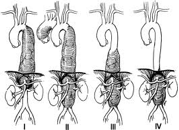
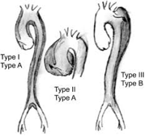

Thoracic and Abdominal Aneurysm Classifications    body {font-family: 'Open Sans', sans-serif;}

### Thoracic and Abdominal Aneurysm Classifications

The Debakey and Crawford classifications overlap. It’s easier to simplify and use the Stanford A or B classification.  
  
**Type A, Types I and II:** Are repaired immediately.  
Requires median sternotomy, Cardiopulmonary Bypass (CPB) Deep Hypothermic Cardiac Arrest (DHCA) and Brain Protection. When that area of aorta is clamped for repair, the blood flow to the brain is interrupted. DHCA is the cerebral protection method they use.  
  
**Type B, Type III:** (distal to left subclavian) - Not an emergency.  
Can be medically managed and watched.  
Requires: Left thoracotomy and one lung ventilation-DLT.  
Does not require full CPB or DHCA  
May require spinal cord protection.  
May require renal protection with Mannitol.  
  
**Thoracoabdominal aneurysms- classified by Crawford.**  

****

  
**Crawford Classifications**  
**Type I:** Most/all of the descending thoracic aorta and most/all of the abdominal aorta. From the subclavian artery and extends to the level of the renal arteries. (Also Type A)  
  
**Type II:** Most/all of the descending thoracic aorta and most/all abdominal aorta. Extends from the left subclavian artery down past renal arteries and may continue distally to the aortic bifurcation. (Also Type A)  
  
**Type III:** Only half or less of the descending aorta and most all of the abdominal aortic. Extends to the bifurcation of the aorta in the pelvis. (Also Type B)  
  
**Type IV:** Involves the upper half of the abdominal aorta and  
extends to the bifurcation of the aorta in the pelvis.  
Thoracic aorta really not involved. (Also Type B)  
  
**Debakey and Cooley Classifications of Aortic Dissections  
**Image below also displays Stanford Type A and B Classification.******

  
Type I:** A dissection in the ascending aorta and extend into the descending aorta.  
**Type II:** Dissects in ascending aorta but does NOT extend to descending aorta.  
**Type III A:** Extends to abdominal wall.  
**Type III B:** Does not extend to abdominal wall.  
  
**Stanford (Dailey)** –Type A or B  
**Type A:** Dissection is ascending aorta that may or may not extend into the descending aorta. This is bad.  
**Type B:** Limited to descending aorta. Not as bad.  
  

Surgical Procedures and Anesthetic Implications; Lynn Fitzgerald Mackey, 2012.  
Anesthesiologist’s Manual of Surgical Procedures ; Jaffe; 2012.  
Clinical Anesthesia ; Barash. Cullen, Stoelting and Callahan; 2009.