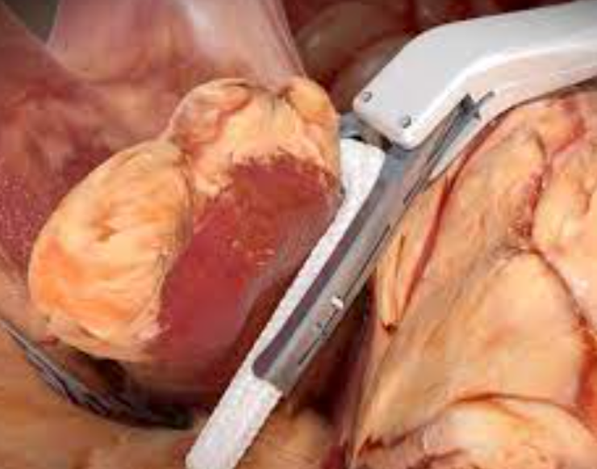

Thoracoscopic Left Atrial Appendage (LAA) or Ligation    body {font-family: 'Open Sans', sans-serif;}

### Thoracoscopic Left Atrial Appendage (LAA) or Ligation

**Review:  
LAA:** A pouch-like extension located on the top of the left atrium.  
It is about the size of your thumb, with a narrow opening into the left atrium.  
Like the appendix, the LAA doesn’t have a clear role in your body.  
  
LAA ligation or clipping is a procedure a cardiac surgeon performs to ligate and permanently seal off the LAA from the rest of the heart in patients with A-fib.  
This prevents blood from circulating through and pooling in the LAA and forming clots associated with A-Fib.  

****

AtriCure AtriClip above  
Clipping alone may be performed robotically as a different procedure.  
  
**Indications:**  
Chronic A-Fib  
Intolerance to anticoagulation  
Not a candidate for the Lariat procedure  
  
When performed thoracoscopically, the intrathoracic area is insufflated to create more space for the surgeon, which may result in episodes of severe hypotension.  
  
**Brief procedure description:  
**\- All patients receive a regimen consisting of steroids, colchicine, and NSAID medications to combat the possibility of developing postoperative pericarditis.  
\- The patient is intubated with a double-lumen tube as the left lung will eventually be deflated.  
\- A patient positioning device (usually pneumatic) will elevate the patient's left side to create more room for the left thoracoscopy (patient still supine).  
\- The left lung is deflated.  
\- The intrathoracic area is insufflated to create more operating space for the surgeon.  
\- Thoracoscopically, the surgeon performs a pericardial window (opens the pericardium).  
\- Collaboration between the cardiac surgeon and anesthesia provider is essential because the insufflation may cause severe episodes of severe hypotension.  
\- Cardiac pressors are often required to correct the hypotension immediately.  
\- In refractory hypotension, the chest may be intermittently deflated to restore BP.  
\- After the LAA is ligated or clipped  
\- Drainage devices are inserted (chest tube and another drainage device  
\- The left lung is reinflated.  

What is the Lariat procedure or left atrial appendage ligation?  
Ascension Via Christi  
Bassen M. Chahad  
Accessed 12/2023  
https://www.youtube.com/watch?v=U3mrr8roq6E  
  
Left Atrial Appendage Ligation (LAL)  
UPMC  
Accessed 12/2024  
http://tinyurl.com/4t93f8zv.