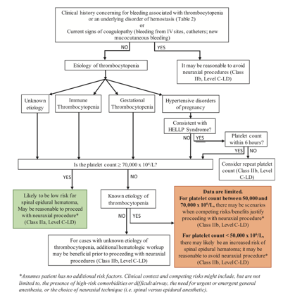

Thrombocytopenia Protocol with Obstetrics    body {font-family: 'Open Sans', sans-serif;}

### Thrombocytopenia Protocol with Obstetrics

**The chart below is from:**  
“Interdisciplinary Consensus Statement on Neuraxial Procedures in Obstetric Patients  
With Thrombocytopenia”  
The Society for Obstetric Anesthesia and Perinatology 2021  
**Refer to:** https://tinyurl.com/3mrsn2hb  

****

  

Interdisciplinary Consensus Statement on Neuraxial Procedures in Obstetric Patients  
With Thrombocytopenia  
The Society for Obstetric Anesthesia and Perinatology 2021  
  
Juliana Perez Botero, MD, Andra H. James, MD, Edward Yaghmour, MD,  
Roulhac D. Toledano, MD, PhD, Mark Turrentine, MD,Timothy Houle, PhD,  
Mark MacEachern, MLIS,Hannah Madden, BS, Anita Rajasekhar, MD, MS.  
Scott Segal, MD,Christopher Wu, MD,Jason P. Cooper, MD, PhD, Ruth Landau, MD, and Lisa Leffert, MD  
https://tinyurl.com/3mrsn2hb