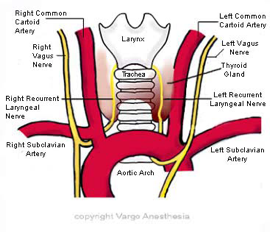

Thyroidectomy and Recurrent Laryngeal Nerve    body {font-family: 'Open Sans', sans-serif;}

### Thyroidectomy and Recurrent Laryngeal Nerve (RLN)

We have all learned that the RLN has a risk of being damaged during thyroid surgery, as it lies close to the inferior thyroid vessels. Due to the long thoracic course of the nerve, it can be damaged by aortic aneurysms, enlarged right atrium, lung and esophageal cancer and enlarged lymph nodes.

**Below is a review of the RLN**  
**Recurrent Laryngeal Nerve (RLN)**. On the right, leaves the vagus as it crosses the subclavian artery, passes under the artery and ascends to reach the larynx, lying between the esophagus and trachea. On the left, leaves the vagus as it crosses the arch of the aorta, passes under the aorta and ascends as on the right. Provides sensory supply to the subglottis and motor supply to all intrinsic muscles of the larynx (except cricothyroid).

  
  
  

-   **SLN** \- External branch - may be damaged during thyroid surgery, as it lies with the superior thyroid vessels.  
      
    The SLN also innervates the cricothyroid muscle.  
    The cricothyroid muscle is the only tensor muscle of the larynx that aids with phonation.  
    Loss of cricothryoid innervation causes loss of vocal cord tension and hoarseness following unilateral damage.  
    This may be temporary as the opposite cricothyroid compensates.

-   **RLN** \- May be damaged during thyroid surgery, as it lies close to the inferior thyroid vessels. Due to the long thoracic course of the nerve, it can be damaged by aortic aneurysms, enlarged right atrium, lung and esophageal cancer and enlarged lymph nodes.

**Motor Response**

**The three main intrinsic laryngeal muscles that are supplied by the vagus nerve via the recurrent laryngeal nerve:**

1.  Lateral cricoaretenoids
2.  Thyroaretenoids (the glottic adductors)
3.  Cricoaretenoids (the vocal cord tensors)