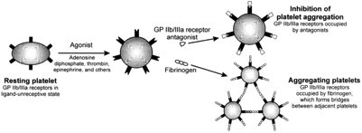

Tirofiban (Aggrastat)    body {font-family: 'Open Sans', sans-serif;}

### Tirofiban (Aggrastat)

**Reversible GP IIb/IIIa Inhibitor and considered an “Anti-Platelet” medication.**  
  
**Reversible:** Meaning it is not bound to the platelets for the platelet’s entire life-span.  
  
**Class:** Direct GP(glycoprotein) IIb/IIIa Antagonist Platelet Aggregation Inhibitor.  
  
**Snake Venum:** A modified version of an anticoagulant found in the venom.  
Administered IV.  
  
**Indications:** to reduce the rate of thrombotic cardiovascular events  
(combined endpoint of death, myocardial infarction, or refractory ischemia/repeat cardiac procedure) in patients with non- ST elevation acute coronary syndrome.  
  
**Mechanism of Action**  
Reversible antagonist of fibrinogen binding to the GP IIb/IIIa receptor on the on the surface of platelets. Inhibits platelet aggregation.  
  
**What are the GPIIb/IIIa receptors**  
The major platelet surface receptor for the binding of fibrinogen and von Willebrand factor.  
Fibrinogen needs to bind to the GPIIb/IIIa receptors to aggregate with other platelets.  
  
**Note below:** on right, when the GPIIb/IIIa receptors are antagonized, they are unable to bind to fibrinogen and other platelets.  

****

  
**Other GP IIb/IIIa Inhibitors  
**Eptifibatide (Integrillin®)-reversible  
Abciximab (Reopro®)-irreversible  
  
**Optional Laboratory Tests** (Platelet function should to be evaluated)  
VerifyNow IIb/IIIa test (platelet function assay)  
Multiplate (platelet function assay)  
PRP - Aggregation (platelet function test)  
PFA - 100/200 (platelet function assay)  
Whole blood aggregation (Platelet function assay)  
Plateletworks Assay (platelet function assay)  
**PT/PTT:** no measurable effect when administered alone.  
  
**Onset and Duration:** Rapid onset and short duration of action after proper IV administration. Coagulation parameters turn to normal 4 to 8 hours after the drug is withdrawn.  
  
**Specific Antidote:** None  
  
**Elimination Half- life:** 2 hours, prolonged in renal insufficiency.  
  
**Clearance:** Mostly renal with about 65% appearing in urine and about 25% in feces, both largely as unchanged tirofiban.  
  
Plasma clearance of tirofiban is decreased about 40% in subjects with creatinine clearance <60 mL/min and >50% in patients with creatinine clearance <30 mL/min, including patients requiring hemodialysis.  
  
**Metabolism:** limited; excretion: urine (65%), feces (25%).  
**Elimination T1/2:** 2 hours, prolonged in renal insufficiency.  
  
**Tirofiban (Aggrastat) and Neuraxial/Deep Regional Block**

table.tableizer-table { font-size: 12px; border: 1px solid #CCC; font-family: Arial, Helvetica, sans-serif; } .tableizer-table td { padding: 4px; margin: 3px; border: 1px solid #CCC; } .tableizer-table th { background-color: #104E8B; color: #FFF; font-weight: bold; }

| Minimal Time between  
last dose and neuraxial procedure | Can it be given with  
epidural catheter in place? | Restart after  
neuraxial procedure and/or  
catheter insertion | Restart after catheter removal |
| --- | --- | --- | --- |
| Avoid until platelet function has returned  
to normal.  
  
GP IIb/IIIa antagonists are normally  
held 4 weeks prior to elective surgery. | NO | Avoid  
  
DO not restart if indwelling  
catheter is in place. | Avoid |

**Restart medication after procedure:** 4 weeks, monitor if prior  
**Remove catheter after administration:** Unknown.  

Dooley M, Goa KL: Lamifiban. Drugs 1999; 57: 215–21Dooley, M Goa, KL  
Hartzman, G.D.; Egbertson, M.S.; Halczenko, W.; Laswell, W.L.; Duggan, M.E.; Smith, R.L.; Naylor, A.M.; Manno, P.D.; Lynch, R.J.; Zhang, G.; Chang, C. T.-C.; Gould, R.J. (1992). "Non-Peptide Fibrinogen Receptor Antagonists. 1. Discovery and Design of Exosite Inhibitors". _Journal of Medicinal Chemistry_ . American Chemical Society. **35** (24): 4640 – 4642  
  
Rx.list.com  
http://www.rxlist.com/aggrastat-drug.htm  
  
Anticoagulants: A Review of the Pharmacology, Dosing, and Complications  
Current Emergency Hospital Med Rep. 2013 Jun; 1(2): 83–97.  
Mohammed Alquwaizani, Leo Buckley, Christopher Adams, and John Fanikos  
  
Garcia DA, Baglin TP, Weitz JI, Samama MM. Parenteral anticoagulants: antithrombotic therapy and prevention of thrombosis, 9th ed: American College of Chest Physicians Evidence-Based Clinical Practice Guidelines. Chest. 2012  
  
Neuraxial and peripheral nerve blocks in patients taking anticoagulant or thromboprophylactic drugs: challenges and solutions.  
Jinlei Li, Thomas Halaszynski; Department of Anesthesiology, Yale University, Yale New Haven Hospital, New Haven, CT, USA  
https://www.dovepress.com/neuraxial-and-peripheral-nerve-blocks-in-patients-taking-anticoagulant-peer-reviewed-fulltext-article-LRA  
  
Anticoagulation 3rd Edition  
_Regional Anesthesia and Pain Medicine_ :  
January/February 2010 - Volume 35 - Issue 1 - pp 64-101  
doi: 10.1097/AAP.0b013e3181c15c70  
Asra Practice Advisory  
  
Regional anaesthesia in the patient receiving antithrombotic and antiplatelet  
therapy  
http://bja.oxfordjournals.org/content/107/suppl\_1/i96.full#ref-4