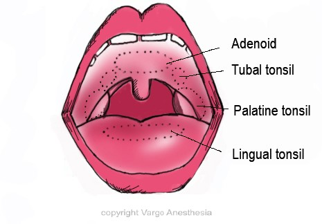
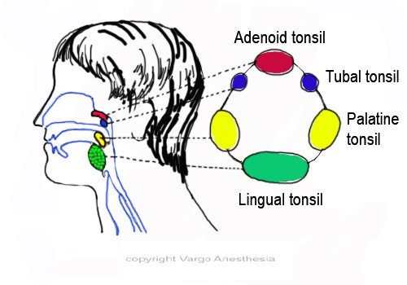
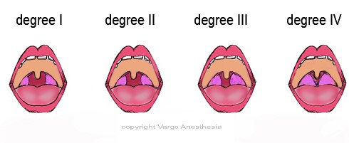
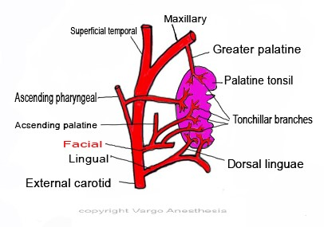

Tonsillectomy and Adenoidectomy (T&A) Notes   

### Tonsillectomy and Adenoidectomy (T&A) Notes

Tonsillectomy is a surgical procedure that was first described in India in 1000 BC.  
For a T&A procedure, it is the adenoid and palatine tonsils that are removed.  
Tonsils and the adenoid are both often surgically removed together, but not always.

**Review:  
The tonsils are 4 separate pieces of tissue:**  
Lingual tonsil  
Pharyngeal (adenoid) tonsil  
Tubal Tonsils are paired.  
Palatine Tonsils are paired.

Tonsils and the adenoid are part of the body’s lymphatic system that fights infection in childhood years. Later in teen to adult years, the tonsils usually shrink, disappear and/or become nonfunctional.

Despite the fact that tonsils are lymphatic tissues, studies show that removing the tonsils do not affect the body’s ability to fight infection.

**Indications for Removal- OSA is now the #1 reason:  
**Between the ages of 2-6, tonsils and adenoids can become chronically infected, swell up and becoming inflamed. With better antimicrobial therapy, there has been a reduction in the frequency of this surgical procedure.Today, with severe adenoid hyperplasia, obstructive sleep apnea has become the most common indication for an adenoidectomy.

The removal of tissues in the airway lumen relieves obstruction and improves airway flow. However, despite the documented success, many children continue to have residual OSA after surgery.

The palatine tonsils are easy to view with the child’s mouth open. The adenoids can not be viewed because they are located up and behind the soft palate in the back part of the nasal pharynx.

**Tonsils that comprise Waldeyer’s ring of lymphoid tissue, an inner ring:**  
Lingual tonsil.  
Pharyngeal (adenoid) tonsil.  
Tubal Tonsils- which are paired.  
Palatine Tonsils- also paired.

**Waldeyer’s ring**  
 

Sometimes in the patient’s chart, you will see that the palatine tonsils are graded.  
Below is the grading scale.

**Gradation of Tonsillar Enlargement**

<table border="1" cellspacing="0" cellpadding="0"><tbody><tr><td width="70" valign="top">
0
</td><td width="134" valign="top">
Not visible<strong></strong>
</td><td width="259" valign="top">
Tonsils don’t reach tonsillar pillars.<strong></strong>
</td></tr><tr><td width="70" valign="top">
1+
</td><td width="134" valign="top">
&lt;25%<strong></strong>
</td><td width="259" valign="top">
Tonsils fill &lt;25% of transverse oropharyngeal space measured.<strong></strong>
</td></tr><tr><td width="70" valign="top">
2+
</td><td width="134" valign="top">
25-49%<strong></strong>
</td><td width="259" valign="top">
Tonsils fill &lt; 50% of the transverse oropharyangeal space.<strong></strong>
</td></tr><tr><td width="70" valign="top">
3+
</td><td width="134" valign="top">
50-74%<strong></strong>
</td><td width="259" valign="top">
Tonsils fill &lt;75% of the transverse oropharyngeal space.<strong></strong>
</td></tr><tr><td width="70" valign="top">
4+
</td><td width="134" valign="top">
75% or more<strong></strong>
</td><td width="259" valign="top">
Tonsils fill 75% or more than the transverse oropharyngeal space.<strong></strong>
</td></tr></tbody></table>

**Palatine Tonsils (the faucial tonsils):  
**As stated above, it is the palatine tonsils that are removed in a tonsillectomy.  
Palatine tonsils are collections of lymph tissue on the right and left backside of the upper oropharynx. They are the largest in 3-6 year olds and eventually shrivel and decrease in size later in teen years.  
The palatine tonsils are mucosa-associated lymphoid tissues (MALT). On the pharyngeal side, they are covered with a stratified squamous epithelium.

**Signs of Tonsillitis:  
**Peritonsillar abscess.  
Airway obstruction.

**Signs of Hypertrophic Palatine Tonsils:  
**Chronic airway obstruction.  
Failure to thrive.  
Dysphagia  
Speech abnormalities.  
Halitosis  
Cervical pharyngitis.  
Persistent pharyngitis.  
  
Kids with cardiac valvular disease are predisposed to develop endocarditis due to recurrent streptococcus bacteremia as a result of infected tonsils.

**Nerve innervation to palatine tonsils:**  
Is through the Maxillary division of the trigeminal nerve via the lesser palatine nerves and also through the Glossopharyngeal nerve via tonsillar branches.

The glossopharyngeal nerve continues past the palatine tonsil and innervates the tongue.  
The glossopharyngeal nerve is the one nerve most likely to be damaged during a tonsillectomy. The patient may have a reduction or loss in general sensation and taste sensation to the posterior third of the tongue.

The tonsillar branch of the facial artery, which branches off the external carotid, forms the main arterial blood supply. The venous drainage is via a plexus surrounding the tonsil, which drains into the pharyngeal plexus. The external palatine vein enters the tonsillar bed from the soft palate. This large vein is usually responsible for the venous hemorrhage following a tonsillectomy.  
  
  
**Blood Supply to Tonsil:** By branches of the external carotid artery.  
**  
Supplied by 5 arteries**  
Tonsillar branch (of facial artery; it is the main supply)  
Ascending palatine artery (a branch of the facial artery)  
Ascending pharyngeal artery (a branch of external carotid artery)  
Dorsal lingual artery (a branch of lingual artery)  
Descending palatine artery (a branch of maxillary artery)

Damage to paratonsillar vein during tonsillectomy leads to excessive venous hemorrhage.

**Adenoid (** **pharyngeal tonsil)  
**The adenoid, unlike the palatine tonsils, has pseudo-stratified columnar ciliated epithelium (PCCE).As already mentioned, it a mass of lymphatic tissue located up behind the soft palate in the roof of the posterior nasopharynx. The adenoids are not visible when looking in the mouth. Adenoids can also become infected or enlarged, contributing to ear infections or ear fluid buildup, difficulty breathing through the nose, and sinusitis. An enlarged adenoid can become almost as large as a ping-pong ball. The enlargement can obstruct airflow enough so that breathing through the nose increases the work of breathing and changes the patient’s voice. Adenoidal infections may also cause symptoms such as excessive mucus production.  
  
**Symptoms of enlarged adenoids or adenoid hyperplasia:**  
Difficult nasal breathing.  
  
Obligate mouth breathing.  
  
Voice changes--the patient talks as if the nostrils are pinched.  
  
Noisy breathing.  
  
Failure to thrive.  
  
Snoring.  
  
Sleep apnea.  
  
Frequent "sinus" symptoms.  
  
Ongoing middle ear infections or middle ear fluid in a school-aged child.  
  
Long standing nasal obstruction due to adenoid hyperplasia may result in orofacial abnormalities including narrowing of the upper airway and dental abnormalities (adenoidal facies).

**Peritonsillar Abscess (sometimes referred to as a Quinsy tonsillectomy):  
**A large mass filled with pus forms in the lateral pharynx. This abscess needs immediate exploration to relieve potential or existing airway obstruction. Many times a peritonsillar abscess is confused with severe exudative tonsillitis. With exudative tonsillitis, it is the tonsils that are enlarged and not the anterior tonsillar pillar. Most peritonsillar abscesses can be treated by incisional or needle drainage. You must be careful when intubating because you may rupture the abscess with resulting spillage of the purulent material into the trachea.

**More Notes:**  
Infected tonsillar pain may be referred to middle ear because of the same nerve supply.  
Do not NASALLY intubate your T & A patient because you may actually damage or dislodge the adenoid.

The patient experiences more pain after tonsillectomy than after adenoidectomy.

Intra-op corticosteroids like Decadron are usually given to reduce discomfort.

There is more pain when electrocautery/laser is used than a sharp surgical dissection, according to experienced ENT surgeons.

**References:**  
**Essential Otolaryngology: Head and Neck Surgery, Tenth Edition** Paperback – May 11, 2012 by K. J. Lee (Author)  
**Handbook of Laryngology: Head and Neck Surgery**, Sept, 2010; David Goldenberg and Bradley Goldstein.  
Perianesthesia Nursing Standards and Practice Recommendation. _Practice Recommendation I: Patient Classification/Recommended Staffing Guidelines_. Cherry Hill, NJ: ASPAN; 2010-2012.