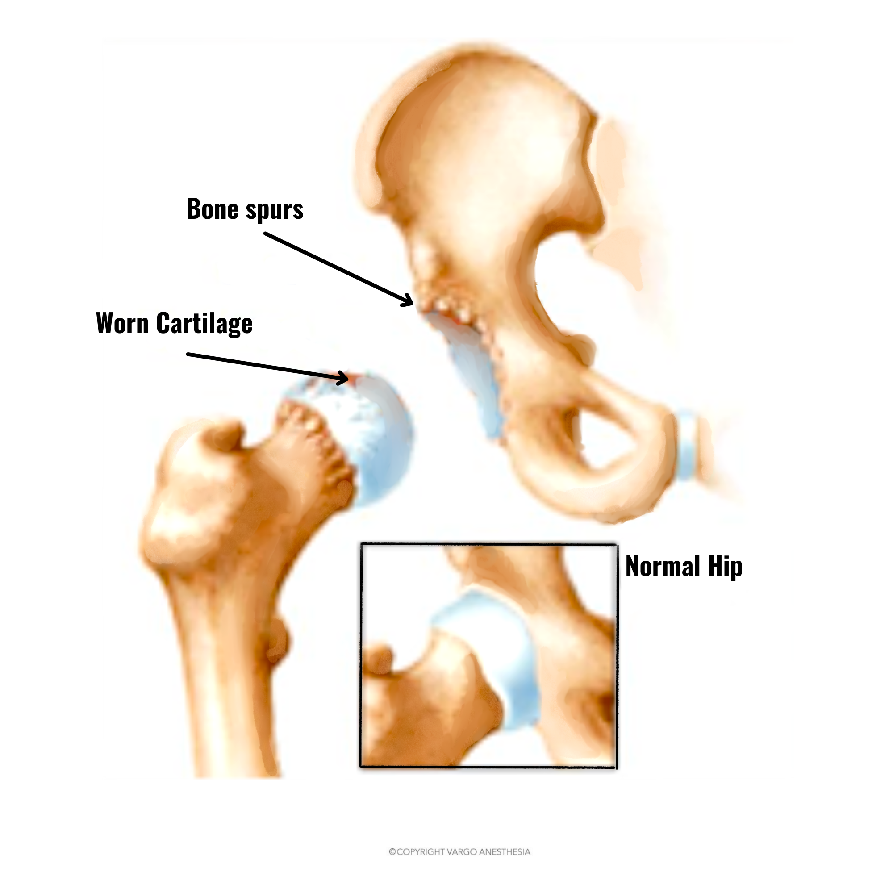
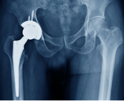
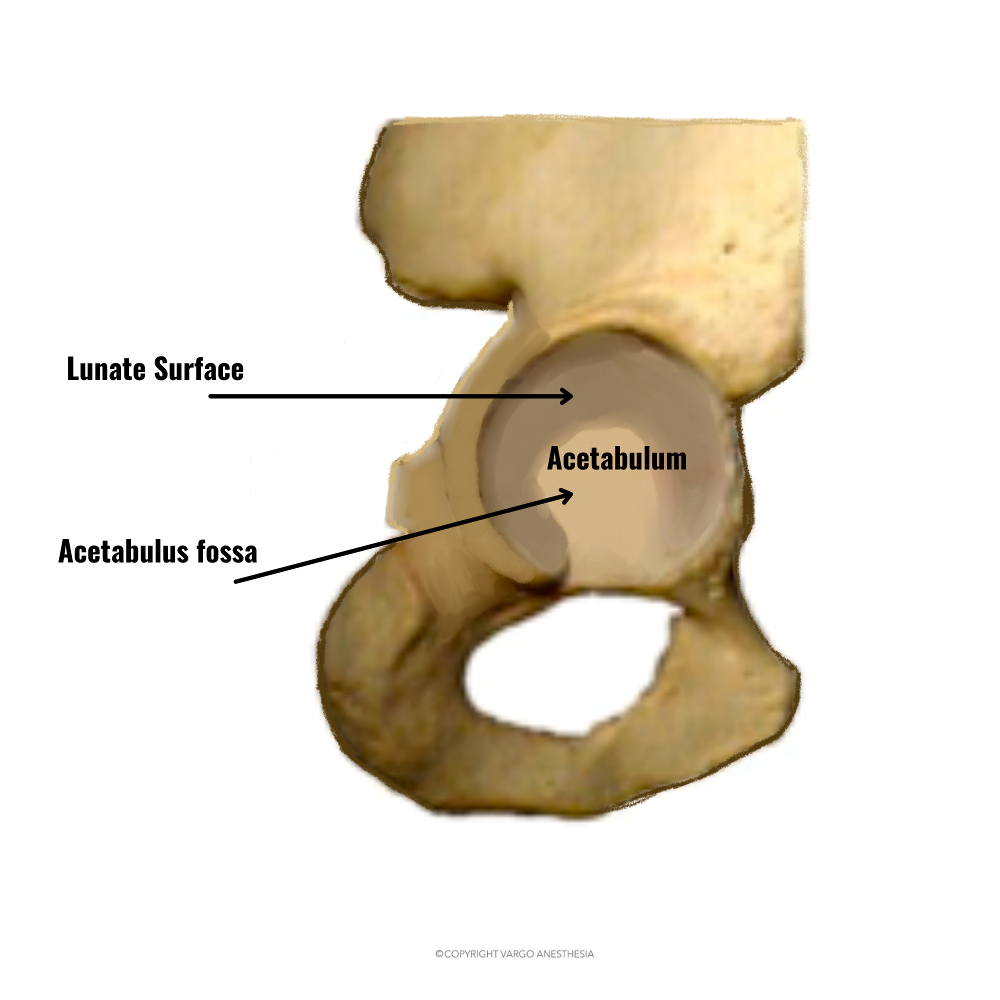
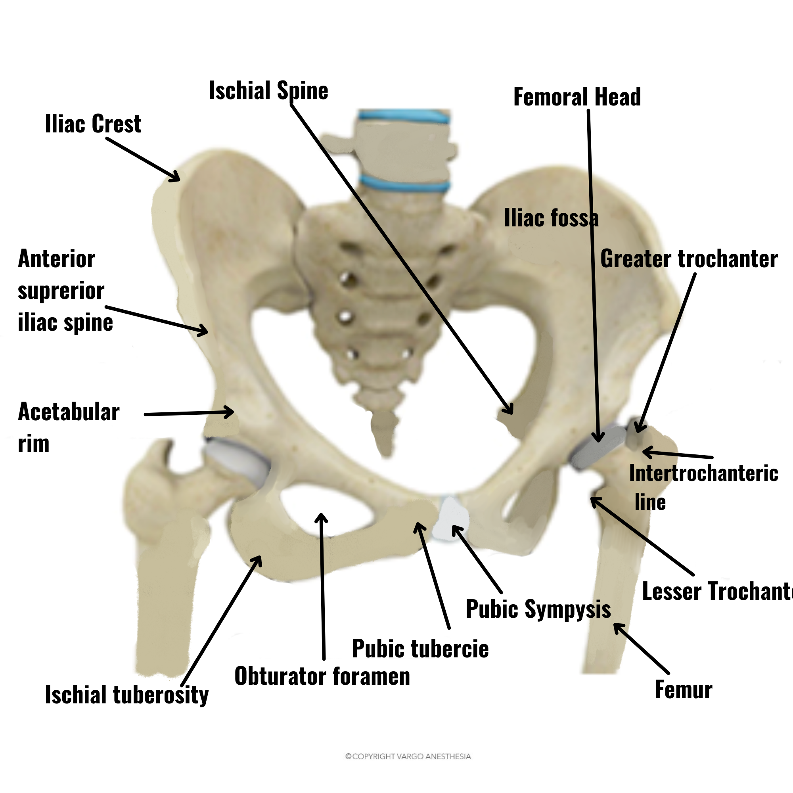
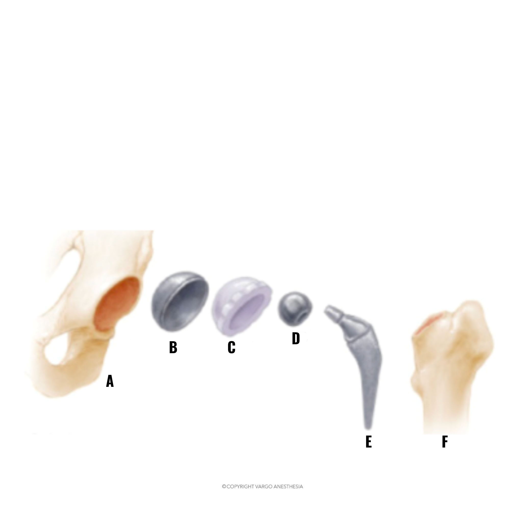
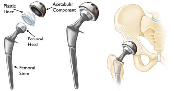
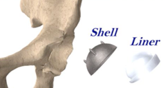
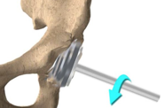
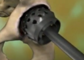

Total Hip Arthroplasty (THA) Anatomy and Review    body {font-family: 'Open Sans', sans-serif;}

### Total Hip Arthroplasty (THA) Anatomy and Review

-   AKA Total hip replacement
-   Usually, an elective outpatient procedure

****

****

**Simplified hip anatomy review:**

-   The hip joint is the largest weight-bearing joint in the human body
-   The joint is a ball and socket joint
-   It is the point of articulation between the head of the femur and the acetabulum of the pelvis
-   It is surrounded by muscles, ligaments, and tendons (not shown here)

**The hip joint is made up of two major parts:**

-   One or both parts may be replaced during surgery
-   Acetabulum
    -   The deep, cup-shaped structure that encloses the head of the femur at the hip joint
    -   The acetabulum is formed by a combination of all three bones of the pelvis: the ilium, pubis, and ischium
-   Femoral head
    -   The upper end of the femur

****

****

**The primary function of the hip joint:**

-   To provide dynamic support to the weight of the body/trunk while facilitating force and load transmission from the axial skeleton to the lower extremities, allowing mobility
-   The hip is a ball-and-socket type diarthrodial joint
-   The surfaces of both the femur head and acetabulum are covered with a smooth tissue (articular cartilage) that cushions the ends of the bones and enables them to glide across each other with ease
-   The hip joint is surrounded by a synovial membrane, a thin tissue that produces a small amount of fluid to lubricate the cartilage and eliminate nearly all friction during hip movement

**Indications for THA:**

-   End-stage degenerative hip osteoarthritis (most common)
-   Hip osteonecrosis (ON)|
-   Congenital hip disorders- including hip dysplasia
-   Spondyloarthropathies
-   Inflammatory arthritis
-   Trauma
-   Neoplasms

**THA is not indicated until patients have failed other conservative treatment methods (such as):**

-   Corticosteroid injections
-   NSAIDs
-   Physical therapy
-   Weight reduction
-   Previous surgical treatments

**Goal:** Pain relief, functional restoration, and improved quality of life

**Contraindications:**

-   Active infection (local or systemic)
-   Remote (i.e., extra-articular) active, ongoing infection or bacteremia
-   Severe cases of vascular dysfunction
-   Skeletal immaturity
-   Quadriplegia
-   Permanent or irreversible muscle weakness in the absence of pain

**Typical Components of THA prosthetic systems (refer to diagram):**

-   Acetabular shell or “Cup” (B) is inserted into the acetabulum (A)
-   Plastic Acetabular liner (C)
-   Femoral head (D)
-   Separate femoral stem (E) inserts into the proximal femur (F)

****

****

****

**Three different surgical approaches:**

-   **Posterior:** Most common approach for primary and revision THA cases
-   **Direct Anterior (DA):** Exposure to the hip anteriorly without the need to detach any of the surrounding muscles
    -   Becoming more popular
-   **Anterolateral (Watson-Jones):** Least commonly used approach secondary to its violation of the hip abductor mechanism

**Patient positioning:** Depends on the approach, lateral or supine

**Surgical navigation and robotic surgical assistance:**

-   Not popular yet, and it adds time to the procedure
-   It involves real-time tracking of bones and surgical instruments during surgery
-   It improves the accuracy of implant position (particularly the acetabular component)

**Anesthesia Techniques:**

-   General/ETT
-   Regional: Spinal or Epidural
    -   +/- propofol infusion and ETC02 Monitoring
    -   Studies suggest a possible reduction in Operative Blood loss and better postoperative pain control
    -   Can be combined with GA (not common)
-   Postoperative pain control can be facilitated
    -   Preop Single shot or indwelling catheter (Q-Pump) facia iliaca block
    -   +/- intrathecal narcotics

When the patients are is in the lateral position, prioritize the airway.

**Surgical procedure:**

-   The THA will depend on the patient’s needs and the orthopedic surgeon’s approach, but generally, the steps are as follows:

**Short outline:**

-   Surgical incision
    1.  The surgeon makes an incision, usually at the side of the hip, cutting through skin and then through muscle and other soft tissue to expose the bones at the hip joint
    2.  Anterior hip replacement: An incision at the front of the hip is made while the patient is supine
-   The hip joint is exposed
-   The femoral neck is cut (with or without dislocation of the femoral head), and the femoral head is removed
-   A reamer prepares the acetabulum, and a cup is placed
    1.  The arthritic femoral neck is cut with a bone saw (with or without dislocation), and the femoral head is removed from the acetabulum.
    2.  The surgeon prepares the acetabulum for its acetabular cup prosthesis by using a tool called a hemispheric acetabular reamer to grind down and shape the inside of the socket.
    3.  It is a cheese-grater type device
    4.  Hemispheric acetabular reamer
    
    ****
    
    ****
    
    7.  The acetabular cup is then tightly placed into the reshaped socket
    8.  This cup is often made of porous titanium metal to allow the bone to grow into it over time, or it may be attached with special bone cement
    9.  The type of cup and how it is attached to the bone depends on the surgeon’s preference and the patient’s physiology
    10.  The surgeon puts a rounded acetabular insert/liner inside the acetabular cup
    11.  The insert may be ceramic or plastic and will facilitate smooth movement within the new joint
-   The femur is prepared, and a stem is placed
    1.  The femur is prepared, and a stem is placed
    2.  The surgeon prepares the femur bone and inserts the prosthetic femoral stem into it
    3.  The femoral stem is a narrow, tapered metal shaft that fits several inches down inside the femur
    4.  The top of the stem is designed to hold a prosthetic ball that will replace the femoral head
    5.  A temporary prosthetic ball is attached to the top of the femoral stem
-   A head ball is then placed onto the stem
    1.  This ball is size matched to the new acetabulum cup and insert
    2.  The surgeon will insert a temporary ball into the new socket and move the hip around, checking to make sure the joint has ease of motion and does not dislocate
    3.  The surgeon will remove the trial component and insert the final ball into the new socket, checking again for ease of movement, the potential ease of dislocation, and restoration of the proper anatomy of the hip, including leg length
-   The hip is reduced, and the surgical wound is closed
    1.  X-rays may be taken to assure proper sizing and positioning of the components 
    2.  The muscle and other soft tissues that were cut are repaired 
    3.  The skin incision is stitched or stapled back together

**Possible complications of THA:**

_Prosthetic related fracture_

-   Most occur on the femoral side during stem insertion
-   3 to 18% for uncemented components

_Nerve injury_

-   Sciatic nerve palsy
-   1-2 percent
-   The sciatic nerve is most common, especially with a posterior approach
-   The lateral femoral cutaneous, femoral, obturator, and superior gluteal nerves may also be injured
-   The peroneal division of the sciatic nerve is more susceptible to injury than the tibial division

_Postoperative leg length discrepancy_

-   Surgeons generally define a significant leg length discrepancy as 2 cm or more.

_Serious Bleeding:_ < 0.5%

-   Major nearby vessels that may be injured
-   Iliac and femoral vessel
-   Profunda femoris artery
-   Obturator artery
-   Superior gluteal artery
-   Note: Tranexamic acid is now commonly administered to help decrease blood loss.

_Possible causes of vascular injury_

-   Retractors
-   Osteotomes
-   Bone saw
-   Scalpel
-   Cerclage wiring
-   Excessive dissection or traction on tissues
-   Acetabular screw placement

  
_Venous thromboembolism_ (VTE): Highest risk of mortality  
_Pulmonary embolism_ \- usually from VTE  
_Fat embolism  
__Surgical site infection  
_  
_Bone Cement Implantation Syndrome_ (BCIS)

-   May be fatal
-   Bone Cement Implantation Syndrome
-   Bone cement has no intrinsic adhesive properties.
-   The cement acts as “grout,” filling empty spaces and creating tight holds between the implant and irregular bone surfaces.
-   BCIS may carry up to a 16-fold increase in 30-day postoperative mortality

**Grades for Bone Cement Implantation Syndrome:**

table.tableizer-table { font-size: 12px; border: 1px solid #CCC; font-family: Arial, Helvetica, sans-serif; } .tableizer-table td { padding: 4px; margin: 3px; border: 1px solid #CCC; } .tableizer-table th { background-color: #104E8B; color: #FFF; font-weight: bold; }

| Grade | Clinical Criterial |
| --- | --- |
| Grade 1 | Moderate hypoxia (SaO2 < 94%) or  
Hypotension (decrease in SBP > 20%) |
| Grade 2 | Severe hypoxia (SaO2 < 88%) or  
Hypotension (decrease in BP > 40%) or  
unexpected loss of consciousness |
| Grade 3 | Cardiovascular collapse requiring CPR |

**Early hemodynamic indicators of BCIS:**

-   Bradycardia
-   Hypotension

  
_Continuous electrocardiography (ECG) and maintenance of systolic blood pressure to within 20% of the baseline is recommended_  
  
**If BCIS is suspected:**

-   Increase inspired oxygen to 100% and supplemental oxygen should be continued postoperatively
-   If there is cardiovascular collapse, consider treating it as RV failure
-   In severe cases, a central venous catheter may be indicated for the administration of inotropic drugs
-   The choice of a vasopressor is facilitated by the presence of noninvasive CO monitoring or a pulmonary artery flotation catheter
-   Aggressive resuscitation with IV fluids
-   For hypotension, opinion is divided as to the relative merits of a pure alpha-adrenergic agonist or a mixed alpha and beta-receptor agonist
-   Hemodynamic instability should be treated with the potential etiology in mind
-   Sympathetic alpha 1 agonists should be a first-line agent in the context of right heart dysfunction

**Possible THA intermediate and long-term complications:**  
_Prosthetic joint infection:_ 1%  
_Dislocation:_ < 5%, most common indication for early revision.

-   About 70% of THA dislocations occur within the first month following index surgery

_Osteolysis_ and wear  
_Aseptic loosening_  
_Sequelae from metal-on-metal wear debris_  
  
**Periprosthetic fracture:** < 1%, fracture in proximity to the implant  
Implant failure or component fracture  
_Heterotopic ossification_  
_Iliopsoas impingement_  
  
**Postoperative mortality:**  
_30- or 90-day mortality rate of less than 1 percent_  
  
**More Notes:**

-   **Nerve innervation to the hip**
-   Femoral nerve: Innervates the anterior part of the hip joint
-   Obturator nerve: Gives branches to the anteromedial part
-   Sciatic nerve: Provides innervation to the posterior part of the joint

**Ligaments of the Hip Joint** are encircled with ligaments to provide stability to the hip by forming a dense and fibrous structure around the joint capsule.

**The ligaments adjoining the hip joint include:**

-   _Iliofemoral ligament:_ It helps in limiting over-extension of the hip
    -   This is a Y-shaped ligament that connects the portion of the pelvis called the ilium to the femur at the front of the joint
-   _Pubofemoral ligament:_ It attaches the pubis to the femur
    -   This is a triangular-shaped ligament that extends between the upper portion of the pubis and the iliofemoral ligament
-   Ischiofemoral ligament:
    -   This is a group of strong fibers that arise from the ischium behind the acetabulum and merge with the fibers of the joint capsule
-   Ligamentum teres - This is a small ligament that extends from the tip of the femoral head to the acetabulum.
    -   It does have a small artery within that supplies blood to a part of the femoral head
-   Acetabular labrum: It deepens the cavity increasing the stability and strength of the hip joint
    -   The labrum is a fibrous cartilage ring that lines the acetabular socket.
-   It also helps regulate the fluid within the joint
-   The labrum is well innervated, and thus injury to the labrum can result in pain

  
  

Total Hip Arthroplasty Techniques  
StatPearls (accessed 12/2021)  
Matthew Varacallo; T David Luo; Norman A. Johanson  
https://www.ncbi.nlm.nih.gov/books/NBK507864/  
  
Total hip arthroplasty  
UpToDate (accessed 12/2021)  
Greg A Erens, MD, Bill Walter, MBBS, FRACS, PhD and Marianna Crowley, MD  
https://tinyurl.com/tpsk6x82  
  
Hip Anatomy (accessed 12/2021)  
Guillaume D. Dumant, MD  
https://www.dumontortho.com/hip-anatomy.html  
  
Surgical approach significantly affects the complication rates associated with total hip arthroplasty.  
Bone Joint J 2019  
Aggarwal VK, Elbuluk A, Dundon J, et al.  
  
Image-guided surgical navigation: Basic principles and applications to reconstructive surgery.  
Orthopaedic Journal at Harvard Medical School 2002; 4:68.  
Murphy SB, Gobezie R. Image-guided surgical navigation:  
  
Understanding Bone Cement Implantation Syndrome  
Cheryl B. Hines, EdD, CRNA  
AANA Journal, December 2018; Vol. 86, No. 6  
  
Bone cement implantation syndrome  
British Journal of Anaesthesia 102 (1): 12–22 (2009)  
A. J. Donaldson H. E. Thomson, N. J. Harper and N. W. Kenny