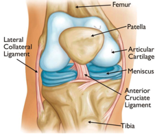
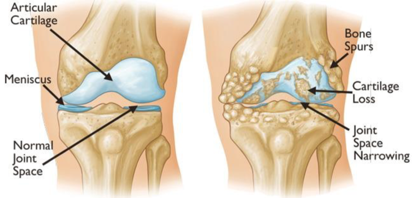
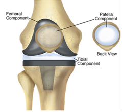
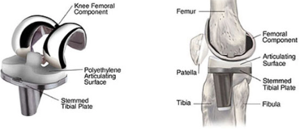
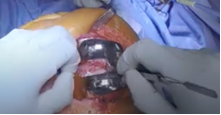
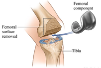
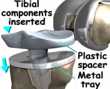
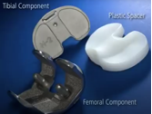
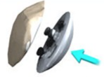
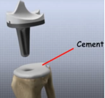

Total Knee Arthroplasty (TKA) Anatomy and Review    body {font-family: 'Open Sans', sans-serif;}

### Total Knee Arthroplasty (TKA) Anatomy and Review

-   Total Knee Arthroplasty refers to surgically replacing the entire knee joint

**Anatomy review:  
**

****

**The knee consists of the following:  
**_Tibia:_  The shin bone or larger bone of the lower leg  
_Femur:_ The thighbone or upper leg bone  
_Patella:_  The kneecap  
_Cartilage:_  A type of tissue that covers the surface of a bone at a joint  
Cartilage helps reduce the friction of movement within a joint  
_Synovial membrane:_  A tissue that lines the joint and seals it into a joint capsule  
The synovial membrane secretes synovial fluid around the joint to lubricate it  
_Ligament:_ A type of tough, elastic connective tissue that surrounds the joint to give support and limits the joint's movement  
  
**The four main ligaments in the knee that connects the femur to the tibia include (refer to diagram above):**

-   Anterior cruciate ligament (ACL)
-   Posterior cruciate ligament (PCL)
-   Medial collateral ligament (MCL)
-   Lateral collateral ligament (LCL)

**Note:**

-   With TKA, the ACL, and sometimes the PCL is removed
-   In some types of knee replacement, the PCL is retained

****

  
_Meniscus:_  The curved part of cartilage in the knees and other joints that acts as a shock absorber, increases the contact area, and deepens the knee joint  
  
Note:

-   With TKA, both menisci are removed

  
_Tendon:_  The tough connective tissue that connects muscles to bones and helps to control the movement of the joint  
  
**Indications for TKA:**

-   For joint destruction and knee pain resulting from:
-   Osteoarthritis-often results from bone rubbing on bone
-   Bone spurs-common with osteoarthritis
-   Rheumatoid arthritis/inflammatory arthritis
-   Posttraumatic degenerative joint disease (DJD)
-   Osteonecrosis/joint collapse with cartilage destruction.
-   Damage to the synovial joint
-   Pain impairs the normal functioning of the knee joint and daily activity

**Contraindications of TKA:**

-   Active infection: In the knee or anywhere in the body
-   Nonfunctioning extensor mechanism: Neurologic disease affecting the lower extremity is a relative contraindication
-   Chronic lower extremity ischemia: Depends on the extent of a large or small-vessel disease and presence or absence of collateral blood flow
-   Skeletal immaturity: TKA is delayed until skeletal maturity is achieved

**Procedure:**

**Pre-op:**

-   The patient is sedated and will usually receive one or two motor sparing regional nerve blocks for postoperative pain
-   The knee area is usually about 85% numb prior to surgery
    -   Anterior coverage is vital, and all the primary blocks should address this area
    -   Posterior coverage helps with tourniquet pain
-   The onset of the preoperative nerve blocks is about 15 to 20 minutes

**The common knee blocks for TKA:**

-   _Adductor canal nerve block:_
    -   It covers the distal branches of the femoral nerve, including the saphenous nerve
    -   Branches of the mixed sensory and motor nerves to the quadricep
    -   Branches of the obturator nerve
-   _IPACK_ block - an acronym meaning
    -   **I**nfiltration between
    -   **P**opliteal
    -   **A**rtery and
    -   **C**apsule of the
    -   **K**nee
-   _Femoral Nerve Block +\\- Lateral femoral cutaneous or Sciatic_
    -   This technique can utilize as the primary anesthetic, provide complete anterior and posterior coverage, and excellent pain control
    -   D/t its potential long duration with surgeons demanding early ambulation, this choice might not be the first choice
    -   Consult with the surgeon if GA and Central Axis techniques are contraindicated to ensure postop management is realistic

**Intraoperative periarticular injection instead of preoperative nerve blocking:**

-   Some surgeons will request no nerve blocks because they will perform a periarticular injection with a long-lasting local anesthetic just before emergence for postoperative pain control

**The knee prosthesis consists of three parts (diagram):**

-   Femoral component
-   Tibial component
-   Patella component

****

****

**Femoral component:**

-   Replaces the distal end of the femur
-   The femoral component is shaped so that it matches the femoral condyles of the femur

****

****

**Tibial component:**

-   Replaces the proximal end of the tibia
-   The tibial component is inserted into the end of the resurfaced tibia
-   It usually consists of a metal tray that firmly holds a plastic bearing surface (spacer) that will glide or articulate against the metal femoral component.

****

****

The plastic bearing (spacer) is exceptionally smooth provides a smooth and strong surface for non-frictional movement with the femoral component.  
  
**Patella component:**

-   With TKA, the patella is usually degraded
-   The surface on its underside may also be cut away and replaced with a polyethylene patella implant
-   Early TKAs did not include a patellar replacement, and postoperative anterior knee pain was common
-   The incorporation of patellar resurfacing during TKA reduces anterior knee pain

****

**TKA components:**

-   Prosthetic component design and materials depend on each patient
-   The main implant components are made of metal – usually titanium or chrome-cobalt alloys
-   The implants are fixated in place either with a cement bonding agent or by osseointegration, in which a porous metal stem extends into the tibia, and the patient's natural bone will grow into it. A polyethylene spacer or platform is then placed between the tibial and femoral implant surfaces
-   Most femoral components are made of metal alloys (cobalt chromium) or metal-ceramic alloys (oxidized zirconium)
-   The patellar component is plastic (polyethylene)
-   The tibial insert component is also plastic (polyethylene). The tibial tray component can be made of the following materials
    -   Cobalt chromium (metal alloy)
    -   Titanium (metal alloy)
    -   Polyethylene (plastic)

**Anesthesia goal:**

-   Provide adequate analgesia that allows early postoperative mobilization.
-   The patient needs to be able to ambulate, micturate with adequate pain control prior to discharge (usually the same day)

**Management/Techniques:**

-   Spinal: Followed with a low dose Propofol infusion (common)
-   General: LMA or ETT
-   Total PNB approach (mentioned above) with mild to moderate sedation is not as common
-   Anticipate physiologic changes
    -   Sympathetic stimulation 2nd to tourniquet (if used)
    -   Possible hemodynamic/C02 changes with tourniquet deflation
    -   Cardio-pulmonary derangement if polymethylmethacrylate is used (bone cement)- see below
-   Coordinate with the surgeon on administrative time if Tranexamic Acid (TXA) is to be infused

**TKA procedure:**

-   First, the orthopedic surgeon makes a midline incision in the knee and moves the patella to the side
-   The majority of the operation involves the surgeon cutting and removing cartilage and some bone from the proximal tibia and distal femur
-   The surgeon cuts and removes arthritic joint surfaces of the knee joint, including the femoral condyles (two knobby protuberances), the tibial surface, and the patellar surface
-   Special cutting guides may be attached to the bone and guide a bone saw that removes the joint
-   Surface and shapes the end of the bones to fit the prosthetic components properly
-   The tibia and femur are then smoothened and capped with metal implants to create new surfaces for the joint
-   The surface of the femoral component mimics the shape of the original femoral condyles
-   If the kneecap has been degraded, the surface on its underside may also be cut away and replaced with a polyethylene patella implant

**Methods to enable the surgeon to implant the TKA more accurately:**

-   Navigation systems from individualized cutting guides are based directly on the patient's anatomy using a preoperative magnetic resonance imaging (MRI) or computed tomography (CT) scan
-   Robotic systems may be used to assist with bone preparation and the placement of implants in TKA
-   Trial implants are also used to assess for the balance prior to putting in the final implant
-   The trial implants are then removed, and the surfaces of the tibia and femur are prepared for the placement of the final implants of the components
-   Cement may or may not be used via surgeon preference to the surfaces of the tibia, fibula, and patella

****

-   When you smell the mixing of the cement, you know the implants will soon be inserted, followed by surgical closure
-   Finally, the various layers of tissue are repaired with dissolvable sutures, and the skin incision is closed with sutures or surgical staples
-   A bandage will be wrapped around the knee, and the patient is being taken to recovery

**Orthopedic rep:**

-   An orthopedic representative from the knee implant company is usually present supplying the instrumentation for TKA and offering advice concerning the technology being used for a more precise implant insertion

**VTE prophylaxis:**  Yes

**Main surgical phases of the TKA:**

-   Cutting and removing cartilage and some bone from the upper part of the tibia and lower sections of the femur
-   Femoral component insertion
-   Tibial component insertion
-   Patellar component applied
-   Surgical closure

**Tourniquet:**

-   The tourniquet is placed around the thigh to control bleeding from the cancellous bone and intramedullary cavity during drilling
-   The tourniquet is typically inflated after prepping and draping the patient prior to incision to reduce inflation time
-   It is deflated just prior to closing the wound
-   Total tourniquet time: Usually 60 to 90 minutes
-   Prolonged use has been associated with SNS stimulation

**Post-op:**

-   Patients (elective) are usually discharged the same day as surgery after the following is achieved
    -   Ambulation
    -   Successful pain management
    -   Stable vital signs
    -   Micturition
    -   Limited PONV

**Possible Complications for TKA:**

-   _Venous thromboembolism_ (VTE), with the potential to propagate a potentially lethal pulmonary embolus (PE), is one of the most feared complications
-   _Peroneal nerve palsy:_ The most common severe neurologic complication after TKA and may result in paresthesia, numbness, and extensor weakness (i.e., foot drop)
-   _Ligament injury:_ Rare, but the most common ligament injured is the medial collateral ligament, with a reported incidence of 1.2 percent
-   _Surgical site infection_ (SSI)
-   _Prosthetic joint infection_
-   _Tourniquet-related ischemic injury_
-   _Wound healing problems_ /delays
-   _Intraoperative fracture_
-   _Vascular injury to popliteal vessels_
-   _Bone Cement Implantation Syndrome_ (BCIS)
    -   Bone Cement Implantation Syndrome
    -   Bone cement has no intrinsic adhesive properties
    -   The cement acts as “grout,” filling empty spaces and creating tight holds between the implant and irregular bone surfaces.
    -   BCIS may carry up to a 16-fold increase in 30-day postoperative mortality

**Morbidity and mortality:**

-   Mortality following TKA is overall low, ranging from 0.5 to 1 percent per year, and is primarily related to preexisting medical comorbidities

  
**Grades for Bone Cement Implantation Syndrome:**

table.tableizer-table { font-size: 12px; border: 1px solid #CCC; font-family: Arial, Helvetica, sans-serif; } .tableizer-table td { padding: 4px; margin: 3px; border: 1px solid #CCC; } .tableizer-table th { background-color: #104E8B; color: #FFF; font-weight: bold; }

| Grade | Clinical Criterial |
| --- | --- |
| Grade 1 | Moderate hypoxia (SaO2 < 94%) or  
Hypotension (decrease in SBP > 20%) |
| Grade 2 | Severe hypoxia (SaO2 < 88%) or  
Hypotension (decrease in BP > 40%) or  
unexpected loss of consciousness |
| Grade 3 | Cardiovascular collapse requiring CPR |

**Early hemodynamic indicators of BCIS:**

-   Bradycardia
-   Hypotension

Continuous electrocardiography (ECG) and maintenance of systolic blood pressure to within 20% of the baseline is ideal

**If BCIS is suspected:**

-   Increase inspired oxygen to 100% and supplemental oxygen should be continued postoperatively
-   If there is cardiovascular collapse, consider treating it as RV failure
-   In severe cases, a central venous catheter may be indicated for the administration of inotropic drugs
-   The choice of a vasopressor is facilitated by the presence of noninvasive CO monitoring or a pulmonary artery flotation catheter
-   Aggressive resuscitation with IV fluids
-   For hypotension, opinion is divided as to the relative merits of a pure alpha-adrenergic agonist or a mixed alpha and beta-receptor agonist
-   Hemodynamic instability should be treated with the potential etiology in mind
-   Sympathetic alpha 1 agonists should be a first-line agent in the context of right heart dysfunction

**Intermediate and late complications:**

-   **Aseptic loosening:**  Loosening of the implant, which can occur in the postoperative period or later
    -   One of the most common modes of failure after TKA
-   **Joint instability:**  Another major cause for that can lead to revision surgery
    -   Instability can occur in flexion, extension, or both
-   **Subacute and chronic periprosthetic infection:**  Infections can happen months to years after TKA
-   **Patellofemoral complications:**
    -   Patellar instability
    -   Loosening of the patellar component
    -   Patellar component failure
    -   Patella fracture
    -   Patella clunk syndrome
    -   Rupture of the extensor mechanism
    -   Anterior knee pain
-   **Periprosthetic fracture:**
    -   Femur/Supracondylar femoral fractures may be associated with notching of the anterior femur at the time of surgery.
-   **Tibial fractures:**  Rare
-   **Polyethylene wear:**  From friction between the femoral component and the polyethylene of the tibial and patellar components.
-   **Causes of accelerated wear:**  Increased activity level and weight
-   **Osteolysis (or bone loss):** From polyethylene wear and is one of the causes of aseptic loosening
-   **Arthrofibrosis**
-   **Persistent pain and patient dissatisfaction:**
    -   Almost 19%
    -   Many patients continue to report clinically significant pain and/or dissatisfaction. One study showed that 19 percent of patients were dissatisfied with their outcome
-   **Metal hypersensitivity:**
    -   Hypersensitive to cobalt, chromium, or nickel
    -   Certain patients appear to be hypersensitive to metals in the replacement component
    -   Symptoms: Persistent pain, effusions, or possibly cutaneous reactions.

  
  

Fundamental Surgery - Total Knee Arthroplasty  
Fundamental VR (accessed 12/2021)  
https://www.youtube.com/watch?v=QdwFXx14KoE  
  
Artificial Knee Replacement  
Randale Sechrist (accessed 12/2021)  
https://www.youtube.com/watch?v=m8LDBlZN-XM  
  
Knee Replacement Surgery Center  
Johns Hopkins Medicine (accessed 12/2021)  
https://www.hopkinsmedicine.org/health/treatment-tests-and-therapies/knee-replacement-surgery-procedure  
  
Total knee arthroplasty  
UpToDate (accessed 12/2021)  
Gregory M Martin, MD and Ian Harris, AM, MBBS, MMed(Clin Epi), PhD  
  
Watch the Full Hour-Long Knee Replacement Surgery with Nurse Holly  
The Doctors (accessed 12/2021)  
https://www.youtube.com/watch?v=3TzNfpatwN0  
  
Total knee replacement surgical technique  
The Stone Clinic (accessed 12/2021)  
https://www.stoneclinic.com/tkrillustration