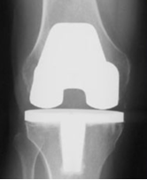
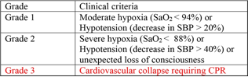

Total Knee Arthroplasty (TKA) and Anesthesia    body {font-family: 'Open Sans', sans-serif;}

### Total Knee Arthroplasty (TKA) and Anesthesia

-   Referred alternatively as Knee replacement or Total knee replacement
-   Refer to “Total Knee Arthroplasty Anatomy and Review” other details

****

**Pre-op labs:**

-   BMP and CBC
-   Serum glucose for obese and/or diabetic patients
-   **Note:** Inform the surgeon when the hemoglobin A1C is greater than 8%
-   Many surgeons cancel high-risk elective procedures due to the increased risk of infection and postpone the procedure until the patient can better manage their diabetes.

**VTE prophylaxis:** Yes

-   Coordinate with the surgeon on administrative time if Tranexamic Acid (TXA) is to be infused
-   10mg/kg or 1000 mg IVPB
-   Commonly given at the beginning of the case and repeated near completion of the procedure

**_Example Pre-operative multimodal analgesia protocol:_**

****

  
**Preoperative peripheral nerve blocks:**

-   Coordinate peri-anesthetic plan with the surgeon to encompass postoperative pain control (if possible)
-   Ideally, the PNB should be performed preoperatively to provide for any pre-existing pain states and facilitate a smooth transition to the operative suite (limiting Surgeons & operative team wait times)

**Pre-op:**

-   The patient is sedated and will usually receive one or two motor sparing regional nerve blocks for postoperative pain
-   The knee area is usually about 85% numb prior to surgery
    -   Anterior coverage is vital, and all the primary blocks should address this area
    -   Posterior coverage helps with tourniquet pain
-   The onset of the preoperative nerve blocks is about 15 to 20 minutes

**The common knee blocks for TKA:**

-   **_Adductor canal nerve block:_**
    -   It covers the distal branches of the femoral nerve, including the saphenous nerve
    -   Branches of the mixed sensory and motor nerves to the quadriceps
    -   Branches of the obturator nerve
-   **_IPACK block:_** an acronym meaning
    -   **I**nfiltration between
    -   **P**opliteal
    -   **A**rtery and
    -   **C**apsule of the
    -   **K**nee
-   **_Femoral Nerve Block +\\- Lateral femoral cutaneous or Sciatic:_**
    -   This technique can be utilized as the primary anesthetic, provide complete anterior and posterior coverage, and excellent pain control
    -   Due to its potential long duration with surgeons demanding early ambulation, this choice might not be the first choice
    -   Consult with the surgeon if GA and Central Axis techniques are contraindicated to ensure postop management is realistic

**Intraoperative periarticular injection instead of preoperative nerve blocking:**

-   Some surgeons will request no nerve blocks because they will perform a periarticular injection with a long-lasting local anesthetic just prior to emergence for postoperative pain control

**Main surgical phases of the TKA:**

-   Cutting and removing cartilage and some bone from the proximal tibia and distal femur.
-   Femoral component insertion
-   Tibial component insertion
-   Patellar component applied
-   Surgical closure

**Anesthesia goal:**

-   Provide adequate analgesia that allows early postoperative mobilization.
-   The patient needs to be able to ambulate, micturate with adequate pain control prior to discharge (usually the same day)

**Management/Techniques:**

-   Spinal: Followed with a low dose Propofol infusion (common)
-   General: LMA or ETT (when a spinal is not performed)
-   Total PNB approach (mentioned above) with mild to moderate sedation is not as common
-   Anticipate physiologic changes
    -   Sympathetic stimulation secondary to tourniquet pain (if used)
    -   Possible hemodynamic/CO 2 changes with tourniquet deflation
    -   Cardio-pulmonary derangement if polymethylmethacrylate is used (bone cement)- see below
-   Coordinate with the surgeon on administrative time if Tranexamic Acid (TXA) is to be infused

**Intraoperative analgesia:**

****

  
**Intraoperative pain management:**

-   The intraoperative pain management is effortless, with a central axis block or PNB targeting the entire limb
-   Theoretically, the patient does not even require the presence of an anesthesia provider
-   However, patients still require monitoring, and most patients want to be asleep or heavily sedated
-   A low dose Propofol infusion (25 to 100 mcg/kg/min) is common without the need for opioids

**Peripheral nerve block(s) (without a spinal):**

-   If an entire limb is not targeted, inadequate anesthesia of the knee or tourniquet area (thigh) might occur, requiring general anesthesia

**Aspiration risk with TKA:**

-   Potential increases in patients with a large protruding abdomen
-   During surgery, the surgeon flexes the patient’s new knee upward (thigh towards the abdomen), increasing intra-abdominal pressure, thus increasing aspiration risk
-   Some surgeons request mild Trendelenburg that further increases the risk of aspiration.
-   Consider intubating, especially in these cases

  
**Duration:** 1-2 hours  
**Position:** Supine with arms out  
**IV Access:** 18G preferable  
**Type and Cross:** Usually, if not, T&S  
**EBL:** Around 100 cc  
**Tourniquet:** Yes

-   Commonly inflated after prepping and draping the patient just prior to incision to reduce inflation time
-   It is deflated just prior to closure
-   Total tourniquet time: Usually 60 to 90 minutes

**Antibiotics:** Yes, prior to incision

**Tranexamic Acid (TXA):**

-   Commonly given to limit bleeding.
-   For dosing, refer to the institution’s or surgeon’s protocol for the intraoperative administration of TXA to decrease blood loss
-   A common TXA protocol is 1gram TXA or 10 – 20 mg/kg IVPB just prior to incision and repeated with incision closure

**Platelet Gel:**

-   Autologous platelet gel (APG) was developed in the early 1990s as a byproduct of multicomponent pheresis
-   When platelet concentrate is combined with thrombin and calcium, a viscous coagulum (gel) is rapidly formed
-   Platelets (PLT) mitigate blood loss and assist with tissue regeneration, collagen synthesis, angioneogenesis and enhance the immune response by releasing growth factors and cytokines.
-   On occasion, 20cc of blood will be needed (drawn) either in pre-op when you start the IV or when the patient goes to sleep for Platelet Gel

**Possible Complications for TKA:**

-   _Venous thromboembolism_ (VTE), with the potential to propagate a potentially lethal pulmonary embolus (PE), is one of the most feared complications
-   _Peroneal nerve palsy_ The most common severe neurologic complication after TKA and may result in paresthesia, numbness, and extensor weakness (i.e., foot drop)
-   _Ligament injury:_ Rare, but the most common ligament injured is the medial collateral ligament, with a reported incidence of 1.2 percent
-   _Surgical site infection_ (SSI)
-   _Bleeding_
-   _Prosthetic joint infection_
-   _Tourniquet-related ischemic injury_
-   _Wound healing problems_ /delays
-   _Intraoperative fracture_
-   _Vascular injury to popliteal vessels_
-   _Bone Cement Implantation Syndrome_ (BCIS)
    -   May be fatal
    -   Bone Cement Implantation Syndrome
    -   Bone cement has no intrinsic adhesive properties.
    -   The cement acts as “grout,” filling empty spaces and creating tight holds between the implant and irregular bone surfaces.
    -   BCIS may carry up to a 16-fold increase in 30-day postoperative mortality

**Morbidity and mortality:**

-   Mortality following TKA is overall low, ranging from 0.5 to 1 percent per year, and is primarily related to preexisting medical comorbidities

**Grades for Bone Cement Implantation Syndrome:**

****

  
**Early hemodynamic indicators of BCIS:**

-   Bradycardia
-   Hypotension

_Continuous electrocardiography (ECG) and maintenance of systolic blood pressure to within 20% of the baseline is recommended._

**If BCIS is suspected:**

-   Increase inspired oxygen to 100%| and supplemental oxygen should be continued postoperatively
-   If there is cardiovascular collapse, consider treating it as RV failure
-   In severe cases, a central venous catheter may be indicated for the administration of inotropic drugs
-   The choice of a vasopressor is facilitated by the presence of noninvasive CO monitoring or a pulmonary artery flotation catheter
-   Aggressive resuscitation with IV fluids
-   For hypotension, opinion is divided as to the relative merits of a pure alpha-adrenergic agonist or a mixed alpha and beta-receptor agonist
-   Hemodynamic instability should be treated with the potential etiology in mind
-   Sympathetic alpha 1 agonists should be a first-line agent in the context of right heart dysfunction

**Post-op:**

-   Patients (elective) are usually discharged the same day as surgery after the following is achieved
    -   Ambulation
    -   Successful pain management
    -   Stable vital signs
    -   Micturition
    -   Limited PONV

**TXA dosing for 24 hours postoperatively:**

-   The TRAC-24 trial found that extending TXA dosing for 24 hours postoperatively reduced the indirect calculated blood loss at 48 hours compared with intraoperative dosing alone (mean difference 126 mL), but mortality and thromboembolic events were similar for both groups

**Post op analgesia (PACU) order options:**

-   **Fentanyl:** 25 mcg IV (max 100 mcg) PRN
-   **Hydromorphone:** 1 mg IV (max 1 mg) PRN
-   **Morphine:** .5 – 1 mg IV (max 5 mg) PRN
-   **Acetaminophen:** 1,000 mg orally or IV (if the last dose is greater or equal than 6 hours
-   **Ketamine:** 10 mg IV x 1
-   **Oxycodone:** (IR): 5 to 10 mg orally depending on the pain scale (one dose prior to discharge)

**For admitted patients or who stay late-analgesia options:**

-   **Acetaminophen:** 1,000 mg PO every 6 hours (650 mg for patients less than 75 years old)
-   **Ketorolac:** 15 mg every 6 hours for 4 doses (if GFR > 50 mL/minute)
-   **Tramadol:** 50 to 100 mg PO or **Oxycodone:** 5 to 10 mg PO or **Hydromorphone:** 2 to 4 mg as needed.
-   **Gabapentin:** 300 mg PO TID
-   **Fentanyl:** 25 mcg IV (max 250 mcg) PRN
-   **Hydromorphone:** 1 mg IV (max 2 mg) PRN
-   **Morphine:** .5 – 1 mg IV (max 20 mg) PRN

  
  

Total knee arthroplasty  
UpToDate (accessed 12/2021)  
Gregory M Martin, MD and Ian Harris, AM, MBBS, MMed(Clin Epi), PhD  
  
Watch the Full Hour-Long Knee Replacement Surgery with Nurse Holly  
The Doctors (accessed 12/2021)  
https://www.youtube.com/watch?v=3TzNfpatwN0  
  
Total knee replacement surgical technique  
The Stone Clinic (accessed 12/2021)  
https://www.stoneclinic.com/tkrillustration  
  
Understanding Bone Cement Implantation Syndrome  
Cheryl B. Hines, EdD, CRNA  
AANA Journal, December 2018; Vol. 86, No. 6  
  
Ligament Injuries to the Knee  
John Hopkins University (accessed 11/2021)  
https://www.hopkinsmedicine.org/health/conditions-and-diseases/ligament-injuries-to-the-knee  
  
The management of the patella in total knee arthroplasty  
Chang Gung Medical Journal Sep-Oct 2006;29(5):448-57.  
Robert Win -Wei Hsu  
  
Bone cement implantation syndrome  
British Journal of Anaesthesia 102 (1): 12–22 (2009)  
A. J. Donaldson H. E. Thomson, N. J. Harper and N. W. Kenny  
  
Association of hospital and surgeon procedure volume with patient-centered outcomes of total knee replacement in a population-based cohort of patients age 65 years and older.  
Arthritis Rheumatology 2007; 56:568.  
Katz JN, Mahomed NN, Baron JA, et al.