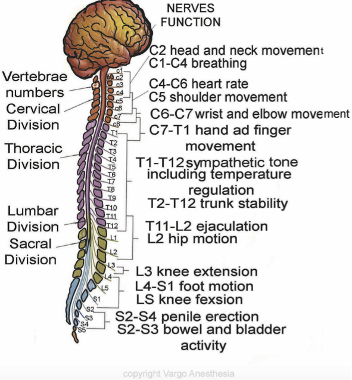

Total Spinal Injection    body {font-family: 'Open Sans', sans-serif;}

### Total Spinal Injection

If the dura is punctured and the epidural dose is injected intrathecally, a total spinal may occur. As the local anesthetic ascends the spine towards the brainstem and cortex, severe hypotension, bradycardia, apnea, and unconsciousness are likely.  
  
Don’t panic. It will all wear off after 1-2 hours depending on what local anesthetic you administered.  
  
Just intubate, hydrate and treat the hypotension with vasopressors.  
  
Remember your dermatomes. C3,4 and 5 keep the diaphragm alive.

****