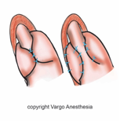

Toupet Procedure    body {font-family: 'Open Sans', sans-serif;}

### Toupet Procedure (Partial Nissen Fundoplication)

(Laparoscopic or robotic)

Toupet procedure is similar to the Nissan procedure except the esophagus is not totally wrapped by the stomach.  
  
**Toupet Fundoplication vs Nissen Fundoplication**  
  
Nissen Fundoplication: A 360-degree wrapping of the stomach around the lower esophagus.  
**Toupet Fundoplication:** A 270-degree wrapping of the stomach around the lower esophagus.  

****

  
**Indication:** GERD, hiatal hernia with dysphagia.  
For patients in whom esophageal peristalsis is documented to be weak, use of a partial wrap, or Toupet procedure, has been recommended as an alternative to lessen the potential for postoperative dysphagia. The incomplete wrapping of the stomach permits some esophageal peristalsis. The most commonly used techniques for reflux laparoscopic surgery are Nissen (360 o fundoplication) and Toupet (270 o posterior wrap).  
  
Toupet procedure was classically considered less effective for the control of gastro-esophageal reflux. The Nissen operation was associated with a higher rate of postoperative morbidity (gas bloat syndrome and dysphagia). So a tailored concept was introduced: partial or total fundoplication depending on the presence or absence of pre-existing esophageal motility disorders. The Toupet procedure is also more appropriate to control GERD in children  
  
**Anesthesia:** General endotracheal with rapid sequence induction.  
**Muscle relaxation:** Required  
**Orogastric tube:** Pass once to decompress the stomach post intubation.  
**Positioning:** Reverse Trendelenburg. Arms to the side for robotic procedure.  
If robotic, bed will be rotated 90 degrees toward the patient’s right.  
**Duration:** 1-3 hours  
**Surgeon position for laparoscopic:** According to surgeon preference; to the right side of patient or at foot of the bed between the patient’s legs.  
**ETT placement:** For robotic, surgeon may request the ETT to be taped on the patients left side of the mouth for easier access for endoscopy at the head of the bed.  
**If robotic:** Ensure adequate length of the ventilator circuit and move the anesthesia machine to the patient’s far left. This provides room for the surgeon’s robotic assistant on the patient’s left side. Only one IV pole, near the left side of the patient’s head, is required.  
**IV Access:** 20 G is acceptable  
**EBL:** < 50 ml  
**Antiemetics:** Required; maximize to prevent PONV and retching.  
_Retching and vomiting is very likely to damage the healing wrap postoperatively. This necessitates a return to surgery, and thus every effort must be made to prevent nausea._  
**Muscle relaxant reversal:** Consider sugammadex over neostigmine.  
  
**Possible complications  
**Hemorrhage from left hepatic artery, left diaphragmatic artery, liver or spleen laceration, short gastric vessels.  
Left sided pneumothorax due to the injury of the left pleura during the posterior dissection of the esophagus.  
Subcutaneous emphysema and vagus nerve trauma are rare complications.  

Laparoscopic Toupet versus Nissen fundoplication for the treatment of gastroesophageal reflux disease.  
International Surgery Journal. 2003 Oct-Dec;88(4):219-25.  
Erenoğlu C, Miller A, Schirmer B.  
  
A MODIFIED NISSEN - TOUPET PROCEDURE FOR THE TREATMENT OF GASTRO-ESOPHAGEAL REFLUX DISEASE AND HIATAL HERNIA: HOW I DO IT  
G. Pavy 1, R. Moldovanu 1,2  
L’Hopital Privé Arras les Bonnettes, France  
Gr.T. Popa, University of Medicine and Pharmacy Iaşi, Romania  
  
Partial posterior wrap (toupet)in patients with defective esophageal body motility  
The Saudi Jounal of Gastroenterology  
Year : 2005 , Volume : 11, Issue : 2, Page : 73-84  
  
Effect of Nissen fundoplication on esophageal motor function.  
Arch Surg 1992; 127: 788-91.  
Stein H. J., Bremner R. M.,Jamieson J. and DeMeester T.R.