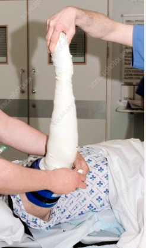

  Tourniquet Deflation Induced Hypotension section { margin-bottom: 20px; } table { border-collapse: collapse; } table, tr, th, td { border: 1px solid black; } h3, p, ol, li { margin: 0px; padding: 0px; } .text-red { color: red; } .text-black { color: black; } ul.custom-dash { list-style: none; padding-left: 0; margin: 0; } ul.custom-dash > li { display: flex; align-items: flex-start; } ul.custom-dash > li::before { content: "–"; margin-right: 0.5em; flex-shrink: 0; line-height: 1.5; } ul.custom-dash > li > \*:not(::before) { flex: 1; } ul.custom-dash > li.no-dash::before { content: ""; width: 1em; margin-right: 0.5em; flex-shrink: 0; } /\* Change the ol style \*/ ol.custom-counter { list-style: none; counter-reset: custom; padding-left: 0; } ol.custom-counter li { counter-increment: custom; margin-bottom: 5px; } ol.custom-counter li::before { content: counter(custom) ") "; font-weight: bold; } /\* This is just for this file \*/ ul.custom-bullet-arrow { list-style: none; padding-left: 0; margin: 0; } ul.custom-bullet-arrow > li { display: flex; align-items: flex-start; } ul.custom-bullet-arrow > li::before { content: "↑"; margin-right: 0.5em; flex-shrink: 0; } ul.custom-bullet-arrow > li.no-arrow::before { content: ""; width: 0.5em; margin-right: 0.5em; flex-shrink: 0; } ul.custom-bullet\_arrow ul { list-style-type: disc; padding-left: 1.5em; margin-top: 0.5em; } img { width: 200px; height: auto; } .mb-10px { margin-bottom: 10px; } .mb-20px { margin-bottom: 20px; } .reference-notes { font-size: 11px; } .text-indent-45px { text-indent: 45px; }

### Tourniquet Deflation Induced Hypotension and other Complications

-   Pneumatic tourniquets are commonly used during limb surgeries (particularly in orthopedic procedures) to limit blood loss and optimize surgical conditions.
-   The goal of a tourniquet is to create a bloodless surgical field.

-   An inflated tourniquet results in physiological changes, which, although mostly tolerated in healthy individuals may not be well-tolerated by those with poor cardiac function or other associated comorbidities.

**Tourniquet inflation and hypertension:**

-   Pain manifests as tachycardia and hypertension under general anaesthesia and occurs 30-60 minutes after cuff inflation.
-   Tourniquet inflation induces sympathetic activation through pain and mediators released from vascular endothelium.
-   The release of norepinephrine from sympathetic activation is known to increase cardiac contractility through beta-adrenergic receptors and to increase peripheral vascular resistance, hence increasing systolic arterial BP through alpha-adrenergic receptors.

**Proposed mechanisms of tourniquet pain:**

-   Pain is transmitted by C-fibers, which are normally inhibited by A-delta fibers.
-   After approximately 30 minutes, A-delta fibers are blocked by mechanical compression, while C-fibers remain functioning.
-   Release of prostaglandins from injured cells, which increases pain perception by sensitizing and exciting pain receptors.
-   Limb ischemia results in central sensitization via NMDA receptor activation due to repeated nociceptive afferent input from affected limb.

**Just prior to inflating the cuff:**

-   The limb is elevated to assist blood flow away from the limb back towards the body (via gravity).
-   Depending on the procedure and/or limb, Esmarch is used to exsanguinate the remaining blood from the limb towards the core.

**Exsanguination of blood from the limb:**

-   An Esmarch bandage is a specialized elastic bandage, often made of rubber, used to create a bloodless field during limb surgery.
-   It is wrapped tightly around the limb, typically from distal to proximal, to force blood out of the surgical area and into the central circulation.
-   This process, known as exsanguination, enables surgeons to see clearly during procedures.
-   A pneumatic tourniquet is inflated, and the Esmarch is removed.

**When a tourniquet is inflated:**

After the pneumatic tourniquet is inflated and the Esmarch removed, the circulation and oxygen to a limb are cut off distal to the cuff.

**Lack of circulation and oxygen delivery results in:**

-   Ischemia to muscle tissues resulting in tissue hypoxia
-   Acidosis
-   Accumulation of lactate
-   Toxic metabolites
-   Oxygen free radicals

A potential issue may arise when the tourniquet is deflated.

-   Acidic products trapped distal to the cuff now circulate throughout the entire circulatory system.
-   Hypotension from dilated blood vessels occurs in response to a sudden shift of blood volume back into the previously ischemic limb, causing a temporary decrease in blood pressure.

**Possible adverse effects from tourniquet deflation:**

-   Hypotension-compensatory- vasodilation from acidosis
-   Metabolic changes
-   Reperfusion syndrome
-   Pulmonary embolism
-   Cardiac arrest

**Always be vigilant when a tourniquet is deflated.**

-   The surgeon will inform the circulating nurse when to deflate the tourniquet.
-   Prior to deflation, always have a pressor available.
-   Treat any hypotension as needed.

**With tourniquet deflation:**

**Increased ETCO2 :**

Consider increasing minute ventilation to maintain normocapnia, (particularly if increased ICP is a concern).

**A temporary decrease in SaO2:**

Monitor saturations, as cuff deflation increases oxygen consumption. Increased FiO2 is rarely needed.

**Increased K+ level:** Monitor ECG.

**Istat for K+ levels:** If patient at risk of complications associated with metabolic effects of tourniquet (end stage renal failure, preop higher K+)

**Be cautious when treating tourniquet-induced hypertension towards the end of a surgical procedure.**

-   It is common for a patient’s blood pressure to increase with prolonged tourniquet time.
-   The hypertension often occurs towards the end of a surgical procedure and may not respond to narcotics.
-   The hypertension (often mild) may not respond to increasing anesthesia depth.
-   Treating the blood pressure just prior to tourniquet deflation may result in severe hypotension.

**Pulmonary embolism after tourniquet deflation:**

-   In a study using a TEE, showers of echogenic material traversing the right atrium, right ventricle and pulmonary artery were observed in all patients to various degrees after the tourniquet was deflated, lasting three to fifteen minutes.

-   Anesthesia providers should consider acute pulmonary embolism as a diagnosis when evaluating a patient who has hemodynamic collapse during total knee arthroplasty performed with cement.

**Extra notes:**

-   Use limb occlusion pressure as a reference for the inflating pressure limit instead of a predetermined fixed pressure range by the surgeon.
-   Never exceed the safe limit of tourniquet pressure and duration. Deflate the tourniquet for short intervals of 10-15 minutes if the safe period has elapsed.
-   Deflation of the tourniquet should be deflated slowly, and a bolus of IV fluid should be given before deflation.
-   Aggressive monitoring during deflation time because most of the fatal complications are known to occur at this time.

Cardiac arrest has been reported from reperfusion syndrome caused by excessive tourniquet pressure leading to sudden hypotension, metabolic acidosis and hyperkalemia after 5 min of tourniquet release

Cardiovascular Effects of Tourniquet Application with Cardiac Cycle Efficiency: A Prospective Observational Study

Journal of Clinical Medicine, 2024, Vol.13(10)

Marve Seker, Serap Aktas, Halim Ulogol, Bulent Gucyetmez and Fezi Toraman

[https://www.mdpi.com/2077-0383/13/10/2745](https://www.mdpi.com/2077-0383/13/10/2745)

The pneumatic tourniquet: Mechanical, ischaemia-reperfusion and systemic effects.

European Journal of Anaesthesiology. 2011, 28, 404–411.

Estebe, J.P.; Davies, J.M.; Richebe, P.

Intraoperative hemodynamic changes during total knee replacement.

Anesthesiology 1979, 50, 239–242.

Samii, K.; Elmelik, E.; Mourtada, M.B.; Debeyre, J.; Rapin, M.

Emboli observed with use of transesophageal echocardiography immediately after tourniquet release during total knee arthroplasty with cement

The Journal of Bone and Joint Surgery . 1998 Mar;80(3):389-96.

A T Berman 1, J L Parmet, S P Harding, C L Israelite, K Chandrasekaran, J C Horrow, R Singer, H Rosenberg

Cardiac arrest following tourniquet release: Needs attention!

Saudi Journal of Anaesthesia, 2015 Oct-Dec;9(4):489–490

wal Krishan Gupta and Amanjot Singh