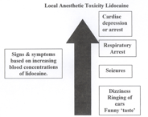
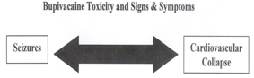

Local Anesthetic Toxicity and Intra Lipids    body {font-family: 'Open Sans', sans-serif;}

### Local Anesthetic Toxicity and Intra Lipids

Local Anesthetic Toxicity may occur 1 to 5 minutes after an excessive dose, with rapid absorption, or because of an accidental intravenous injection/  
But onset may range from 30 seconds to as long as 60 minutes. So always be aware for any of the changes below after a regional block.  
  
**Local Anesthetic Toxicity mostly involves the:**  
Central nervous system (CNS) and/or  
Cardiovascular system.  
  
**Possible Initial Neuro Symptom:  
**Tongue numbness  
Circumoral numbness  
Metallic taste  
Lightheadedness  
Dizziness  
Visual and auditory disturbances (difficulty focusing and tinnitus)  
Disorientation  
Drowsiness  
  
**Advanced Neuro Symptoms (INTERVENTION Necessary)  
**Muscle twitching heralds the onset on tonic-clonic seizures  
Sudden alteration in mental status  
Severe Agitation  
Decreased LOC with or without tonic-clonic convulsions  
  
**Possible Cardiac Symptoms**  
Cardiovascular collapse  
Sinus Bradycardia  
Conduction Blocks  
Asystole  
V-Tachy  
  
**Treatment of Local Anesthetic Toxicity  
**Stop injecting the local anesthetic  
  
Call for Anesthesia Help Stat, code cart and for 20% lipid emulsion (Intralipids)  
**  
Airway Management**  
Ventilate with 100% O2, if necessary - intubate to secure the airway.  
Hyperventilation may help by increasing plasma pH with metabolic acidosis.  
  
**Seizure suppression:** benzodiazepines - versed is preferred.  
Benzodiazepines lower the probability of seizures but can mask early signs of toxicity.  
AVOID propofol in patients having signs of cardiovascular instability.  
  
**Management of Cardiac Arrhythmias (if present)  
**Give 10% calcium gluconate or 10% calcium chloride to raise the cardiac threshold and prevent dysrhythmias.  
Utilize ACLS.  
  
**AVOID the following drugs**  
Vasopressin  
Calcium channel blockers  
Beta-blockers  
Local anesthetics  
  
Reduce individual epinephrine doses  
  
**Doses of 20% Intralipids  
**Initial Bolus 1.5ml/kg (lean body mass) over 1 minute.  
(Repeat bolus once or twice for persistent cardiovascular collapse.  
  
Then  
  
Infusion rate of 0.25mL/kg/min over 20 minutes.  
70kg patient = 350mLs over 20 minutes.  
80kg patient = 400mLs over 20 minutes.  
90kg patient = 450mLs over 20 minutes.  
100kg patient = 500mLs over 20 minutes.  
  
Increase infusion rate up to 0.50 mL/kg/min for refractory hypotension.  
**Continue infusion** for at least 10 minutes after attaining circulatory stability  
Recommended upper limit: Approximately 10 mL/kg lipid emulsion over the first 30 minutes.  
  
**Defibrillator Instructions  
**Place electrodes appropriately on chest  
Turn Defibrillator ON  
Dial in Defib mode  
Set on: Biphasic 200J for 70kg patient  
120-150J for < 70kg  
To deliver a shock: press CHARGE then press shock  
  
**More Notes  
**Higher blood concentrations are associated with large volumes of dilute local anesthetic when compared to the same dose in a smaller volume. (i.e. 400 mg of lidocaine in 40 ml will result in higher blood concentrations than 400 mg of lidocaine in 20 ml).  
  
More later but signs and symptoms vary among local anesthetics…  
  
**Lidocaine and Bupivacaine Toxicity Differ**  
With lidocaine there is a large disparity in blood concentrations between CNS signs and symptoms (which occur at lower blood concentrations and cardiovascular collapse)

****

With bupivacaine there is a small disparity in blood concentrations between CNS signs and symptoms and CV collapse.  
CNS signs and symptoms may occur at the same time or close together.

****

Ropivacaine is similar to bupivacaine in onset and duration. It has a better safety profile in regards to CV toxicity when compared to bupivacaine.  
  
First pass metabolism plays a role. Amides have a high rate of first pass metabolism as it passes through the liver.  
  
Slow absorption from tissue is less likely to produce toxicity.  
  
Toxicity is the result of intravenous/arterial injection or gross overdose.  
  
Patients who received versed will have higher seizure threshold, and may not manifest seizure activity before complete CNS depression results.  
  
**Cardiovascular system-How it is affected**  
Local anesthetics may block the fast sodium channels in the fast-conducting tissue of Purkinje fibers and ventricles resulting in a decrease rate of depolarization.  
The effective refractory period and action potential duration are also reduced by local anesthetics. High concentrations can decrease conduction times leading to prolonged PR intervals and widened QRS complexes, and even sinus brady/arrest.  
  
Ventricular arrhythmias and fibrillation are more common with bupivacaine than lidocaine.  
  
Local anesthetics have a dose-dependent negative inotropic effect.  
  
Patients with acidosis and/or hypoxia are at a greater risk for the cardiac depressant effects of local anesthetics.  
  
Patients under general anesthesia may typically present with cardiotoxicity as the first sign of local anesthetic toxicity.  
  
**Blocks with highest occurrence rate (Think most vascular)**  
Intercostal blocks  
Epidural/caudal blocks,  
Brachial plexus and femoral/sciatic nerve blocks  
Subcutaneous injections.  
  
Benzodiazepines or IV anesthetic drugs will have higher seizure threshold, and may not manifest  
seizure activity before complete CNS depression results.  
  
**Test Dose**  
Epinephrine (5-15 µg) is still used today as a marker of intravascular injection.  
**  
Test Dose - Signs of an intravascular injection  
**Increase in heart rate >10 bpm  
Systolic blood pressure by >15 mm Hg  
or a 25% decrease in lead II T-wave amplitude.  
  
Elderly on beta-blockers are less responsive to beta stimulation.  
Despite the above precautions, there are still false negative test results.  
  
**Slow injections are safer  
**When administering a regional, always use slow, incremental injections with frequent aspirations (every 3-5 mL) between injections while monitoring the patient for signs of toxicity.  
  
A slow rate of injection of divided doses may decrease the intravascular injections.  
  
With a rapid injection there is a greater chance of seizure because at higher blood level there is no time for distribution of the drug as compared to a slow infusion where the seizure occurs at a lower drug level because of the distribution.  
  
Occurrence of Torsades des Pointes with bupivacaine toxicity may require overdrive pacing if that rhythm predominates.  
  
**Don’t give Calcium Channel Blockers and Phenytoin  
**Calcium channel blockers and phenytoin are contraindicated because their co-administration with local anesthetics may increase the risk of mortality.  
  
Recovery from local anesthetic-induced cardiac arrest can take more than an hour with CPR.  
  
**Don’t give Propofol with Intralipids  
**Propofol should not be used for treatment with intralipids although judicious administration to control seizures when used in small divided doses is appropriate.  
  
**Other Allergic Reactions with Local Anesthetics  
Amino-esters Local Anesthetics  
**Procaine  
Cocaine  
Chloroprocaine  
Tetracaine  
Benzocaine  
  
Amino-esters are all derivatives of the allergen para-amino-benzoic acid (PABA).  
So any local anesthetics belonging to the ester group (above) may cause positive skin reactions, ranging from toxic eruptions in situ to generalized rash or urticaria.  
  
One study shows an allergic incidence of up to 30%, but no patients developed anaphylaxis. However, true allergic reactions to the local anesthetics of the amino-amide group are extremely rare.  
  
Preparations of amide anesthetics do not cause true allergic reactions, unless they contain the preservative methylparaben, which is in its chemical structure virtually the same as PABA.In some countries, the use of prilocaine in regional anesthesia is banned.  
  
The condition of methemoglobinemia caused by prilocaine is spontaneously self-limiting and reversible. Reversal can be accelerated with the administration of methylene blue intravenously (1 mg/kg).

“Checklist for Treatment of Local Anesthetic Systemic Toxicity” 2014;  
American Society of Regional Anesthesia and Pain Medicine  
  
https://www.asra.com/advisory-guidelines/article/3/checklist-for-treatment-of-local-anesthetic-systemic-toxicity.  
  
AAGBI Safety Guideline  
“Management od Severe Local Anesthetic Toxicity”  
http://www.aagbi.org/sites/default/files/la\_toxicity\_2010\_0.pdf