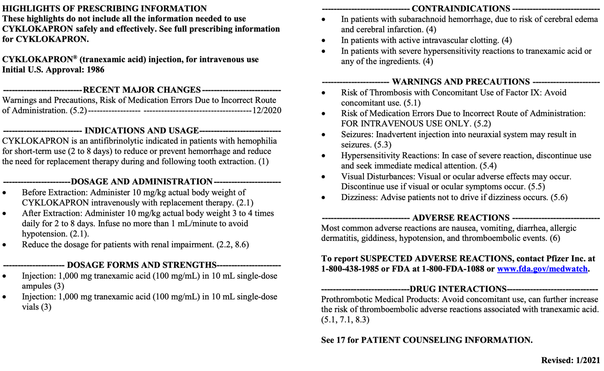

Tranexamic Acid (TXA) Contraindications and Precautions    body {font-family: 'Open Sans', sans-serif;}

### Tranexamic Acid (TXA) Contraindications and Precautions

**Contraindications:  
**\- Patients with active intravascular clotting  
\- Patients with subarachnoid hemorrhage.  
Anecdotal experience indicates that CYKLOKAPRON may cause cerebral edema and cerebral infarction in such patients.  
\- Patients with hypersensitivity to tranexamic acid or any of the ingredients   
**  
Warnings and precautions:  
Risks of thrombosis:**  
Avoid concomitant use of Factor IX and other procoagulants.  
**Risk of medication errors by using another route besides IV.**  
TXA is to be administered only intravenously  
**Seizures:** Inadvertent neuraxial injection has been reported to induce seizures.  
**Hypersensitivity**  
**Visual disturbance:** Visual or ocular adverse effects may occur.  
**Dizziness:** Advise patients not to drive if dizziness occurs  
 **Notes on Warning and Precautions:  
Thromboembolic Risk**Tranexamic acid is an antifibrinolytic and may increase the risk of thromboembolic events. Venous and arterial thrombosis or thromboembolism have been reported in patients treated with cyklokapron.  
Avoid concomitant use of CYKLOKAPRON and pro-thrombotic medical products, as the risk of thrombosis may increase.  
**  
These pro-thrombotic medications include but are not limited to:  
**Factor IX Complex concentrates  
Anti-inhibitor Coagulant concentrates  
Hormonal contraceptives.  
  
**Incorrect Route of Administration:**CYKLOKAPRON is for intravenous use only.  
Severe adverse reactions, including seizures and cardiac arrhythmias, have occurred when CYKLOKAPRON was inadvertently administered intrathecally instead of intravenously.**  
Seizures:  
**CYKLOKAPRON may cause seizures, including focal and generalized seizures.  
The most common setting for tranexamic acid-induced seizures has been during cardiovascular surgery (a setting in which CYKLOKAPRON is not FDA-approved and which uses doses of up to 10-fold higher than the recommended human dose and in patients inadvertently given tranexamic acid into the neuraxial system). CYKLOKAPRON is not approved and not recommended for neuraxial administration.  
  
**Renal patients:**  
Consider dose reduction during surgery and dose adjustments for patients with clinical conditions such as renal dysfunction.  
Consider electroencephalogram (EEG) monitoring for patients with a history of seizures or who experience myoclonic movements, twitching, or show evidence of focal seizures.  
Discontinue CYKLOKAPRON if seizures occur.  
**  
Hypersensitivity Reactions:  
**Cases of hypersensitivity reactions, including anaphylactic reactions, have occurred with the use of intravenous tranexamic acid.  
**Visual Disturbances:  
**Although not seen in humans, focal areas of retinal degeneration have been observed in cats and dogs following oral or intravenous tranexamic acid at doses between 250 to 1600 mg/kg/day (1.6 to 22 times the recommended usual human dose based on body surface area) from 6 days to 1 year.  
No retinal changes have been observed in eye examinations of patients treated with tranexamic acid for up to 8 years.  
Patients expected to be treated for greater than three months may consider ophthalmic monitoring, including visual acuity and optical coherence tomography, at regular intervals.  
  
**Dizziness:  
**CYKLOKAPRON may cause dizziness.  
Concomitant use of other drugs that may cause dizziness may worsen this effect.  
Patients should be advised to avoid driving or using machines until they know how CYKLOKAPRON affects them.  
**  
Adverse reactions:  
**Nausea  
Vomiting  
Diarrhea  
Allergic dermatitis  
Giddiness  
Hypotension  
Thromboembolic events

****

  

FDA (accessed 03/2024)  
https://tinyurl.com/3wpay9fy  
CYKLOKAPRON ® Warnings and Precautions  
Pfizer (accessed 03/2024)  
https://www.pfizermedicalinformation.com/cyklokapron/warnings