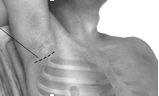
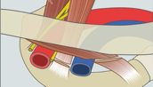
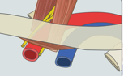

Transaxillary Rib Resection for Thoracic Outlet Syndrome (TOS)    body {font-family: 'Open Sans', sans-serif;}

### Transaxillary Rib Resection for Thoracic Outlet Syndrome (TOS)

The thoracic outlet space is between the clavicle and the underlying rib. Thoracic outlet syndrome results when the neurovascular bundle composed of the brachial plexus and the subclavian artery and vein exiting the thoracic cavity is compressed by the first rib and clavicle at the top of the outlet cavity.  
Also, hypertrophic muscles, namely the scalene and the subclavius, with their corresponding tendons, will also contribute to TOS.  
Having a cervical rib increases the chance of developing TOS.  
Symptoms include pain, tingling or weakness in the shoulder and arm, especially when raising the arms.  
Many patients with TOS develop a chronic pain syndrome requiring pain management and thus a higher tolerance to narcotics.  
**  
The Surgical procedure:  
**The transaxillary approach is one of the most frequently used in addressing thoracic outlet syndrome (TOS).The patient is placed on a bean bag in the lateral position with the operative side up. The arm is extended anteriorly with the elbow flexed and the head is slightly turned away.  
**Note:** The surgical team must avoid hyper-abduction of the surgical sided arm, which may cause strain on the brachial plexus. It is prudent to instruct a scrubbed surgical team member or an operating assistant to return the arm to the neutral position every 20 minutes or so during the course of the operation to further minimize positioning-related brachial plexopathy.  
  
A 5-6 cm. subaxillary incision is made between the latissimus dorsi and pectoralis muscles.  
Dissection is performed through the soft tissue to the chest wall. After the first rib is visualized, the surgeon will divide of the subclavius, anterior scalene, and middle scalene muscles, then removal of a portion of the first rib.

****

  

**  
Before**

  

**  
After**

  
Anesthesia and Thoracic outlet decompression for TOS:  
General anesthesia with a single lumen ETT.  
Double lumens tubes are not common anymore. Check with surgeon preference.  
**Regional:** A cervical-thoracic paravertebral regional block (PVB) can be performed to  
manage acute postoperative pain, but it is rarely done. Most TOS patients are young and healthy.  
**Position:** Lateral position; surgical site facing up and with the surgical sided arm abducted upward to optimize surgical access.  
**IV access:** 18g or larger bore: in case of hemorrhage.  
**Muscle relaxation:** Not used. A nerve stimulator may be used intraoperatively by the surgeon in order to identify the nerves he or she must avoid so no damage may occur.  
**Arterial line:** Usually not needed.  
**Pulse oximetry:** Consider placing the pulse ox finger probe on the abducted extremity to assess effective circulation. The surgeon may not permit due to sterility.  
**EBL:** 20-50 ml., but may be much greater.  
**Duration:** 60-90 minutes.  
**Emergence:** Awake extubation will help to assure adequate ventilation and to help the anesthesia provider avoid possible thoracic complications listed below.  
  
**Anesthesia/surgical concerns:  
**Over-abduction and pulling of the patient’s arm during the procedure.  
Extubation by surgical team with arm abduction. Isolate ventilator circuit and endotracheal tube away from patient’s arm and adhesive portions of the drapes.**  
  
Possible Complications:  
**Horner’s syndrome due to sympathetic nerve injury.Pneumothorax  
Hemothorax  
Hemorrhage  
Chylothorax (leakage of lymphatic fluid drains into space between lung and chest wall)  
Damaged thoracic duct  
Damaged phrenic nerve  
Damaged brachial plexus  
Causalgia around the neck  
Damage to the long thoracic nerve  
Damage of the subclavian artery or vein  
Axillary artery thrombosis  
Complex regional pain syndrome (CRPS) or reflex sympathetic dystrophy (RSD).  
Incomplete decompression.  
Transient paralysis due to T1 root compression  
Permanent paralysis due to T1 root compression  
Recurring pain and symptoms after 6 months (requiring re‑operation).  
  
**Post op:**  
**The apical pleura is at risk.  
**  
Due to the breach in the apical pleura, blood may accumulate in the thoracic cavity rather than in the drain. The patient will require return to the operating room for a video-assisted clot evacuation, or thoracotomy in severe cases.  
An Upright chest X-ray in PACU may exclude a significant pneumothorax or hemothorax.  
  

Hansson T, Povlsen SD. Treatment for thoracic outlet syndrome. Cochrane Database Syst Rev. 2014;(11)  
  
Yavuzer S, Atinkaya C, Tokat O. Clinical predictors of surgical outcome in patients with thoracic outlet syndrome operated on via transaxillary approach. Eur J Cardiothorac Surg. 2004;25:173–8  
  
Urschel HC, Kourlis H. Thoracic outlet syndrome: a 50-year experience at Baylor University Medical Center.  
Proc (Bayl Univ Med Cent) 2007;20:125–35.  
THORACIC OUTLET SYNDROME ANAESTHESIA TUTORIAL OF THE WEEK 286  
  
Anesthesia Tutorial of the week  
Dr Sandeep Kusre, Dr Richard Telford  
Royal Devon & Exeter Hospital, United Kingdom  
  
Neurogenic TOS  
Center for Thoracic Outlet Syndrome  
Washington University School of Medicine  
http://tos.wustl.edu/For-Patients/Neurogenic-TOS  
  
Han S, Yildirim E, Durai K, Ozisik K, Yazkan R, Sakinci U. Transaxillary approach in thoracic outlet syndrome: the importance of resection of the first-rib. Eur J Cardiothorac Surg 2003;24:428- 433.  
  
First Rib Resection in Thoracic Outlet Syndrome  
Redorbit, 2007.  
https://www.redorbit.com/news/health/934063/first\_rib\_resection\_in\_thoracic\_outlet\_syndrome/  
  
Proceedings (Baylor University Medical Center). 2002 Oct; 15(4): 374–375.  
Use of general anesthetic only vs general anesthetic combined with paravertebral block for perioperative pain management after first rib resection  
Amit N. Patel, MD, MS, Karen U. Finlay, BS, Katharina C. Schyra, BS, Comeco C. Jones, BSN, 1 Robert E. Black, BS, Larry J. Dullye, DO, Linda W. Jennings, PhD, H.A. Tillmann Hein, MD, Harold C. Urschel, Jr, MD, and Michael A.E. Ramsay, MD