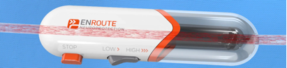

Transcarotid Artery Revascularizations (TCAR)    body {font-family: 'Open Sans', sans-serif;}

### Transcarotid Artery Revascularizations (TCAR)

(TCAR) General Also called “Silk Road’s® TCAR procedure.”  
The Enroute® transcarotid sent system is used in conjunction with the Enroute® transcarotid Neuro-Protective System® (NPS).The NPS system is designed to reduce the risk of stroke by combining direct carotid artery access with robust blood flow during transcarotid  
stent placement and capturing plaque while blood passes through during the procedure as it permits reverse carotid blood flow back into the patient.

****

**Procedure:**  
A small incisions is made just above the clavicle to expose the common carotid artery.  
A soft, flexible sheath is placed directly into the carotid artery and connected to a system that will reverse blood flow away from the brain to protect against fragments of plaque that may come loose during the procedure.  
The blood is filtered and returned through a second sheath placed in the femoral vein in the patient’s thigh.  
The NPS allows balloon angioplasty and stenting to be performed while blood flow is reversed.  
After the stent is placed successfully to stabilize the plaque in the carotid artery, flow reversal is turned off and blood flow to the brain resumes in its normal direction.

****

**Above:** NPS system  
**Indications for Enroute® transcarotid stent system  
Patients at high risk for adverse events complicating carotid endarterectomy who require carotid revascularization and meet the following criterial:**  
Less than 50% stenosis of the common or internal carotid artery  
Vessel diameter must be 4-9 mm at the target of lesion and carotid bifurcation must be at minimum 5 cm above the clavicle to allow for placement of the ENROUTE Transcarotid NPS.  
  
**An amalgamation of the “high risk for CEA” inclusion criteria. Patients must meet one or more criteria:**  
Age ≥75  
Congestive heart failure  
Left ventricular ejection fraction ≤35%  
Two or more diseased coronary arteries with ≥70% stenosis  
Unstable angina  
Myocardial infarction within 6 weeks  
Abnormal stress test  
Requirement for open heart surgery  
Requirement for major surgery (including vascular)  
Uncontrolled diabetes  
Severe pulmonary disease  
History of liver failure with elevated prothrombin time  
  
**Contraindications of Enroute Transcarotid Stent System:  
**Patients in whom antiplatelet and anticoagulation therapy is contraindicated.  
When Enroute® transcarotid NPS is cannot be placed.  
Patients with uncorrected bleeding disorder.  
Known allergy to nitinol.  
Lesions in the ostium of the common carotid artery.**  
  
Possible complications**  
Hematoma at the access or remote site.  
Hemorrhage  
Hyperperfusion syndrome  
Infection  
Restenosis of the vessel (> 50% obstruction)  
TIA  
CVA  
Vessel rupture  
Dissection  
Perforation  
**  
Anesthesia for TCAR may be local, MAC or general anesthetic  
Refer to:  
**“Transcarotid Artery Revascularizations”  
“Transcarotid Artery Revascularizations (TCAR) MAC”

  
  

The TCAR Procedure  
Silk Road Medical (accessed 05/2020)  
https://silkroadmed.com/the-tcar-procedure/