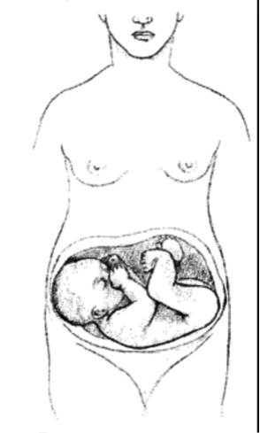

Transverse Presentation    body {font-family: 'Open Sans', sans-serif;}

### Transverse Presentation

**"Transverse Lie"** means a **sideways position.**  
  
The baby has his head to one of his mother's sides and the bottom across her abdomen at her other side.  
  
This is normal before 26 weeks, but by 29-30 weeks we expect babies to be head down, or at least **breech.  
  
**The doctor will try to manually turn the baby to head down, but a C-section is usually needed.

****

Breech, posterior, transverse lie: What position is my baby in?  
babycenter.com (accessed 08/2022)  
Kate Marple and edited by Layan Alrahmani, M.D., ob-gyn  
  
Transverse Lie, CH. 26  
Oxorn-Foote Human Labor and Birth, 6e, 2013  
Glenn D. Posner, Jessica Dy, Amanda Black, Griffith D. Jones