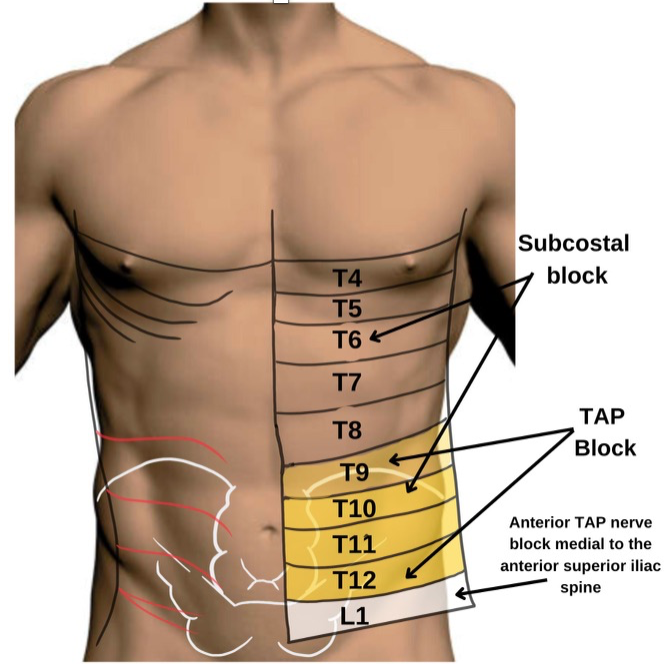
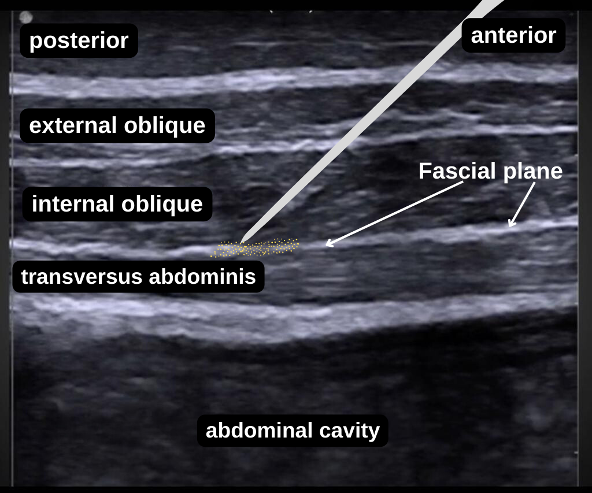
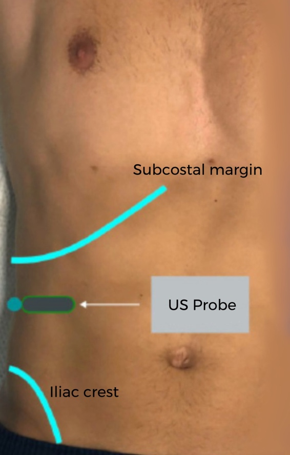
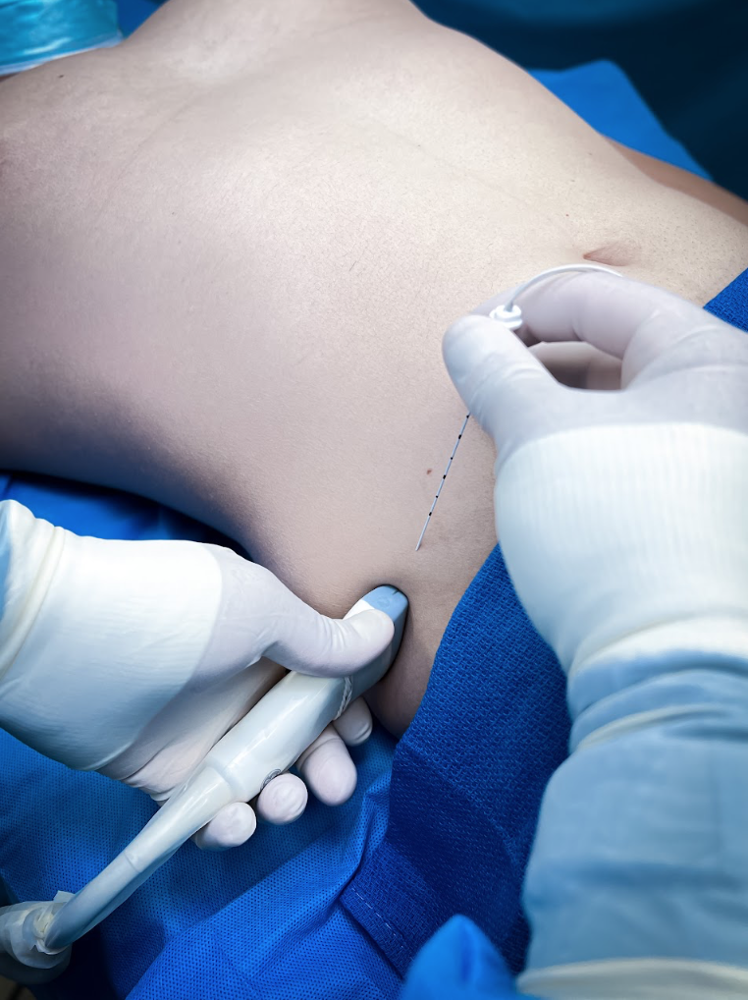

Transversus Abdominis Plane (TAP) Block, Lateral    body {font-family: 'Open Sans', sans-serif;}

### Transversus Abdominis Plane (TAP) Block, Lateral

A lateral TAP block is also referred to as “midaxillary.”  
**Introduction:  
**The TAP block provides somatic analgesia to the lower anterior abdominal wall and the parietal peritoneum for surgical procedures involving the lower abdomen.  
It can be unilateral or bilateral TAP block may be performed, depending on the surgical procedure.  
  
**Goal:** To block the thoracolumbar nerves (T9 to T12) that travel from the spine and eventually loop around (lateral to anterior) and innervate the lower abdominal wall.  
Some literature states T10-T12.  
  
**What the lateral TAP block DOES NOT cover:**  
Visceral analgesia  
Complete anesthesia for surgery.

****

**The location of the TAP (Tranversus Abdominus Plane):  
**Also referred to as “TAP space.”The intermuscular fascial plane is where the nerves travel between the tranversus abdominus and the internal oblique of the abdominal wall.  
This is the area where the local anesthetic is injected.  
  
**For coverage of T6-T9:** The subcostal block is needed.  
**The L1 segmental nerves:** Requires an anterior TAP nerve block medial to the anterior superior iliac spine.  
  
**This is a plane block.**  
The local anesthetic is injected in the plane between the transversus abdominis (TA) and internal oblique (IO) muscles.  
  
**TAP block is also a volume-dependent block.**  
This block relies on local anesthetic spread more than the local anesthetic concentration because it is a volume-dependent block.  
  
**Absolute contraindication:** (as with other regional blocks)  
Patient refusal  
Inflammation or infection over the injection site.  
Allergy to local anesthetics  
  
**Relative contraindications:** (as with other regional blocks)  
**Anticoagulation or bleeding disorders  
**Patient uncooperativeness (Pediatric or elderly patients may need sedation).  
  
**The nerves being blocked:**  
These nerves arise from the anterior rami of spinal nerves T7 to L1.  
  
**These include:**  
Intercostal nerves (T7-T11)  
subcostal nerve (T12)  
Iliohypogastric and ilioinguinal nerves (L1).

****

**Unilateral TAP blocks:**  
For surgical procedures involving only one side of the abdominal wall.  
Cholecystectomy  
Appendectomy  
Nephrectomy  
Renal transplants  
Open inguinal hernia, but not as the primary anesthetic.  
  
**Bilateral TAP Blocks can be for procedures involving midline and transverse abdominal incisions:  
**Umbilical or ventral hernia repair  
Cesarean deliveries  
Hysterectomy  
Prostatectomy  
Laparoscopic (including robotic) procedures  
  
**The lateral three layers of abdominal wall muscles are visualized laterally:**  
External oblique  
Internal oblique  
Transversus abdominis (innermost muscular layer of the anterolateral abdominal wall.

****

**The target site for the injection of local anesthetic:  
**The target is to inject the fascial plane between the internal oblique and the transversus abdominis muscles at the midaxillary line (TAP space).  
A “POP” may be felt each time the needle tip penetrates a fascial plane.

****

Each muscle is separated by a layer of fascia (fascial plane)  
  
**  
US probe location:**  
A linear transducer is placed in the axial plane on the midaxillary line between the subcostal margin and the iliac crest.

****

****

****

**Needle insertion and local anesthetic injection:**  
\- Insert the needle 2-3 cm medial to the transducer in the anterior axillary line.  
\- Advance the needle tip (medial to lateral) until it reaches the fascial plane between the internal oblique and transversus abdominis muscles approximately in the midaxillary line.  
\- A “pop” sensation may be felt as the needle tip passes through each fascial layer separating the muscles.  
\- After negative aspiration, inject 1-2ml of normal saline for needle tip confirmation.  
**\-** Visualize hydrodissection (separation) between the internal oblique and the transversus abdominus muscle.  
\- Slowly administer 3-5ml incremental doses of local anesthetic up to a total volume of 10-15 mLs.  
  
**Ultrasound-guided TAP Block equipment needed:**  
Ultrasound machine with a mid to high-frequency probe (5-13 MHz)  
Ultrasound probe cover  
Antiseptic for skin disinfection  
Sterile ultrasound gel  
Sterile gloves  
**Needle:** 50 mm or 80 mm needle  
20 ml needle and injection tubing  
15-20 ml local anesthetic per side  
  
**Common local anesthetics and strength (all long-lasting):  
**0.5% Ropivacaine  
0.25% Levobupivacaine  
One 20 mL vial (13.3 mg/mL) of Liposomal bupivacaine for each side.  
Each vial contains 266 mg.  
  
**Continuous indwelling catheter:** Rare  
It can be used for postoperative lower abdominal pain or chronic pain syndromes from the anterior abdominal wall.  
A continuous infusion is only effective if a big bolus is administered every 8-12 hours.  
Be vigilant for local anesthetic toxicity.  
  
**Possible complications of a TAP block (very rare):  
**Local anesthetic systemic toxicity  
Allergic reaction to local anesthetic  
Peritoneal puncture  
Infection  
Hematoma  
Spleen or liver puncture  
Bowel perforation  
Block failure  
  
**When a TAP Block can be a diagnostic tool:**  
The TAP block is valuable in diagnosing pain stemming from the abdominal wall; it can thus help differentiate between the somatosensory (abdominal wall) and the visceral origin of pain.  
  
**Billing codes:**  
Unilateral single injection: 64486  
Bilateral single injection: 64488  
  

Edited by Dr. Michael Kaminsky, Regional Anesthesiologist  
Contributor: Michael MacKinnon DNP, FNP-C, CRNA, FAANA  
National University Associate Professor Doctor of Anesthesiology Program  
  
Ultrasound-Guided Transversus Abdominis Plane and Quadratus Lumborum Nerve Blocks  
NYSORA (accessed 05/2023)Hesham Elsharkawy and Thomas F. Bendtsen  
https://tinyurl.com/atzu7as5  
  
Ultrasound Guided Transversus Abdominis Plane (TAP) Block  
Regional Anesthesiology and Acute Pain Medicine (accessed 5/2023)  
https://www.youtube.com/watch?v=OqedcP9OPvc  
  
How To Perform an Ultrasound-Guided TAP Block for Appendicitis Pain  
American College of Emergency Physicians Vol. 38; NO. 05, May 2019  
Arun Nagdev, MD, Sally Mahmoud, MD, and Daniel Mantuani, MD, MPH  
Clinical Implications of the Transversus Abdominis Plane Block in Adults  
Anesthesiology Research and Practice 2012(10)  
Mark J Young, Andrew Gorlin, Vicki E Modest and Sadeq A Quraishi  
  
Transversus abdominis plane (TAP) blocks procedure guide  
UpToDate (accessed 05/2023)  
Kariem El-Boghdadly and Hesham Elsharkawy  
https://tinyurl.com/52ts2978  
  
A Rare Complication of a TAP Block Performed after Caesarean Delivery. Case Report  
Anesthesiology, 2017  
Salaria ON, Kannan M, Kerner B, Goldman H.  
https://www.ncbi.nlm.nih.gov/pmc/articles/PMC5682055/  
  
TAP Block for Post Cesarean Delivery Pain  
Anesthesia Illustrated (accessed 05/2023)  
**https://www.youtube.com/watch?v=AhJ5zFMXT0k**  
  
Distribution patterns, dermatomal anesthesia, and ropivacaine serum concentrations after bilateral dual transversus abdominis plane block.  
Regional Anesthesia and Pain Med. 2012;37(3):294.  
Børglum J, Jensen K, Christensen AF, Hoegberg LC, Johansen SS, Lönnqvist PA, and Jansen T