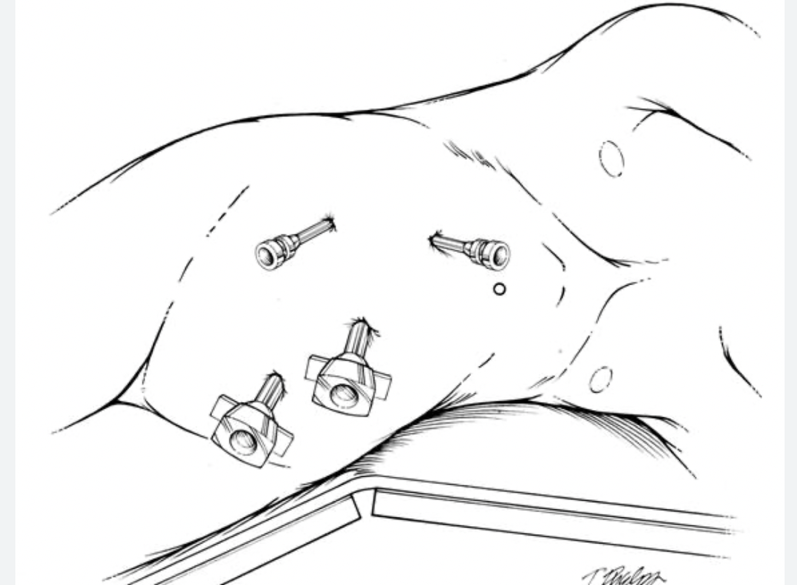

  Ureterectomy section { margin-bottom: 20px; } table { border-collapse: collapse; } table, tr, th, td { border: 1px solid black; } th, td { padding: 0px 8px 0px 8px; text-align: left; vertical-align: top; } h3, p, ol.custom-counter, li { margin: 0px; padding: 0px; } .text-red { color: red; } .text-black { color: black; } ul.custom-dash { list-style: none; padding-left: 0; margin: 0; } ul.custom-dash > li { display: flex; align-items: flex-start; } ul.custom-dash > li::before { content: "–"; margin-right: 0.5em; flex-shrink: 0; line-height: 1; } ul.custom-dash > li > \*:not(::before) { flex: 1; } ul.custom-dash > li.no-dash::before { content: ""; width: 1em; margin-right: 0.5em; flex-shrink: 0; } /\* Change the ol style \*/ ol.custom-counter { list-style: none; padding-left: 0; counter-reset: custom calc(var(--start, 1) - 1); } ol.custom-counter li { counter-increment: custom; margin-bottom: 5px; } ol.custom-counter li::before { content: counter(custom) ") "; } /\* This is just for this file \*/ ul.custom-bullet-arrow { list-style: none; padding-left: 0; margin: 0; } ul.custom-bullet-arrow > li { display: flex; align-items: flex-start; } ul.custom-bullet-arrow > li::before { content: "↑"; margin-right: 0.5em; flex-shrink: 0; } ul.custom-bullet-arrow > li.no-arrow::before { content: ""; width: 0.5em; margin-right: 0.5em; flex-shrink: 0; } ul.custom-bullet\_arrow ul { list-style-type: disc; padding-left: 1.5em; margin-top: 0.5em; } img.resized-200 { width: 200px; height: auto; } img.resized-400 { width: 400px; height: auto; } img.resized-600 { width: 600px; height: auto; } .mb-10px { margin-bottom: 10px; } .mb-20px { margin-bottom: 20px; } .mt-10px { margin-top: 10px; } .mt-20px { margin-top: 20px; } .reference-notes { font-size: 11px; } .additional-notes { font-size: 13px; } .text-indent-45px { text-indent: 45px; } .text-bold { font-weight: bold; } .text-italic { font-style: italic; } .text-center { text-align: center; } .border { border: 1px solid black } .padding-notes { padding: 0px 5px; }

### Ureterectomy

The removal of part or all of the ureter.

This procedure can be performed as an open, laparoscopic, or robotic surgery.

The specific technique depends on the surgeon, location, and extent of the problem.

The affected ureter is dissected and exposed from surrounding organs such as the liver, spleen, and intestines.

The ureter will be dissected free from its surrounding structures.

If it is a resection, the ureter will be re-joined using sutures, or the ureter may be reimplanted directly into the top of the bladder.

A ureteric stent will be inserted and remain in the ureter for a period of 6 weeks.

Types of Ureterectomy

There are different types of ureterectomy, depending on the extent of the removal:

Distal ureterectomy: Removal of the lower part of the ureter

Proximal ureterectomy: Removal of the upper part of the ureter

Nephroureterectomy: Removal of both the kidney and the ureter

Segmental ureterectomy: Removal of a specific section of the ureter

Indications:

Cancer: Ureteral cancer is the most common reason for ureterectomy.

Stones: Large or recurrent kidney stones can damage the ureter and require removal.

Infections: Chronic or severe infections of the ureter can lead to scarring and damage.

Trauma: Injuries to the ureter may necessitate its removal.

Anesthesia management:

General/ETT

**Regional:** Low ESP block

**Position:** Lateral with surgical side up, with the bed flexed

**Duration:** 1-2 hours

**EBL:** For laparoscopic - Minimal to 100 mLs

Possible complications:

Bleeding-rare

Wound infection-rare

UTI is quite common as a catheter remains in the bladder for 2 weeks

Urine leak

Ureteric stricture at the joined section

Distal Ureterectomy

ECU Health (accessed 10/2025)

Nephroureterectomy

The Cleveland Clinic (accessed 10/25)

https://my.clevelandclinic.org/health/treatments/17264-nephroureterectomy