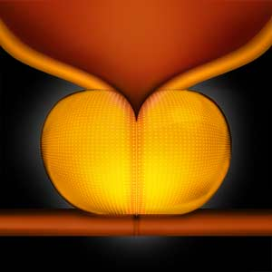
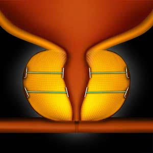

Urolift Procedure    body {font-family: 'Open Sans', sans-serif;}

### Urolift Procedure

The ‘UroLift’ procedure has emerged as a new minimally invasive, nonablative surgical treatment for benign prostatic hyperplasia (BPH).The UroLift System is a straightforward procedure that utilizes tiny implants to lift and hold the enlarged prostate tissue out of the way so it no longer obstructs the urethra.  
There is no cutting, heating, or tissue removal from the prostate gland.  
  
**Enlarged Prostate (below):**  
An enlarged prostate compresses on the urethra, making it difficult for urine to flow.

****

****

**The UroLift Device** (above) and a camera are used to deliver the implants that will hold the prostate tissue out of the way and increase the opening of the urethra.  
  
**Facts:**  
\- The product was reviewed and cleared by FDA in September 2013.  
\- The UroLift technology is mechanical rather than ablative or cavitating  
\- Over 100K procedures have been performed across the US, and the clinical trials looking at outcomes showed that 90 percent of men never needed another procedure.  
  
**Procedure:**  
Under cystoscopic guidance, a deployment of adjustable implants serves to retract the obstructing lateral prostate lobes and create an open, continuous voiding channel through the prostatic fossa, from the verumontanum up to the bladder neck.  
  
The number of implants deployed is dependent on the adenoma size and configuration.  
Implants are typically placed at the 2 and 10 o’clock positions (angled anterolaterally), at least 1.5 cm distal to the bladder neck, to preserve its integrity.  
  
This tissue-sparing method expands the urethral lumen and theoretically avoids damage to the dorsal venous complex and the primary neurovascular bundles.  
  
**Anesthesia management:**  
General/LMA (most popular)  
Deep MAC (not common)  
  
**Optional:** Spinal  
**EBL:** Minimal  
**Position:** Lithotomy  
**Duration:** 20 -60  
**  
Contraindications:**  
Obstructive median prostatic lobe  
Active urinary tract infection  
PSA > 10 ng/ml (unless negative biopsy)  
Prostatitis within the past year  
History of urinary retention  
Previous BPH surgery  
Previous pelvic surgery/irradiation  
Large prostate burdens (>100 ml)  
  
**Advantages of the UroLift procedure:  
**\- No Foley catheter  
\- Same-day discharge  
\- Rapid symptom relief, better than reported for medications  
\- Risk profile better than reported for surgical procedures such as TURP  
\- Preservation of sexual function  
\- Return to regular activity in days, not months  
\- No ongoing BPH medications  
\- 19 clinical study publications; 5 years of published clinical data  
  
**Possible Complications/Side Effects:  
**Pelvic pain  
Dysuria  
Urinary tract infection  
Stricture formation  
Bladder neck contractures  

UroLift: A new minimally-invasive treatment for benign prostatic hyperplasia  
Therapeutic Advances in Urology; 2016 Dec; 8(6): 372–376.  
Patrick Jones, Bhavan P. Rai, Omar Aboumarzouk, and Bhaskar K. Somani  
  
Urolift ®  System  
Texas Urology Specialists  
Accessed 10/2023  
https://tinyurl.com/mbwkbd2v  
  
UroLift Treatment for the enlarged prostate (BPH)  
Birmingham Prostate Clinic  
Accessed 10/2023  
https://tinyurl.com/ysz56p2b