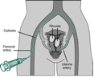

Uterine Fibroid Embolization (Uterine Artery Embolization)     body {font-family: 'Open Sans', sans-serif;}

### Uterine Fibroid Embolization (Uterine Artery Embolization)

Embolization is a minimally invasive treatment for uterine fibroids—which are noncancerous growths that are within the uterus.  
**Goal:** To block tiny vessels that lead to the fibroids, starve the fibroids and cause them to die.  
Technique: A catheter is inserted into the femoral artery and threaded cephalad to the uterine artery that feeds the fibroid. Using real-time imaging, tiny particles the size of grains of sand are injected and the blood flow to the fibroid tumor is obstructed and causes the fibroid to shrink and die.

This procedure is usually done in Radiology without anesthesia by an Interventional Radiologist. Sometimes anesthesia is needed due to anxiety etc.  
 

**Anesthetic:** Usually MAC: Try using a Propofol infusion at 25-50 mcgs/kg/min.  
Rarely an ETT unless specifically indicated. Spinal is an option but rare.  
**Duration:** Depends on the radiologist.  
**IV Access:** 20G is acceptable  
**EBL:** Minimal

**Possible Complications**  
Immediate complications may relate to vascular access, thromboembolic events, infection, and pain management.  
  
**Post-embolization syndrome** is a well-described phenomenon consisting of pain, fever, nausea, leukocytosis, and occasionally malaise.  
Uterine infection  
Uterine necrosis

Jaffe, Richard A. _Anesthesiologist's Manual of Surgical Procedure_. 2012.

Rock Jr., John A., M.D, Howard W. Jones III, M.D, and TeLinde Richard W. _Telinde's Operative Gynecology_. Philadelphia, PA: Lippincott Williams & Wilkins, 2011. 

Surgical Procedures and Anesthetic Implications; Lynn Fitzgerald Mackey, 2012.

Schirf, Brian, M.D, Robert Vogelzang, M.D, and Howard Chrisman, M.D. "Complications of Uterine Fibroid Embolization." _Seminars in Interventional Radiology_ 23.2 (2006): 143-49.

Spies, James B., and Jean-Pierre Pelage. _Uterine Artery Embolization and Gynecologic Embolotherapy_. Philadelphia, PA: Lippincott Williams & Wilkins, 2004.