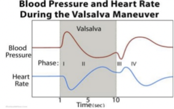

Valsalva Maneuver (VM)    body {font-family: 'Open Sans', sans-serif;}

### Valsalva Maneuver (VM)

The Valsalva maneuver involves a forced expiration against a closed glottis.  
**  
Also performed when:**  
Bearing down during a bowel movement  
Attempting to pop your ears with elevation.  
During lifting heavy weights  
Coughing  
Vomiting  
Straining while urinating.   
Bearing-down during parturition.   
Blowing up balloons or playing wind instrument.   
Weightlifting or powerlifting.  
The Valsalva maneuver was given by the Italian physician Anton Maria Valsalva in 1774, when he described it as the act of forced expiration against a closed glottis after a full inspiration.  
This was done with the purpose of expelling foreign bodies or exudates from the middle ear.  
Later in 1851, the German physiologist, Edward Weber described in detail, the complicated and significant cardiovascular changes associated with this maneuver.  
  
**Proper VM  
**The patient is placed in a supine or semi-recumbent position and instructed to exhale forcefully against a closed glottis after a normal inspiratory effort (ie, at tidal volume).  
The patient should maintain the strain for 10 to 15 seconds and then release it and resume normal breathing.  
**  
Signs of adequate VM:**  
Neck vein distension  
Increased tone in the abdominal wall muscles  
Flushed face.  
  
**Modified VM**  
Involves the standard strain for 15 seconds in the semi-recumbent position, followed by supine repositioning with 15 seconds of passive leg raise at a 45 degree angle, has been shown to be more successful in restoring sinus rhythm for patients with SVT  
  
**Origin of VM**  
The Valsalva maneuver was given by the Italian physician Anton Maria Valsalva in 1774, when he described it as the act of forced expiration against a closed glottis after a full inspiration.  
This was done with the purpose of expelling foreign bodies or exudates from the middle ear.  
Later in 1851, the German physiologist, Edward Weber described in detail, the complicated and significant cardiovascular changes associated with this maneuver.  
  
**Physiologic results:  
**Increased intrathoracic pressure  
Increases CVP  
Decreased venous return  

****

  
**4 phases of VM  
**Phases 1 and 2 occur during the active strain.  
Phases 3 and 4 occur after the strain phase has been completed.  
  
**Phase 1  
Initiation of the active strain**  
Compression of the aorta causes an immediate transfer of blood to peripheral arteries, thus increasing directly the arterial BP and ‘transmitting’ the intrathoracic pressure to the rest of  
the circulation.  
Both diastolic and systolic pressure increase with no significant change in pulse pressure  
Increase 15 mmHg increase systolic blood, but the HR remains the same.  
However, bradycardia is a normal event in men with parasympathetic reactivity, particularly when strain pressure is low.  
  
**Baroreceptor response in Phase 1**  
The rise in the arterial pressure (sensed by arterial baroreceptors) and, to a lower degree, the decreased transmural pressure in the right atrium and the pulmonary vessels (sensed by low-pressure cardiopulmonary baroreceptors) both trigger a decrease in HR (through increased parasympathetic activity) and a reduction of the peripheral resistance (through inhibition of sympathetic activity).  
In consequence, the arterial pressure starts to decline.  
  
**Phase 2**  
This phase occurs due to **decreased venous return** (leading to a decrease in stroke volume) and an increased SVR from peripheral vasoconstriction.  
Bradycardia.  
Later in this phase, the baroreceptor reflex is activated causing more vasoconstriction and tachycardia (due to autonomic stimulation) in an attempt to bring the blood pressure to normal.  
Return of the systolic blood pressure to baseline (below the 15 mmHg increase) during the remainder of the straining phase.  
Relative tachycardia may occur during this phase.  
**  
Phase 3**  
Occurs after release of the strain followed by an abrupt fall in systolic blood pressure below baseline.  
Syncope or pre-syncope symptoms (e.g. dizziness) may potentially occur in the standing position.  
Onset of an acute decreased intrathoracic pressure results in blood pooling in the pulmonary vessels leading to a further fall in blood pressure.  
At the end of phase 3, early phase 4, a **reflex sympathetic response** is initiated to increase BP.  
  
**Phase 4** **(overshoot phase)**  
When the patient reopens their glottis, blood rushes back into the great vessels and heart resulting in increase in diastolic filling  
and stroke volume output by means of the Frank-Starling mechanism.  
This phase is identified by a secondary rise in systolic blood pressure >15 mmHg above baseline.  
Heart rate and total peripheral resistance continue to be increased during the post-strain period.  
The ejection of an increased stroke volume into a constricted arterial system produces a rapid and marked increase in arterial pressure.  
_With the combined sudden increased cardiac volume and sympathetic activation results in an “overshoot” in mean aortic pressure._ This again activates the baroreceptors to decrease sympathetic system and increase parasympathetic firing with its subsequent slowing of heart rate.  
  
The autonomic system is responsible for controlling the exaggerated responses and involves the baroreceptors, cardiopulmonary, and chemoreceptor reflexes.  
  
**Absent of overshoot in phase 4 may indicate:**  
Moderately decreased left ventricular ejection fraction.  
Patients taking beta-blockers  
  
**Clinical potential outcomes of VM**  
Slowing of sinoatrial nodal activity.  
Block at the atrioventricular node "unmasking" atrial activity.  
Termination of the SVT.  
No response (generally indicating inadequate performance of the technique).  
  
**Possible complications of VM or cardiac message (vagal maneuvers) Cardiac:** Exaggerations of the expected response from the procedure; all transient and typically Resolve within seconds to minutes:  
Prolonged sinus pauses/asystole  
Atrioventricular block  
Hypotension  
Arrhythmia  
Atrial fibrillation  
  
**Adverse effects:**  
Headaches  
Dizziness  
Nausea  
Altered vision  
  
**Neurologic (< 1%)  
**Cerebral strokeStroke or transient ischemia attack following carotid sinus massage.  
  
Rupture of the round window of the ear.  
Induction of labor in pregnant women.  
Increased intra-ocular pressure which can lead to retinal or macular hemorrhage.  
  

The Valsalva manoeuvre: physiology and clinical examples  
ACTA Physiologica 2015  
L. Pstras,K. Thomaseth, J. Waniewski, I. Balzani and F. Bellavere  
Physiology Philes: Valsalva Manoeuvre  
Life in the FASTLANE, last update June 5, 2019 (accessed 02/2020)  
Dr Michelle Johnston, last update June 5, 2019  
  
The bradycardic response to the Valsalva manoeuvre in normal man.  
Respiratory Physiology . 2001 Feb;124(3):205-15.  
R. Looga  
  
The Valsalva manoeuvre – cardiovascular effects and performance technique: a critical review.  
Respiratory Physiology & Neurobiology 2005 147, 39–49.  
Looga, R.  
Valsalva's maneuver and Weber's experiment.  
New England Journal of Medicie 1955;253:822-3  
Derbes VJ, Kerr A Jr.  
  
The Valsalva manoeuvre and response revisited.  
Mayo Clinical Proceedings 1986;61:211-7.  
Nishimura RA, Tajik AJ.  
  
Cerebral hemodynamics during the Valsalva maneuver: Insights from ganglionic blockade.  
Stroke 2004;35:843-7.  
Zhang R, Crandall CG, Levine BD.  
  
Anaesthesia and the Valsalva manoeuvre. A test of circulatory responses in neurosurgical patients including those in the sitting position.  
Anaesthesia 1979;34:534-42.  
Rawlinson WA, Edmonds-Seal J, Adams AP.  
  
Postural modification to the standard Valsalva manoeuvre for emergency treatment of supraventricular tachycardias (REVERT): a randomised controlled trial.  
Lancet. 2015;386(10005):1747. Epub 2015 Aug 2 (accessed 02/2020)  
Appelboam A, Reuben A, Mann C, Gagg J, Ewings P, Barton A, Lobban T, Dayer M, Vickery J, Benger J, REVERT trial collaborators   
https://www.uptodate.com/contents/vagal-maneuvers/abstract/11  
  
Left ventricular dysfunction--bedside Valsalva manoeuvre.  
British Heart Journal. 1980;44(5):560.   
Zema MJ, Restivo B, Sos T, Sniderman KW, Kline S   
  
Nurse Anesthesia 6th Ed. 2018 ; pp. 454  
J. Nagelhout and S. Elisha